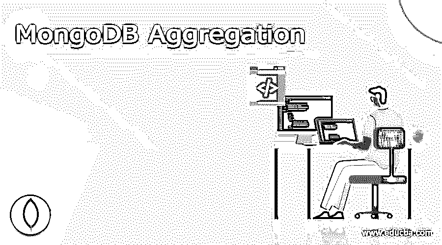
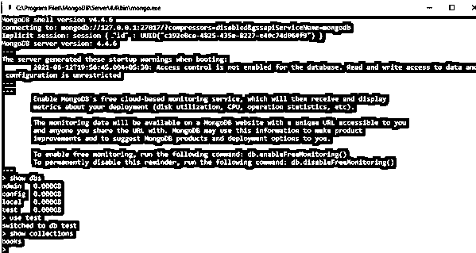

# MongoDB 聚合

> 原文：<https://www.educba.com/mongodb-aggregation/>

## MongoDB 聚合的定义

MongoDB 聚合使用 aggregate()方法来执行聚合操作。基本上，这个聚合操作实践数据记录并提供计算结果。聚合操作将来自各种文档的值集合在一起，并能够执行一系列操作，如平均、求和、最大值、最小值等。，以仅提供一个结果。SQL 中 MongoDB 聚合的一个对应项是 count(*)和 group by。MongoDB 聚合与 SQL 中提供的聚合函数相同。

MongoDB 支持三种技术来执行聚合操作:

<small>Hadoop、数据科学、统计学&其他</small>

✔专用聚合
✔聚合管道
✔ Map-reduce 函数

因此，聚合被应用于对集合中的文档的查询操作的结构，减少和改变它们。

**语法:**

让我们来看看 MongoDB aggregate()方法的一般语法，如下所示:

`Db.NAME_OF_COLLECTION.aggregate(AGGREGATE_OPERATION);`

由于 MongoDB 聚合由三种方式组成，因此:

#### 聚合管道

由于 MongoDB 的聚合框架是基于数据处理管道的思想建模的，因此文档插入了一个多级管道，将文档转换为聚合结果。

这可以用下面的例子来说明:

`Db.products.aggregate([
{$match: {status: “X”}},
{$group: {_id: “$pro_id”, total: {$sum: “$amount”}}}
])`

让我们详细解释一下上面的例子:

第一阶段:在这个阶段中，$match 阶段将根据字段 status 过滤文档，然后将状态字段等于“x”的文档传递给后续阶段。

第二阶段:在此阶段中，$group 阶段将按照字段 pro_id 对文档进行分组，以计算每个不同 pro_id 的总金额。

最简单的管道阶段支持执行查询和文档转换的过滤器，这些过滤器会改变结果文档的形式。而其他管道操作支持按特定字段或多个字段对文档进行分组和排序的工具，以及聚合由文档数组组成的数组内容的其他工具。总的来说，流水线阶段可能使用操作符来完成一些任务，例如连接一个字符串或计算平均值。

因此，管道通过 MongoDB 内部的内置操作提供了丰富的数据聚合，可以被认为是 MongoDB 中应用的数据聚合的首选技术。这个聚合管道也可以在分片集合上执行。它有一个内部优化阶段。

**单一目的聚合操作**

对于聚合，MongoDB 还提供:

`db.collection.distinct(), db.collection.estimatedDocumentCount() and db.collection.count().`

这些操作将从单个集合中聚集文档。然而，这些操作提供了对公共聚合过程的基本访问，但是缺乏聚合管道的灵活性和能力。

**地图缩小**

基本上，聚合管道比 MongoDB 中的 map-reduce 操作提供了更好的可用性和性能。

这个 map-reduce 操作可以通过$merge、$group 等聚合管道操作符来重写。它需要自定义功能，所以 MongoDB 从 4.4 版开始支持 JavaScript 中的$function 和$accumulator 聚合操作符。

要查看 map-reduce 操作的聚合管道替代示例，我们需要进一步了解高级 Map-Reduce 聚合管道及其示例。

### MongoDB 中的聚合是如何工作的？

当我们需要从 MongoDB 中为任何图形演示或者其他操作收集指标时，没有比 MongoDB 聚合更好的方法了。MongoDB 中的聚合负责处理数据，产生计算出的输出，通常是通过组合来自几个文档的数据，然后以各种方式对这些组合的数据执行，以产生一个集合结果。它练习文档，然后产生计算输出，从而对组合的数据执行一系列操作，只返回一个结果。

MongoDB 中的聚合在受到限制的情况下取得了进展，因为有数百万个嵌入式文档，处理时间很长，并且服务器的随机内存可能会终止操作。

这个 MongoDB 聚合在 UNIX 命令中使用了管道概念，其中管道定义了在少量输入上执行操作的可能性，并将结果输出作为后续命令的输入，并且它遵循相同的规则。MongoDB 在聚合框架中支持这种思想。

这里，操作符分为三个范围，如阶段、表达式和累加器。

有一组可能的阶段，每一个阶段都被认为是一组文档，作为输入，并生成一组结果文档(否则，就是管道完成时的最后一个 JSON 文档)。然后，这将依次在后续阶段实施，同样如此。聚合框架中确定的一些可能阶段如下:

1.$match:这是一个过滤操作，因此可以减少作为后续阶段输入的文档数量。

2.$project:它用于从一个集合中选择几个特定的字段。
3。$group:它执行我们正在讨论的具体聚合。
4。$sort:它有助于对文档进行排序。
5。$limit:它限制要查看的文档总数，由从现有位置开始的特定数字提供。
6。$skip:它有助于在文档列表中为一组提供的文档向前跳转。
7。$unwind:它用于展开使用数组的文档。当应用一个数组时，数据元素是一种预先连接的形式，然后这个操作将在下一次包含不同的文档时完成。因此，在此阶段的帮助下，我们可以增加后续阶段的文档总数。

### 例子

假设我们在集合中有如下数据，其中我们使用了“test”数据库，相关的集合名称是“books”:

`show dbs
use test
show collections`

`Db.books.find().pretty()
{
_id: ObjectID(60e6e3242908975c299b09b1),
title: ‘Overview of MongoDB’,
description: ‘MongoDB database tool is a No SQL database.’,
by_publisher: ‘my books’,
url: ‘http://www.mybooks.com’,
tags: [‘NoSQL’, ‘Databases’, ‘MongoDB’],
likes: 100
},
{
_id: ObjectID("60e6e4252908975c299b09b2),
title: ‘SQL’,
description: ‘SQL is structured query language used in RDBMS.’,
by_publisher: ‘my books’,
url: ‘http://www.mybooks.com’,
tags: [‘SQL’, ‘RDBMS’, ‘MongoDB’],
likes: 500
},`

**输出:**

对于我们使用 db . collection _ name . insert({ write concern:<doc>，ordered: <boolean>})语法插入到集合中的每个数据，_id: ObjectID()是不同的。在我们执行这个命令之后，它将返回 WriteResult 对象，因此，我们将通过 MongoDB _id 字段创建获得 ObjectID，并为进一步的操作进行验证。</boolean></doc>

使用集合细节来查看定义每个出版商写了多少本书的列表以及这两本书的所有喜欢的总和，我们将应用 aggregate()方法的语法，如下所示:

### 结论

MongoDB 聚合充当管道，或者说，充当对数据实现的一系列过滤器/操作符。在这里，我们可以将一个集合通过管道传输到顶部，并通过一系列操作来改变它，最终从底部弹出一个结果。

引入了聚合框架，它实践文档的组装以增强在各个阶段操纵文档的扫描过程，根据给定的标准或操作进行相应的处理以执行等效的结果。

### 推荐文章

这是 MongoDB 触发器指南。在这里我们讨论触发器的定义、语法以及如何在 Mongodb 中工作？示例和代码实现。您也可以看看以下文章，了解更多信息–

1.  [MongoDB 加入](https://www.educba.com/mongodb-join/)
2.  [MongoDB findOne()](https://www.educba.com/mongodb-findone/)
3.  [MongoDB 分组依据](https://www.educba.com/mongodb-group-by/)
4.  [MongoDB 数据库](https://www.educba.com/mongodb-database/)

