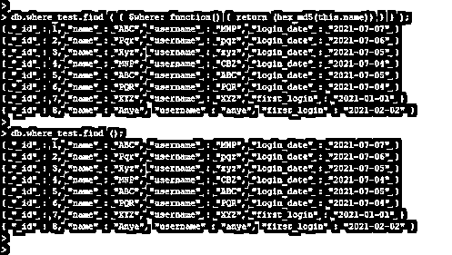
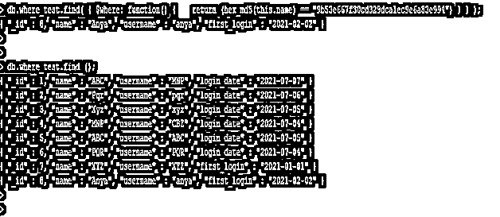
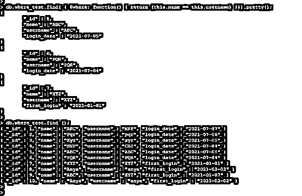

# Mongodb 在哪里

> 原文：<https://www.educba.com/mongodb-where/>

## Mongodb 的定义

Mongodb，其中操作符用于匹配和显示满足查询中使用的 JavaScript 函数或表达式条件的文档。查询包含 JavaScript 的函数或 JavaScript 的表达式，可以在 MongoDB 中使用 where 运算符传递。我们在 MongoDB 中使用 where 运算符时使用了 JavaScript 表达式或函数参数，我们可以在使用 where，operator 时传递其中一个参数。JavaScript 函数或表达式，其中操作符在 MongoDB 中被称为“this”或“obj”。

**语法:**

<small>Hadoop、数据科学、统计学&其他</small>

下面是 MongoDB 中 where 运算符的语法。

`Db.collection_name.find ({$where: <JavaScript expression (String) | JavaScript Function>})`

**MongoDB 中 where 运算符的参数描述语法。**

1)集合名称–

这被定义为使用 where 操作符从集合中检索数据的集合的名称。我们需要在 find 方法中指定集合名称，以便在 MongoDB 中使用 where 操作符检索数据。

2)Find–这用于通过使用 where 操作符从集合中查询数据。我们可以使用 pretty 方法查找结构化格式文档的检索结果。

3)Where–这是使用运算符显示匹配文档结果的地方。我们必须使用 where 操作符传递 JavaScript 函数或表达式来显示文档的结果。

4) JavaScript 表达式——使用 where 操作符，我们传递 JavaScript 表达式来返回集合中匹配文档的结果。使用时此参数的类型，其中运算符是字符串。

5) JavaScript 函数——使用 where 操作符，我们传递 JavaScript 函数来返回集合中匹配文档的结果。在 MongoDB 中使用 where 运算符时，JavaScript 函数或 JavaScript 表达式是一个强制参数。

### 如何在 Mongodb 中工作？

我们在 where 操作符中使用了像 map、md5、isString、ISODate、hex_md5、emit、gc、UUID、version、NumberLong、NumberInt 这样的 JavaScript 函数。

MongoDB 中有多个 JavaScript 函数可用，我们在 where 操作符中使用这些函数来显示匹配文档的结果。

下面是我们在 where 运算符中使用的可用属性。

1)参数
2) MaxKey
3) MinKey

我想我们还没有从我们的函数中找到任何匹配的文档，我们使用了 where 操作符，然后 where 操作符返回空的结果集。

在下面的示例中，我们可以看到，我们没有找到具有给定的指定十六进制字符串的名称，因此 where 运算符没有在输出中显示任何结果。

**代码:**

`db.where_test.find ()
db.where_test.find ( { $where: function() { return (hex_md5(this.name) == "9b53e667f30cd329dca1ec9e6a83e99") } } );`

**Figure–当在集合中找不到任何匹配的文档时，操作符将返回空的结果集。**

在上面的例子中，我们使用了 hex_md5 作为函数名，它将 name 字段的值与 md5 哈希值进行比较。在比较了所有的文档之后，它将返回匹配文档的结果。

我们需要使用带有 where 操作符的 find 方法来显示 MongoDB 中匹配文档的结果。

使用 where 运算符的 Find 方法将以非结构化格式显示结果，要以结构化格式显示结果，我们需要将 pretty 方法与 find 方法结合使用。

MongoDB 版本 4.4 和更高版本，其中运算符不支持已弃用的 JavaScript BSON 类型代码。它将只支持 BSON 类型的字符串或 JavaScript BSON 类型的代码。

一般来说，当我们不能使用另一个操作符，或者我们不能从另一个操作符得到预期的结果时，我们应该使用 where 操作符。

Where 运算符将对集合进行全面扫描，以从查询中找到结果。它将扫描每个文档，从集合中找到匹配的文档。

Where operator 习惯于在 MongoDB 中提供更好的灵活性。

其中 operator 不访问任何属性或全局函数，比如在 mongo shell 中可用的 db。

### 例子

下面是 MongoDB 中 where 操作符的例子。

#### 1)当运算符使用 hex_md5 函数而不使用哈希值时–

在下面的例子中，我们使用了带有 where 运算符的 hex_md5 函数。但是我们没有使用任何哈希值来匹配文档。

我们可以看到，在不使用任何哈希值的情况下，hex_md5 函数将返回集合中的所有文档。

我们已经使用 where 操作符使用了 name 字段，但是所有的文档都被返回，因为我们没有使用任何哈希值来与 name 字段进行比较。

**代码:**

`db.where_test.find ( { $where: function() { return (hex_md5(this.name)) } } );
db.where_test.find ()`

**图–where 运算符使用 hex_md5 函数而不使用哈希值的示例。**

#### 2)使用 hex_md5 函数的运算符使用哈希值–

在下面的例子中，我们使用了带有 where 运算符的 hex_md5 函数。此外，我们使用哈希值来匹配文档。我们已经使用“9 b 53 e 667 f 30 CD 329 DCA 1 EC 9 e 6 a 83 e 994”哈希值从集合中查找匹配的文档。

我们可以看到，使用 hash 值，hex_md5 函数将只返回集合中匹配的文档。

我们在 where 操作符中使用了 name 字段。

**代码:**

`db.where_test.find ( { $where: function() { return (hex_md5(this.name) == "9b53e667f30cd329dca1ec9e6a83e994") } } );
db.where_test.find ()`

**图–where 运算符使用 hex_md5 函数并使用哈希值的示例。**

#### 3)使用 JavaScript 表达式的 Where 运算符–

在下面的例子中，我们使用了带有 where 操作符的 JavaScript 表达式。我们使用 JavaScript 表达式来匹配来自名称和用户名字段的文档。

使用下面的表达式，我们可以看到，只有匹配的文件将返回这两个领域是相同的。

我们使用了一个带有 find 方法的 pretty 方法，以结构化格式返回结果。

name 和 username 字段用于从 where_test 集合中检索匹配的文档。在输出中，我们可以看到返回了三个文档，它们在两个字段上的值相同。

**代码:**

`db.where_test.find ( { $where: function() { return (this.name == this.username ) } } ) .pretty ();
db.where_test.find ()`

**图–使用 JavaScript 表达式的 Where 运算符示例。**

### 结论

当我们需要从集合中检索匹配的文档时，Where 操作符在 MongoDB 中更有用。JavaScript 函数和 JavaScript 表达式与 where 运算符一起使用来显示匹配的文档。我们可以使用多个 JavaScript 函数，如 MD5、hex_md5 来显示使用 where 操作符的集合的结果。

### 推荐文章

这是 Mongodb 的指南。这里我们讨论定义，语法，如何在 Mongodb 中工作？示例和代码实现。您也可以看看以下文章，了解更多信息–

1.  [MongoDB 加入](https://www.educba.com/mongodb-join/)
2.  [MongoDB findOne()](https://www.educba.com/mongodb-findone/)
3.  [MongoDB 分组依据](https://www.educba.com/mongodb-group-by/)
4.  [MongoDB 数据库](https://www.educba.com/mongodb-database/)

