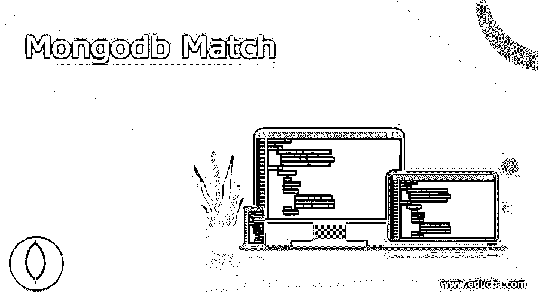

# Mongodb 匹配

> 原文：<https://www.educba.com/mongodb-match/>

## Mongodb 匹配的定义

MongoDB 为用户提供了不同的功能，其中匹配是 MongoDB 提供的功能之一。基本上，它被称为 MongoDB 操作符，用于根据我们的要求过滤 Mongodb 文档。换句话说，MongoDB $match 管理员引导报告只将那些符合预定条件的记录传递给即将到来的管道阶段。基本上，MongoDB 为用户提供了不同的匹配操作符，如$match 和$count 等，我们可以根据自己的需要使用它们。我们还可以对聚合管道使用匹配操作符。

**语法:**

<small>Hadoop、数据科学、统计学&其他</small>

`{$match: {specified required query statement}}`

**解释**

在上面的语法中，我们使用了$match Mongodb 操作符，如下所示。这里$ match 用于指定匹配操作符，在括号内，我们需要编写一个指定的匹配条件的查询语句。基本上，查询语句取决于用户的要求。

### match 在 Mongodb 中是如何工作的？

现在让我们看看匹配操作符在 Mongodb 中是如何工作的，如下所示。如果您尽可能准时地将$match 放在总管道中，以限制总管道中记录的完整数量，这种方法尤其可行。当$match 设置在管道的绝对起点时，问题可以利用记录。

$where 不能在$match 问题中用作累积管道的组件。

当您开始使用 Mongodb 时，您将利用 discover()命令来询问信息，这大概就足够了，但是，当您开始进行除信息恢复之外的其他工作时，您应该了解 Mongodb 的整个管道。

*   $ match()stage——引导我们需要使用的归档，那些符合我们需求的归档
*   $group()阶段——总工作完成了吗
*   $ sort()stage——按照我们要求的方式(攀爬或潜水)对后续报告进行排序

管道的贡献可以是一个或几个分类。

然后，管道在这一点上对信息执行渐进的改变，直到我们的目标实现。

因此，我们可以将一个令人难以置信的调查分成更简单的阶段，在每一个阶段中，我们都完成了一个关于信息的交替过程。这样，在调查程序结束之前，我们将完成我们需要的所有工作。这种方法允许我们通过检查信息和产量来检查我们的问题在每个阶段是否适当地工作。每一阶段的收获都是下一阶段的贡献。在调查中使用的阶段数量没有限制，或者我们如何加入它们。
现在我们来看看 Mongodb 中对匹配的限制是什么，如下。
$ match 查询语法与细读的活动问题标点符号没有区别；例如，$match 不承认粗糙的集合发音。要记住$match 的累积发音，请使用$ specifed expr 问题发音:

`{ $match: { $specifed expr: { <required indicated total articulation inquiry statement> }`

您不能将$where in $match 问题用作收集管道的一项功能。

您不能在$match 查询中使用$near 或$nearSphere 作为累积渠道的一部分。作为另一种选择，您可以购买相同的令牌:

使用$geoNear 阶段，而不是$match 阶段。

在 match 阶段，将 geoWithin inquiry administrator 与 center 或 centerSphere 一起使用。

要在$match 阶段使用$text，$match 阶段必须是管道的主要阶段。透视图不支持文本搜索。

### 例子

现在让我们来看看 Mongodb match 的不同例子，以便更好地理解。首先，我们需要使用如下语句创建集合。在创建集合之前，我们需要如下创建数据库。

**解释**

这里，我们使用上面的语句创建了一个示例数据库，现在使用下面的语句在数据库中创建一个集合，如下所示。

`db.stusent( document )`

**解释**

通过使用上面的语句，我们创建了一个学生集合，并且我们有如下的文档:

`{"_id":{"$oid":"60e88f66694de57586da756e"},"name":"jenny","result":"pass","detp":"comp"}
{"_id":{"$oid":"60e8900f694de57586da756f"},"name":"Rohit","result":"pass","dept":"comp"}
{"_id":{"$oid":"60e8903f694de57586da7570"},"name":"Pooja","result":"faile","dept":"mech"}
{"_id":{"$oid":"60e89068694de57586da7571"},"name":"Sameer","result":"pass","dept":"comp"}
{"_id":{"$oid":"60e89094694de57586da7572"},"name":"Rohit","result":"pass","dept":"comp"}`

现在我们可以如下执行匹配操作符。

`db.student.aggregate([{ $match : { name : "jenny" } } ] );`

**解释**

假设我们需要找到那些有 jenny 的学生名字，我们可以使用上面的语句。在这个例子中，首先，我们需要指定集合名称，后跟 aggregate 关键字，在括号内，我们需要指定所需的条件，或者我们可以说查询语句。在本例中，我们需要找到姓名以 jenny 开头的学生姓名，如图所示。上述语句的最终输出通过下面的屏幕截图进行了说明。

现在让我们看看 Mongodb 匹配的另一个例子，如下所示。假设我们需要找到 comp 部门的学生学习，我们需要使用如下语句。

`db.student.aggregate([{ $match : { dept : "comp" } } ] );`

**解释**

通过使用上述语句，我们试图找到那些学生在 comp。在这个例子中，首先，我们需要指定集合名称，后跟 aggregate 关键字，在括号内，我们需要指定所需的条件，或者我们可以说查询语句。这里，我们尝试将部门与部门名 dept = comp 匹配，如上面的语句所示。上述语句的最终输出通过下面的屏幕截图进行了说明。

现在让我们来看下面这个例子。

在这个例子中，我们需要找出那些在机械系学习的学生如下。

`db.student.aggregate([{ $match : { dept : "mech" } } ] );`

**解释**

上述语句的最终输出通过下面的屏幕截图进行了说明。

这样，我们可以在 Mongodb 中实现 match，这里我们也可以根据用户需求使用组。

### 结论

我们希望您能从这篇文章中了解 Mongodb 匹配。从上面的文章中，我们已经了解了匹配的基本语法，我们也看到了匹配的不同例子。从本文中，我们了解了如何以及何时使用 Mongodb match。

### 推荐文章

这是一个 Mongodb 匹配的指南。在这里，我们讨论定义，语法，如何在 Mongodb 匹配工作？示例和代码实现。您也可以看看以下文章，了解更多信息–

1.  [MongoDB 加入](https://www.educba.com/mongodb-join/)
2.  [MongoDB findOne()](https://www.educba.com/mongodb-findone/)
3.  [MongoDB 分组依据](https://www.educba.com/mongodb-group-by/)
4.  [MongoDB 数据库](https://www.educba.com/mongodb-database/)

