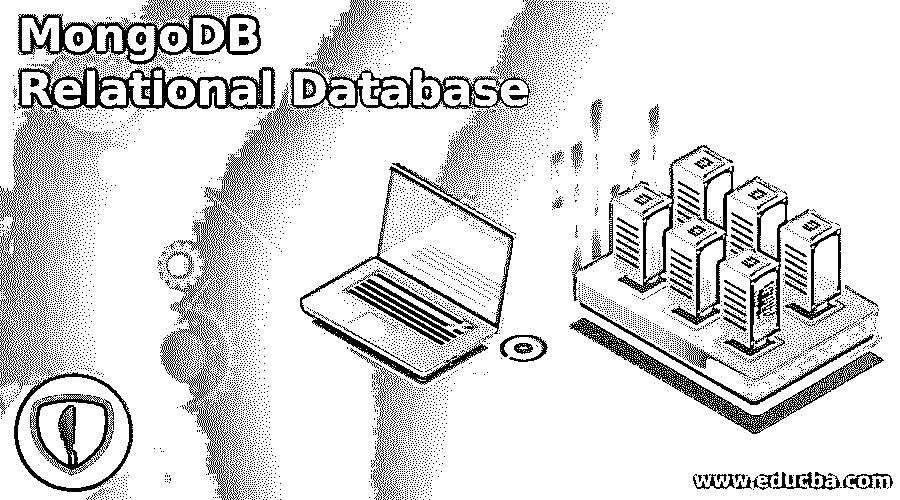
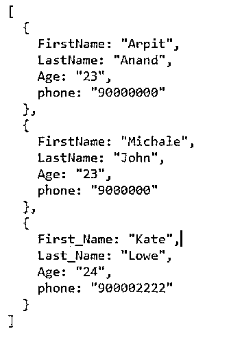
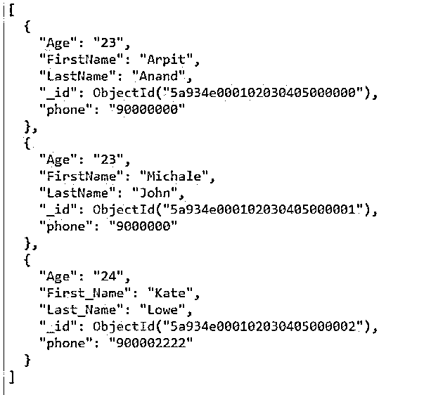

# MongoDB 关系数据库

> 原文：<https://www.educba.com/mongodb-relational-database/>

## MongoDB 关系数据库简介

下面的文章提供了 MongoDB 关系数据库的概要。MongoDB 是一个非 SQL 数据库，它是开源的，面向文档的。它是用 C++编写的，提供了高性能和可用性。它提供自动缩放和面向文档的数据库。最初，它于 2007 年在纽约开发为 PaaS(平台即服务)，旨在与具有快速功能和灵活开发的大数据技术一起工作。它提供可扩展性、更好的性能和高可用性，提供面向文档的存储，将数据存储为文档。

### 如何使用 MongoDB？

*   MongoDB 处理键值对。它有一个数据库模块，作为所有集合的物理容器。MongoDB 可以有多个数据库。
*   它还包括一个集合，相当于 RDMS 中的一个表，它可以包含作为一组键值对的文档。由于将值存储在键值中，这些文档具有动态模式建模。文档可以有不同的字段，它提供了横向可伸缩性。
*   文档与 RDBMS 中的元组/行相同，数据在 MongoDB 中存储为文档，格式为名称/值对的 JSON 文件。数据存储在二进制 JSON 的 BSON 中。
*   游标是 MongoDB 中的一个指针，它包含查询的结果集。我们可以遍历光标来检索结果。我们不能在 MongoDB 中使用 join，因为它存储在一个集合中。
*   名称-值对在文档中称为字段，可以是零个或多个字段。

### MongoDB 的特性

下面给出了 MongoDB 的特性:

<small>Hadoop、数据科学、统计学&其他</small>

*   **无 SQL 数据库:** MongoDB 是一个无 SQL 数据库，是一个面向文档的数据库。
*   **副本:** MongoDB 支持主从副本。主机可以执行读写操作，数据存储在从机中作为备份。
*   **面向文档:**数据存储为文档。
*   MongoDB 是用 C++写的。
*   **无模式:** MongoDB 是无模式的。
*   **可伸缩:** MongoDB 是可伸缩的，并提供易于向外扩展的特性。
*   **即席查询支持:** MongoDB 支持即席查询，用户可以通过字段进行搜索，并支持正则表达式。
*   **索引:**我们可以索引 MongoDB 中使用的任何字段。
*   **高性能:** MongoDB 为用户提供高性能，相对更快。
*   它支持具有动态模式的数据，其中模式可以被改变。
*   **大文件存储:** MongoDB 具有存储大文件存储的能力，能够方便地处理和查询数据。
*   **易支持和故障恢复:**提供易支持的数据和故障恢复机制来处理查询处理数据。
*   分片: MongoDB 跨多台机器存储数据，这有助于处理批量数据。
*   在任何地方运行的自由，MongoDB 可以在全球任何地方运行，具有处理数据的杠杆作用。
*   **负载平衡:**数据在 MongoDB 上水平分割，这允许负载平衡，它可以在多个服务器上运行，并且在任何故障的情况下，数据都可以恢复。
*   MongoDB 中并不明确要求不同的数据完整性模式。MongoDB 中不太需要数据的规范化。

### MongoDB 关系数据库示例

下面是提到的例子:

让我们尝试在 MongoDB 中创建一个键值文档数据，并尝试将数据放入其中。

**代码:**

`[
{
FirstName: "Arpit",
LastName: "Anand",
Age: "23",
phone: "90000000"
},
{
FirstName: "Michale",
LastName: "John",
Age: "23",
phone: "9000000"
},
{
First_Name: "Kate",
Last_Name: "Lowe",
Age: "24",
phone: "900002222"
}
]`

这包括姓名、年龄和电话。

**输出:**

让我们找到一个 Mongo 查询并找到结果。

这个 find 方法将光标返回到结果。它从集合中选择文档，光标从所选文档返回。它返回一个指针，并由一个指针返回。

**输出:**

输出创建嵌入了 _id 列的键值对。

**输出:**

id 是创建的唯一 ID，它是要使用的键-值对的对象 ID。

让我们检查一些可以与 MongoDB 一起使用的查询。

**1。创建数据库 MongoDB:** 这个查询用于创建数据库。

**代码:**

`Use db;`

删除 MongoDB 中的数据库。

**2。Db.dropDatabase():** 这个查询用于删除数据库。

**输出:**

**3。集合的创建:**该查询用于创建集合。

**代码:**

`Db.createCollection(“collecitonName”)`

**输出:**

**4。Drop Collection:** 这个查询用于在 Mongo 中删除集合。

**代码:**

`Db.collectionName.drop()`

**输出:**

### 结论

从各种示例和架构中，我们试图了解这个 MongoDB 是如何工作的，以及它在 SQL 级别上的用途。各种查询模型展示了在 MongoDB 上的用例处理和工作。我们还看到了 Mongo 的内部工作和特性，以及它在各种编程目的中的使用。本文介绍了 MongoDB 的基本工作原理、特性以及清除 No SQL MongoDB 的示例。

### 推荐文章

这是一个 MongoDB 关系数据库的指南。这里我们讨论一下入门，如何使用 MongoDB？分别是特征和例子。您也可以看看以下文章，了解更多信息–

1.  [MongoDB 加入](https://www.educba.com/mongodb-join/)
2.  [MongoDB findOne()](https://www.educba.com/mongodb-findone/)
3.  [MongoDB 日期查询](https://www.educba.com/mongodb-date-query/)
4.  [MongoDB 数据库](https://www.educba.com/mongodb-database/)

