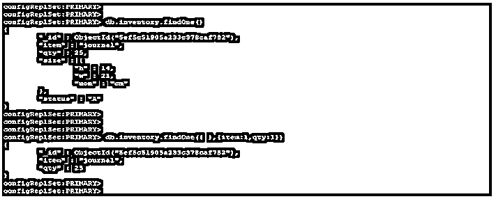
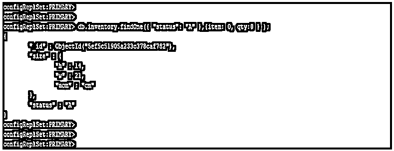

# MongoDB findOne()

> 原文：<https://www.educba.com/mongodb-findone/>

## MongoDB findOne()的定义

MongoDB findOne()函数用于返回满足给定查询条件的单个文档。如果给定的查询条件满足多个文档中的条件，那么 MongoDB 中的 findOne 函数将按照文档存储到磁盘的顺序返回第一个文档，基本上，相同条件的文档将按照自然顺序返回。如果我们的集合是 caped 集合，那么 findOne 函数将按照插入顺序返回数据，如果我们的查询不满足从集合中检索行的任何条件，那么 findOne 函数将返回一个空结果。

**语法:**

<small>Hadoop、数据科学、统计学&其他</small>

*   下面是 MongoDB 中 findOne 函数的语法。

`name_of_collection.findOne (Query, Projection)`

`findOne (Query, Projection)`

**参数:**

下面是 MongoDB 中 findOne 函数的参数描述语法。

*   **名称:**定义为集合的名称。
*   这是 MongoDB 中用来从集合中检索单个文档的函数。
*   **查询:**该参数的类型是 MongoDB 中的文档。这个参数主要用于在 MongoDB 中使用查询操作符指定查询的标准。
*   **Projection:** 这类参数基本上是在 MongoDB 中使用运算符来指定字段的返回。如果我们没有使用这个参数，那么它将返回匹配文档中的所有字段。

### MongoDB findOne()函数起作用

*   下面是 MongoDB 中 findOne 函数的工作方式。
*   基本上，我们在 findOne 函数查询和投影中使用了两个参数。
*   带有 findOne 函数的 Projection 参数将采用以下形式的文档。

`{Collection_field1: <type or boolean>, Collection_field2: <type or boolean>, Collection_field3: <type or boolean>, …, Collection_fieldN: <type or boolean>}`

*   Type 或 boolean 被定义为包含或排除 MongoDB 中文档的值。
*   True 定义为值为 1 或 true。基本上，如果我们没有用 findOne 函数指定 projection 的参数，MongoDB 中的 findOne 函数会指定 _id 字段。
*   False 被定义为值为 0 或 false。
*   findOne 函数中的 Projection 参数不会将 exclude 和 include 规范与 _id 异常字段混合。
*   MongoDB findOne 函数基本上返回单个文档，但不会返回集合中的光标。
*   在 MongoDB findOne 函数中，如果我们使用了投影参数，那么 findOne 函数将返回在投影中使用的字段。
*   下面的例子表明，如果我们使用了 projection 参数，那么 findOne 函数将返回在投影中使用的字段。
*   在第一个例子中，我们使用了 findOne 函数，但没有指定投影参数，它将返回指定文档中的所有字段。
*   在第二个示例中，我们用 findOne 函数指定了投影。指定投影后，它将只返回我们在查询中指定的字段。

`db.inventory.findOne()
db.inventory.findOne({ },{item:1,qty:1})`

*   如果集合文档包含来自集合 findOne 的多个匹配字段，该函数将返回集合中的第一个文档。
*   下面的例子表明，如果集合文档包含集合中的多个匹配字段，findOne 函数将返回集合中的第一个文档如下。

`db.inventory.find()
db.inventory.findOne({"status" : /^A/ })`

*   在上面的示例查询中，我们指定了返回包含状态为 A 的文档的查询，它将使用 MongoDB 中的 findOne 函数从集合中只返回一个文档。
*   在上面的 findOne 函数示例中，我们检索了第一个包含状态为。

### MongoDB findOne()的示例

*   下面是 MongoDB 中 findOne 函数的一个例子。我们使用库存集合来描述 MongoDB 中 findOne 函数的一个例子如下。
*   下面是库存收款单据。

`db.inventory.find()`

*   **找到一个带空参数的函数**

以下示例显示了带有空参数列表的 findOne 函数。

`db.inventory.findOne()`

*   **使用查询参数**查找一个函数

以下示例显示了带有查询参数的 findOne 函数。我们将查询定义为返回包含数量为 25 的第一个文档。

`db.inventory.findOne({"qty" : 25 })`

*   **查找一个排除指定字段的函数**

以下示例显示了 findOne 函数从文档中排除指定字段。我们已经从指定的文档中排除了项目和数量字段。

`db.inventory.findOne({ "status": "A" },{item: 0, qty:0 } );`

*   **用投影参数**寻找一个函数

以下示例显示了带有投影参数的 findOne 函数。

`db.inventory.findOne({ },{status:1,qty:1})`

### 推荐文章

这是 MongoDB findOne()的指南。在这里，我们还将讨论 mongodb findone()的语法和参数，以及不同的示例和代码实现。您也可以看看以下文章，了解更多信息–

1.  [蒙戈布排序()](https://www.educba.com/mongodb-sort/)
2.  [蒙戈布进口](https://www.educba.com/mongodb-import/)
3.  [MongoDB 监控](https://www.educba.com/mongodb-monitoring/)
4.  [MongoDB 关系](https://www.educba.com/mongodb-relationships/)

