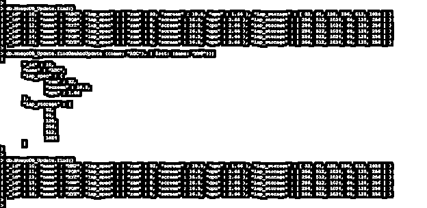
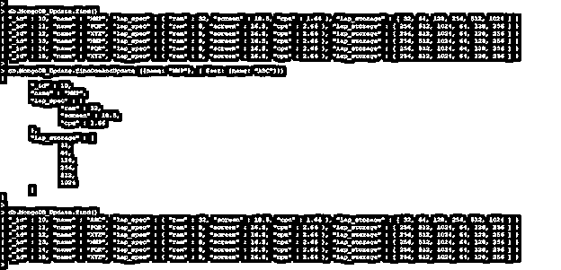
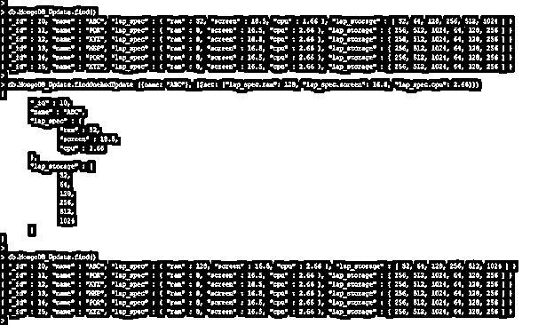
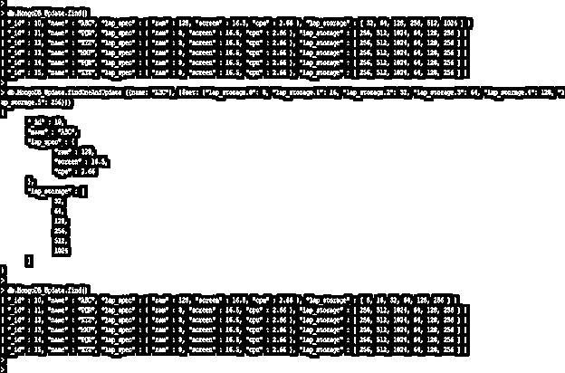
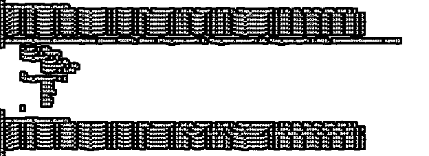
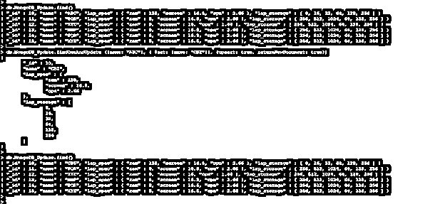

# Mongodb findOneAndUpdate

> 原文：<https://www.educba.com/mongodb-findoneandupdate/>

## Mongodb findOneAndUpdate 简介

MongoDB findOneAndUpdate 方法用于更新集合中的单个文档；我们可以根据查询中使用的排序标准和过滤器来更新单个文档。我们需要在 findOneAndUpdate 方法中使用集合名称来更新指定集合中的文档。我们可以在 findOneAndUpdate 方法中使用多个参数，如 upsert、returnNewDocument 和 arrayFilters 此外，findOneAndUpdate 方法将更新匹配查询选择标准的第一个文档。如果我们的选择标准匹配集合中的多个文档，findOneAndUpdate 方法将只更新第一个匹配的文档。

**语法**

<small>Hadoop、数据科学、统计学&其他</small>

下面是 MongoDB findOneAndUpdate 方法的语法。我们可以使用这种方法更新单个文档。

`db.name_of_collection.findOneAndUpdate (
{Selection criteria of update query using findOneAndUpdate method}, {$set operator} {Upsert (optional), returnNewDocument (Optional), collation (optional), arrayFilters (Optional), sort (optional)}
)`

**MongoDB****中** **findOneAndUpdate 方法的参数说明。**

*   **集合的名称–**该参数被定义为集合名称，我们使用 findOneAndUpdate 方法来更新单个文档。
*   **findOneAndUpdate****–**这是 MongoDB 中用来更新集合中单个文档的方法名。
*   **更新查询的选择条件—**在本节中，我们定义了更新单据的选择条件。在这个选择标准中定义了我们要更新的文档。
*   **$set 操作符–**该操作符在 MongoDB 中用于更新任何文档。它会用新值更新或替换现有值。
*   **up sert–**它是一个可选参数，与 MongoDB 中的 findOneAndUpdate 方法一起使用。要在 findOneAndUpdate 方法中使用该参数，我们需要在查询中将该参数值定义为 true。此参数的默认值为 false。
*   **Collation–**这也是 MongoDB 中 findOneAndUpdate 方法使用的默认参数。该参数将指定 MongoDB 中排序规则操作的使用。在 findOneAndUpdate 方法中使用此参数时，它将允许用户使用特定于语言的规则。
*   **array filters—**findOneAndUpdate 方法中该参数的类型为数组。此参数显示了我们使用 findOneAndUpdate 修改的数组
*   **排序–**该参数将决定我们要修改哪个文档。排序参数实参的类型是文档。
*   **return new document—**findOneAndUpdate 方法中该参数的类型为 boolean。在 MongoDB 中使用 findOneAndUpdate 方法时，它是一个可选参数。默认情况下，该参数将返回原始文档；要返回更新的文档，我们需要将 returnNewDocument 参数与 findOneAndUpdate 方法一起使用。

### findOneAndUpdate 在 Mongodb 中是如何工作的？

我们需要用 MongoDB 中的 findOneAndUpdate 方法传递一个三参数。前两个参数是必需的，而第三个参数是可选的。

1)更新查询的选择标准

2)要更新的新数据

3)可选参数

*   当我们使用 findOneAndUpdate 方法更新任何文档时，该方法将返回原始文档。因此，它不会返回更新的文档。
*   在下面的例子中，我们看到我们已经将 id 10 的名称从 ABC 更新为 MNP。执行查询后，它将显示 id 为 10 的文档的所有原始详细信息。它不会显示更新的详细信息，但在集合详细信息中，我们可以看到 id 10 文档的名称从 ABC 更新为 MNP。

**代码:**

`db.MongoDB_Update.find ()
db.MongoDB_Update.findOneAndUpdate ({name: "ABC"}, {$set: {name: "MNP"}})
db.MongoDB_Update.find ()`

figure–findOneAndUpdate 方法将返回原始文档。

*   如果我们想要返回更新的文档，那么我们需要用 findOneAndUpdate 方法将 returnNewDocument 参数值作为 true 传递。
*   如果我们在使用选择标准进行搜索时没有找到任何匹配的文档，那么 findOneAndUpdate 方法将返回空值。
*   下面的示例显示，如果我们在集合中没有找到任何匹配的文档，findOneAndUpdate 方法将返回 null 值。
*   在下面的例子中，我们必须找到文件名为 ABC 的文档，但是文件名为 ABC 的文档在集合 MongoDB_Update 集合中不存在，所以它将返回空值。

**代码:**

`db.MongoDB_Update.findOneAndUpdate ({name: "ABC"}, {$set: {name: "MNP"}})
db.MongoDB_Update.find ()`

图-如果在集合中没有找到任何匹配的文档，示例 findOneAndUpdate 方法将返回空值。

**例子**

*   下面的例子展示了 MongoDB 中的 findOneAndUpdate 方法。

**使用 findOneAndUpdate** **方法更新单个文档—**

*   在下面的例子中，我们已经将名称“MNP”更新为“ABC”。我们可以看到，第一个名字“MNP”被更新为“ABC”。

**代码:**

`db.MongoDB_Update.find ()
db.MongoDB_Update.findOneAndUpdate ({name: "MNP"}, {$set: {name: "ABC"}})
db.MongoDB_Update.find ()`

图 7-使用 findOneAndUpdate 方法更新单个文档的示例.

*   **使用 findOneAndUpdate** **方法更新嵌入文档—**

*   在下面的例子中，我们已经更新了嵌入的文档。我们已经为 ABC 字段的名称更新了 lap_spec 集。

**代码:**

`db.MongoDB_Update.find ()
db.MongoDB_Update.findOneAndUpdate ({name: "ABC"}, {$set: {"lap_spec.ram": 128, "lap_spec.screen": 16.5, "lap_spec.cpu": 2.66}})
db.MongoDB_Update.find ()`

图 7-使用 findOneAndUpdate 方法更新嵌入文档的示例.

*   **使用 findOneAndUpdate** **方法更新数组元素—**

*   在下面的例子中，我们已经更新了数组元素文档。我们已经为 ABC 的名称更新了 lap_storage 数组。

**代码:**

`db.MongoDB_Update.find ()
db.MongoDB_Update.findOneAndUpdate ({name: "ABC"}, {$set: {"lap_storage.0": 8, "lap_storage.1": 16, "lap_storage.2": 32, "lap_storage.3": 64, "lap_storage.4": 128, "lap_storage.5": 256}})
db.MongoDB_Update.find ()`

图 7-使用 findOneAndUpdate 方法更新数组元素的示例.

*   **使用 findOneAndUpdate** **方法-**返回更新的文档

*   在下面的例子中，我们已经返回了更新的文档。我们可以看到，我们已经更新了 lap_spec 集，这个更新的结果在输出中返回。
*   我们已经用 findOneAndUpdate 方法传递了 returnNewDocument 参数的真值。

**代码:**

`db.MongoDB_Update.find ()
db.MongoDB_Update.findOneAndUpdate ({name: "XYZ"}, {$set: {"lap_spec.ram": 8, "lap_spec.screen": 16, "lap_spec.cpu": 1.66}}, {returnNewDocument: true})
db.MongoDB_Update.find ()`

图-使用 findOneAndUpdate 方法返回更新文档的示例。

*   **使用 findOneAndUpdate 方法更新插入参数—**
*   在下面的例子中，我们使用了 upsert 参数。我们已经把名字从 ABC 更新为 CBZ。

**代码:**

`db.MongoDB_Update.find ()
db.MongoDB_Update.findOneAndUpdate ({name: "ABC"}, {$set: {name: "CBZ"}}, {upsert: true, returnNewDocument: true})
db.MongoDB_Update.find ()`

图–使用 findOneAndUpdate 方法的 Upsert 参数示例。

### 结论

我们可以使用 findOneAndUpdate 方法更新单个文档。如果有多个文档符合我们的选择标准，那么它将更新集合中的第一个文档。此方法将返回原始文档；如果我们想返回一个更新的值，那么我们需要使用 returnNewDocument 参数。

### 推荐文章

这是 Mongodb findOneAndUpdate 的指南。这里我们讨论 findOneAndUpdate 如何在 MongoDB 中工作，以及 Mongodb 中 findOneAndUpdate 方法的参数描述。您也可以看看以下文章，了解更多信息–

1.  [MongoDB 加入](https://www.educba.com/mongodb-join/)
2.  [蒙戈布排序()](https://www.educba.com/mongodb-sort/)
3.  [MongoDB 分片](https://www.educba.com/mongodb-sharding/)
4.  [MongoDB 用户](https://www.educba.com/mongodb-users/)

