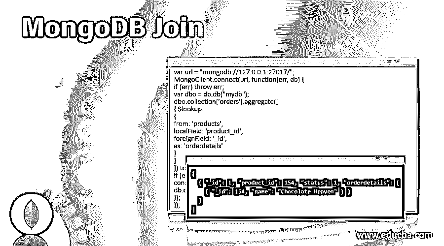

# MongoDB 加入

> 原文：<https://www.educba.com/mongodb-join/>

## JS MongoDB Join 简介

加入我们 NoSQL 和 SQL 数据库的最大区别之一。使用它们之间的公共字段，SQL 中的 Join 子句允许我们将两个或更多表中的行组合起来。在本主题中，我们将了解 MongoDB Join。

并不总是没有连接=没有 SQL。

<small>Hadoop、数据科学、统计学&其他</small>

MongoDB 面向文档的数据库旨在存储非规范化的数据。MongoDB 3.2 版本中引入了一个新的查找操作，即$lookup。该操作可以对两个以上的集合执行类似左外连接的操作。但是，仅在聚合运算中允许使用查找运算符。

### JS MongoDB 连接聚合的语法

`$lookup`

让我们假设这些就像是对结果进行分组、查询和过滤的操作符管道。一个操作符的输出被用作下一个操作符的输入。查找查询比聚集难度级别的查询更容易和简单。并且这些通常会比通常运行得慢。然而，对于复杂的搜索操作来说，这些功能非常强大，是无价的选择。

让我们借助一个例子来理解聚合——

在这个例子中，让我们假设我们正在创建一个拥有大量用户的社交媒体平台。它将用户的所有详细信息存储在单独的文档中。

`{
"_id": ObjectID("96945b421236f5c1883bdac7"),
"name": "User name,(first name and last name)",
"country": "India",
"dob": ("2000-05-18"),
"email: "username@hotmail.com"
}`

我们希望增加必要字段的数量。但是在 SQL 或 MongoDB 中，所有这些都需要一个 unique _id 字段，其中包含一个对自身唯一的值。在 SQL 中，这个唯一值或唯一键称为主键。如果需要的话，它会自动插入。现在，社交网络需要收集帖子，这将帮助我们存储用户数据和大量更新。文档中文本日期和评级的存储是作为引用 user_id ID 字段和放置它的用户来完成的。

让我们创造同样的——

`{
"_id": ObjectID("45b83bc76f5c1969cc1"),
"user_id": ObjectID("96945b421236f5c1883bdac7"),
"date: ("2020-07-16"),
"text": "Hey there, this is kavya. I am waiting for reply",
"rating": "first priority"
}`

MongoDB 中的聚合查询作为管道操作符数组传递，该数组以特定的顺序定义每个操作符。最初，我们需要使用过滤器 match $match 从包含正确评级的帖子集合中提取文档。

`{ "$match":63.0
{
"rating": "first priority"
}
}`

### JS MongoDB Join 是如何创建的？

例如，有名为 publishers 和 books 的表，可以用 SQL 编写如下命令:

`SELECT title.of.the.book, name.of.the.publisher
FROM the.book
LEFT JOIN the.book.id.num.publisher ON id.num.publisher`

这里,. book 的表有一个 id.num.pub 字段，它指向出版商的表中的 id 字段。

在实际应用中，这是非常可能的，因为一个出版商可以一次出版数千本书。现在，如果发布者详细信息有优化，我们也可以通过更新发布者详细信息或更改记录来实现。由于每本书的出版商信息没有重复，数据中的冗余是最小的。这种技术被称为规范化。

SQL 数据库和约束特性提供了一系列规范化，以确保关系维护。

**示例—**

`var MongoClient = require('mongodb').MongoClient;
var url = "mongodb://127.0.0.1:27017/";
MongoClient.connect(url, function(err, db) {
if (err) throw err;
var dbo = db.db("mydb");
dbo.collection('orders').aggregate([
{ $lookup:
{
from: 'products',
localField: 'product_id',
foreignField: '_id',
as: 'orderdetails'
}
}
]).toArray(function(err, res) {
if (err) throw err;
console.log(JSON.stringify(res));
db.close();
});
});`

**输出:**

### 结论

Lookup 非常强大和有用，即使在基本的例子中，它所需要的也只是一个聚合查询复杂度。对于更强大的 join 子句，它不是 SQL 中提供的替代品，MongoDB 也没有提供约束。城市邮政文件将保留，即使你将文件被删除。应该很少需要查找操作员。如果您非常需要数据存储，那么您可能使用了错误的数据存储。如果您有关系数据，请使用关系 SQL 数据库。

### 推荐文章

这是 MongoDB Join 的指南。这里我们讨论 JS MongoDB Join 是如何创建的，以借助一个例子来理解聚合。您也可以看看以下文章，了解更多信息–

1.  [MongoDB 监控](https://www.educba.com/mongodb-monitoring/)
2.  [MongoDB 自动增量](https://www.educba.com/mongodb-auto-increment/)
3.  [MongoDB 特性](https://www.educba.com/mongodb-features/)
4.  [MongoDB 认证](https://www.educba.com/mongodb-authentication/)

