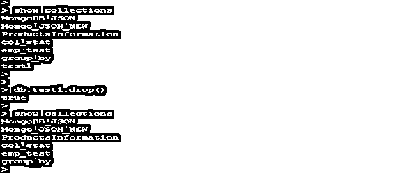
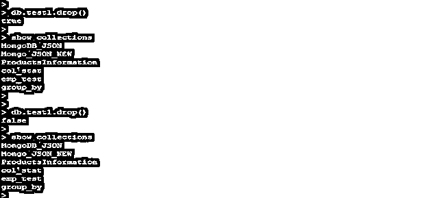
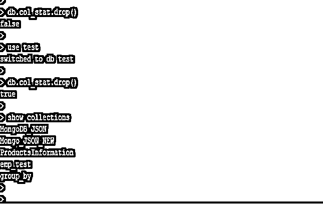
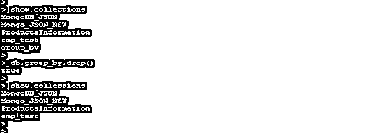
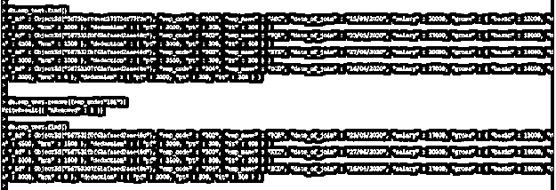
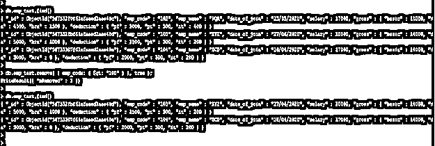

# MongoDB 删除集合

> 原文：<https://www.educba.com/mongodb-delete-collection/>

## MongoDB 删除集合简介

MongoDB delete 集合在 MongoDB 中有两个可用的方法，在 MongoDB 数据库服务器中执行 drop 命令后，它将以 true 或 false 格式给出结果。如果数据库中存在该集合，并且它将成功删除，那么它将返回 true 结果。如果数据库中不存在该集合，并且它不会成功删除，那么它将返回 false 结果。我们可以使用 drop and remove 方法从 MongoDB 中删除任何集合，而且我们需要在删除集合时给出集合名称。

**语法:**

<small>Hadoop、数据科学、统计学&其他</small>

下面的语法显示了 MongoDB 中集合的删除。

**1)使用下落法**

`db.collection_name.drop()`

在上面的语法中，集合名称被定义为我们用来从数据库服务器中删除的集合的名称。

Drop 方法用于从数据库服务器中删除指定的集合。

**2)使用移除方法**

1) `db.collection_name.remove ({})`

2) `db.collection_name.remove (<query>, {Writeconcern, justone})`

在上面的语法中，集合名被定义为我们必须从中删除文档。

Remove 是我们用来从集合中删除文档的方法。

如果我们传递空结果集({ }) remove 方法将从集合中删除所有文档。

查询参数被定义为从集合中删除指定的文档，这是我们在查询中提供的标准。

只有一个参数被定义为只从集合中删除一个文档。我们需要通过将关键字指定为 true 来启用它。在选择标准中使用 true 关键字后，仅删除一个文档。如果我们在选择标准中没有使用 true 关键字，那么所有文档都将从集合中删除。使用 Writeconcern 时，将忽略默认使用的 write concern。

### 如何删除 MongoDB 中的收藏？

我们可以使用两种方法删除 MongoDB 中的集合。

1)下降

2)移除

如果我们想要删除整个集合及其索引，那么我们可以使用 drop 方法从数据库中删除任何集合。

使用 drop 方法，集合及其索引将从数据库服务器中删除。

使用 remove 方法时，我们可以从集合中删除指定的文档。

使用 remove 方法，集合中的所有文档都将被删除，但文档的索引会保留，它们不会从数据库服务器中删除。

从数据库服务器中删除任何集合后，它将在下面显示两个结果集。

1)真
2)假

以下示例显示，在从数据库服务器删除集合时，resultset 将显示真值。
在下面的例子中，结果集显示输出为 true。结果集显示结果为 true，因为集合已从数据库服务器中删除。

`> show collections
> db.test1.drop()
> show collections`

以下示例显示，在从数据库服务器中删除集合时，resultset 将显示 false 值。

在下面的示例中，结果集将输出显示为 false。resultset 将输出显示为 false，因为集合没有从数据库服务器中删除，或者不在数据库中。

`> show collections
> db.test1.drop()
> show collections`

要从数据库中删除任何集合，首先，我们需要连接到特定的数据库。当我们没有连接或使用指定的数据库时，不会删除集合。

下面的示例显示了在从数据库中删除集合之前，我们需要使用指定的数据库。

`> db.col_stat.drop()
> use test
> db.col_stat.drop()
> show collections`

第一次我们在删除集合时没有使用指定的数据库，同时它会显示错误的结果，所以集合没有从数据库中删除。

第二次使用指定的数据库，然后使用 drop 方法时，集合被删除，结果集显示为 true。

### 例子

下面的例子展示了 MongoDB 中的 delete 集合。

#### 1)使用 drop 方法删除集合

在下面的示例中，我们使用 drop 方法删除了集合。我们已经从测试数据库中删除了 group by 集合。

**代码:**

`> show collections
> db.group_by.drop()
> show collections`

#### 2)使用 remove 方法从集合中删除指定的文档

在下面的例子中，我们使用指定的标准从集合中删除了指定的文档。

我们已经删除了 emp_code 为 101 的文档。emp_test 集合中 emp_code 为 101 的所有文档被删除。

**代码:**

`> db.emp_test.find()
> db.emp_test.remove({emp_code:"101"})
> db.emp_test.find()`

#### 3)仅使用一个参数从集合中删除单个文档

在下面的示例中，我们仅使用一个参数从集合中删除了单个文档。

我们对 emp_code 参数使用了大于 100 的标准。在集合中，我们看到了 emp_code 大于 100 的 3 个文档，但是只有一个文档被删除，同时只将一个参数值定义为 true。

**代码:**

`> db.emp_test.find()
> db.emp_test.remove({emp_code: {$gt: "100" } }, true );
> db.emp_test.find()`

#### 4)使用 remove 方法从集合中删除所有文档

在下面的例子中，我们使用 remove 方法删除了 emp_test 集合中的所有文档。

我们没有使用 remove 命令定义任何选择标准，因此 emp_test 集合中的所有文档都将被删除。

我们可以看到，在下面的例子中，emp_test 中的所有文档都将被删除，但是表的索引和结构没有被删除。

**代码:**

`> db.emp_test.find()
> db.emp_test.remove({ })
> db.emp_test.find()
> show collections`

### 结论

使用 drop 方法，我们可以删除集合及其索引，使用 remove 方法，我们可以从集合中删除单个或所有文档。如果数据库中存在该集合，resultset 会将结果显示为 true，否则会在输出中显示 false。

### 推荐文章

这是一个 MongoDB 删除集合的指南。这里我们讨论一下定义，如何在 MongoDB 中删除集合？并分别举例说明。您也可以看看以下文章，了解更多信息–

1.  [什么是 MongoDB？](https://www.educba.com/what-is-mongodb/)
2.  [MongoDB 加入](https://www.educba.com/mongodb-join/)
3.  [MongoDB findOne()](https://www.educba.com/mongodb-findone/)
4.  [MongoDB 分组依据](https://www.educba.com/mongodb-group-by/)

