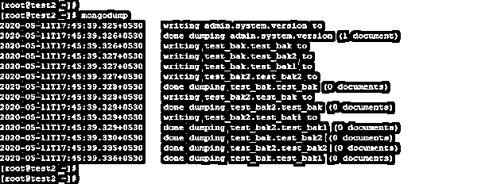
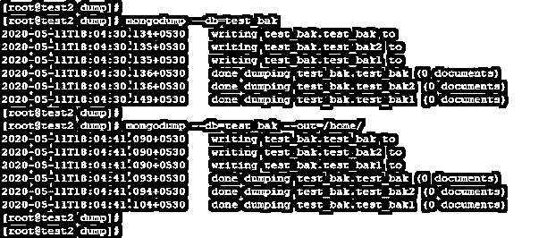

# MongoDB 中的备份

> 原文：<https://www.educba.com/backup-in-mongodb/>

## MongoDB 中的备份简介

备份在每个数据库中都是必不可少的，对于从丢失中恢复数据非常有用。我们已经对数据库进行了备份，以应用每个数据库的备份策略，因此只能恢复数据。基本上，MongoDB 中有两种类型的备份可用，即 cp 或 rsync 和 mongodump 备份。

### 如何在 MongoDB 中创建备份？

下面是 MongoDB 中可用的备份类型。

<small>Hadoop、数据科学、统计学&其他</small>

*   热备份(Mongodump / Mongorestore)
*   冷备份(cp 和 rsync)

我们必须使用 mongodump 命令在 MongoDB 中进行热备份。使用 mongodump，我们可以备份单个数据库和单个集合。我们可以使用 mongodump 命令对整个数据库服务器进行备份，并从远程服务器进行备份。我们也可以使用系统工具对 MongoDB 服务器进行备份；这称为系统级备份。Mongodump 和 mongorestore 备份实用程序可以处理 BSON 数据转储，对于创建小型数据库集合的备份非常有用。

#### 1.热备份(Mongodump / Mongorestore)

*   我们可以在 MongoDB 实例运行时备份集合或数据库。Mongodump 数据库实用程序通过连接到 mongodb 实例来进行数据库备份。
*   我们可以使用 MongoDB 中的 mongodump 工具备份整个服务器、单个数据库、单个集合或部分集合。
*   我们还可以使用–host 从另一台主机获取备份，以连接到该主机。
*   Mongodump 会将输出写入 BSON 文件，这些文件保存了可从 mongod 实例访问的数据。
*   下面是 mongodump 命令的语法和示例。

##### 1.使用 mongodump 进行整个数据库服务器备份

*   我想我们必须在同一个数据目录中进行备份，然后使用下面的命令。
*   在下面的示例中，我们在发出命令的同一个目录中进行了备份。

**代码:**

`mongodump`

**输出:**

在下面的例子中，我们将整个数据库备份到/home 目录中。为了将备份放入不同的目录，我们在 mongodump 中使用了–a 标志。

**代码:**

`mongodump --out=/home/`

**输出:**

##### 2.使用 mongodump 进行单个数据库备份

我们可以在同一个分区或不同的分区进行单个数据库备份。下面是使用 mongodump 命令进行单个数据库备份的语法和示例。

**语法**

`mongodump --db=database_name
mongodump --db=test_bak –out=(partition mount point on which we have taken backup)`

**代码:**

`mongodump --db=test_bak
mongodump --db=test_bak –out=/home/`

**输出:**

##### 3.使用 mongodump 进行单个集合备份

我们可以在同一个分区或不同的分区中进行单个集合备份。下面是使用 mongodump 命令进行单个集合备份的语法和示例。

**语法**

`mongodump --db=database_name –collection=collection_name
mongodump --db=test_bak –collection=collection_name –out=(partition mount point on which we have taken backup)`

**代码:**

`mongodump --db=test_bak --collection=test_bak2
mongodump --db=test_bak --collection=test_bak2 --out=/home/`

**输出:**

#### 2.冷备份(使用 cp 和 sync)

*   我们已经在 MongoDB 中使用 cp 和 rsync 命令进行了冷备份。为了进行冷备份，我们需要停止 MongoDB 的服务。
*   冷备份是数据库的完整备份。我们无法从完整的数据库转储中恢复单个集合或数据库。
*   我们需要停止 MongoDB 的服务；如果我们不能停止 MongoDB 的服务，那么我们的备份将会不一致。
*   我们可以在 MongoDB 中使用 cp 和 rsync 命令复制数据库的直接文件。热备份是数据库服务器的一致备份。
*   使用冷备份时间点，不可能在 MongoDB 中恢复副本集。我们无法使用冷备份设置时间点恢复。
*   下面是采取冷备份的方法。

##### 1.使用 cp 命令

下面的例子显示了在 MongoDB 中使用 cp 命令进行备份。

**语法**

`cp –aRp (path of data directory files) (Backup copied location)`

**代码:**

`systemctl stop mongod
cp -aRp /var/lib/mongo/ /home/
echo $?`

**输出:**

##### 2.使用 rsync 命令

下面是一个使用 rsync 命令进行备份的示例。

**语法**

`rsync (path of data directory files) (Backup copied location)`

**代码:**

`systemctl stop mongod
rsync -avzh /var/lib/mongo/ /home/`

**输出:**

### 推荐文章

这是 MongoDB 中的备份指南。这里我们讨论一个关于 MongoDB 中备份的介绍，以及如何用例子创建一个备份。您也可以浏览我们的其他相关文章，了解更多信息——

1.  [MongoDB 管理](https://www.educba.com/mongodb-administration/)
2.  [MongoDB 收藏](https://www.educba.com/mongodb-collection/)
3.  [MongoDB 创建索引](https://www.educba.com/mongodb-create-index/)
4.  [MongoDB 替代品](https://www.educba.com/mongodb-alternatives/)

