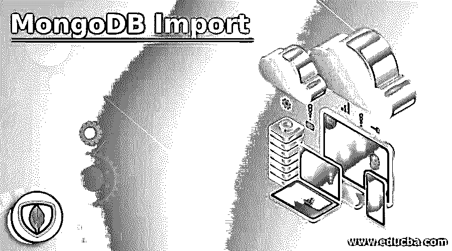
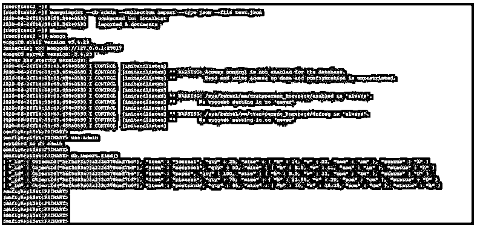
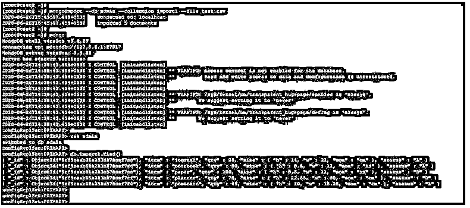
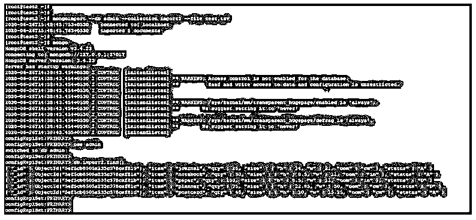

# MongoDB 导入

> 原文：<https://www.educba.com/mongodb-import/>

## MongoDB 导入简介

MongoDB Import 命令用于从 TSV、CSV 或 JSON 文件中导入文档。MongoDB 导入是 MongoDB 中工具包的一部分，我们可以从官方下载中心下载这个导入包。

### MongoDB 导入的语法

下面是 MongoDB 导入的语法。

<small>Hadoop、数据科学、统计学&其他</small>

`Mongoimport --host (host name) -u (name of user) -p (password of user) --authenticationDatabase (admin database used for authentication)   --db (Name of database) --collection (name of collection) --drop --file /name_of_file (Name of file which was we have used to import into collection)`

**下面是 MongoDB 导入的参数描述语法:**

*   **Mongoimport:** 该命令用于使用 CSV、TSV 和 json 文件将数据加载到集合中。
*   **Uri:** 这被定义为我们在 MongoDB 中从文件导入数据时使用的连接 URL。
*   **用户名:**这是我们从文件导入数据时使用的用户名。
*   **用户密码:**定义为我们从文件导入数据时使用的用户密码。
*   **主机名:**这是我们从文件导入数据时使用的数据库服务器的主机名。
*   **端口号:**定义为我们从文件导入数据时使用的数据库服务器的端口号。
*   **数据库名称:**这被定义为我们从文件中导入数据的数据库的名称。
*   **集合名称:**这被定义为集合的名称，我们将从 MongoDB 中的文件中导入数据。
*   **认证数据库:**从文件导入数据时，我们需要定义认证数据库。
*   **文件名:**该参数定义为我们将数据导入集合的文件的名称。我们可以在 MongoDB 中导入 CSV、TSV 和 JSON 文件中的数据。
*   **副本集名称:**从文件导入数据时，我们必须在将数据导入集合时定义副本集名称。

### 导入命令在 MongoDB 中是如何工作的？

在将数据从文件导入集合时，我们需要定义数据库名称、用户名、端口号、用户密码和导入文件名。我们使用扩展的 json 格式数据将数据从 json 文件导入到集合中。在 MongoDB 的新版本中，我们使用扩展的 json 格式数据文件将文档从文件导入到集合中。

在将数据导入集合时，我们在 MongoDB 的 mongoimport 命令中使用了以下选项。

*   数据库名称
*   集合名称
*   用户名
*   用户口令
*   主机名
*   端口名
*   认证数据库
*   副本集名称
*   认证机制
*   文件名
*   丢弃关键字

从 MongoDB 版本开始，我们已经插入了 json 文件中的文档，这些文档将按照它们在文件中出现的顺序插入。当文档从输入文件中出现时，它们将按顺序插入到集合中。通过在 MongoDB 中使用 mongoimport 命令，可以批量插入订单数据。我们维护了插入顺序标志，以便按照 MongoDB 中的插入顺序插入文档。

### 例子

下面是 MongoDB 导入的示例:

#### 示例#1

使用 JSON 文件将数据导入集合。

下面的例子显示了使用 JSON 文件将数据导入到集合中。我们已将数据导入导入集合。在将数据插入导入集合时，我们使用数据库名称作为 admin。

**代码:**

`mongoimport --db admin --collection import --type json --file test.json
mongo
use admin
db.import.find()`

**输出:**

#### 实施例 2

使用 CSV 文件将数据导入集合。

以下示例显示了使用 CSV 文件将数据导入到集合中。我们已经将数据导入到 import1 集合中。在将数据插入到 import1 集合时，我们使用数据库名称作为 admin。

**代码:**

`mongoimport --db admin --collection import1 --file test.csv
mongo
use admin
db.import1.find()`

**输出:**

#### 实施例 3

使用 TSV 文件将数据导入集合。

下面的例子显示了使用 TSV 文件将数据导入到集合中。我们已经将数据导入到 import2 集合中。在将数据插入到 import2 集合时，我们使用数据库名称作为 admin。

**代码:**

`mongoimport --db admin --collection import2 --file test.tsv
mongo
use admin
db.import2.find()`

**输出:**

### 推荐文章

这是一个 MongoDB 导入的指南。这里我们讨论一下入门，import 命令在 MongoDB 中是如何工作的？和示例。您也可以看看以下文章，了解更多信息–

1.  [MongoDB Skip()](https://www.educba.com/mongodb-skip/)
2.  [MongoDB 自动增量](https://www.educba.com/mongodb-auto-increment/)
3.  [MongoDB 分片](https://www.educba.com/mongodb-sharding/)
4.  [MongoDB 特性](https://www.educba.com/mongodb-features/)

