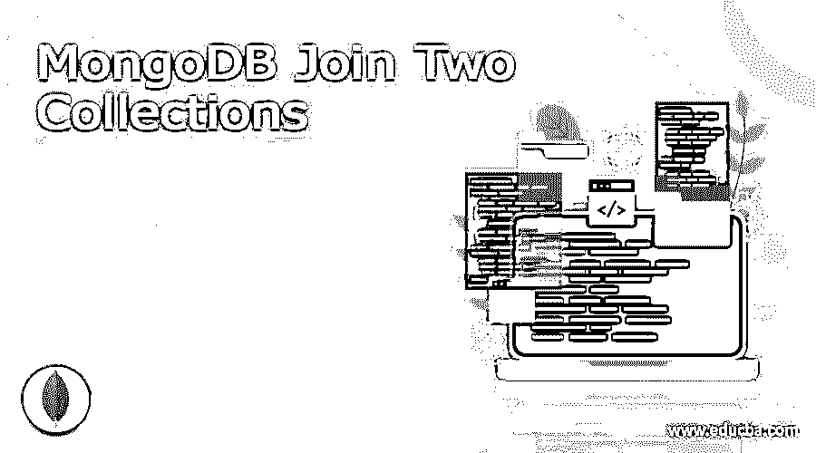

# MongoDB 连接两个集合

> 原文：<https://www.educba.com/mongodb-join-two-collections/>

## MongoDB 上连接两个集合的定义

MongoDB 是一个 NoSQL 数据库，是最常见的可访问文档之一，它既存储为完全受控的云服务，也用于部署在自我管理的基础设施上。因为 MongoDB 不是 RDBMS 类型，但是用户仍然可以通过$lookup 阶段执行左外部连接。stage $lookup 允许您声明用户需要将哪个集合加入当前集合，以及哪些字段必须匹配。

在 MongoDB 中，除非使用基本的脚本查询函数，否则很难将数据从一个集合关联到另一个集合。因此，为了解决这个问题，引入了 JOIN 概念，它简化了数据关系。MongoDB 对两个集合的连接操作是通过使用 3.2 版开发的$lookup 操作符来执行的。

<small>Hadoop、数据科学、统计学&其他</small>

**语法:**

MongoDB JOIN 操作背后的关键概念是实现一个集合数据与另一个集合数据之间的关联。这是通过使用$lookup 操作符完成的，因此，连接两个集合的基本语法可以定义如下:

`{
$lookup:
{
From:<join collections>,
localField: <input documents’ field>,
foreignField:<documents’ field of the ‘from’ collection>,
as: <result array field>
}
}`

$lookup 运算符处理具有以下字段的文档:

*   From:它声明了同一个数据库中的集合，用于执行带有但带有分片集合限制的连接。
*   LocalField:它表示从文档输入到$lookup 阶段的字段，该阶段操作本地字段与来自集合“from”的文档的外部字段的等价匹配。当输入文档没有本地字段值时，该操作符将赋予该字段一个空值，以便进一步匹配。
*   foreignField:它声明“from”集合中文档的字段，该集合对输入文档中的 foreignField 和 localField 进行等价匹配。当集合“from”中的文档没有 foreignField 的值时，该运算符将赋予该字段一个空值，以便进一步匹配。
*   As:它声明了添加到输入文档中的新数组字段的名称。此外，新的数组字段包括来自集合“from”的匹配文档。但是当所述名称已经在输入文档中占优势时，则占优势的字段将被覆盖。

在 SQL 概念的情况下，连接操作的结果总是一个不同的行，它将父表和外表中的所有字段关联起来。但是在 MongoDB 中，情况有所不同，输出文档被补充为一组原生集合文档。

### 如何在 MongoDB 中加入两个集合？

为了连接 MongoDB 集合，我们需要将操作符实现为$lookup，它被定义为执行与其他集合的左外部连接的阶段，也有助于从连接的文档中过滤数据信息。假设用户需要获取所有学生的成绩，那么可以编写下面的查询:

`Students.aggregate([{
$lookup: {
From: ‘Grades’,
LocalField: ‘Student_id’,
foreignField: ‘Stud_id’,
as: ‘Student_grade’
}}]);`

我们可以在上面的查询中看到，名为“from”的初始参数表示要与当前集合联接的集合，另一方面，“localField”参数表示当前集合中的主要键，该键将通过“foreignField”参数与另一个集合中的外键匹配。在这里，来自学生的 stud_id 和来自年级的 stud _ id 被匹配和连接，以便检索数据。此外，结束参数“as”作为代码名添加到数据中。

必须注意，在查找结果的每条记录中，来自连接表的数据也作为主要元素出现在数组中，上面查询的输出数据中的每一行都显示为，

`{_ID: String, Quantity: Number, Student_id: String, Student_grade: Array, Stud_id: String, Student_name: String}`

这里，在 grades 数组中，初始元素将是查询连接的数据。

### 例子

让我们用几个例子来说明 MongoDB 中两个集合的连接，解释如下:
假设我们创建了两个集合，分别命名为 students 和 marks as，

**学生:**

`{“_id”: 1, “name”: “Nikhil Singh”, “age”: 25, “grade”: “A”}
{“_id”: 2, “name”: “Kiran Sharma”, “age”:20, “grade”: “B”}
{“_id”: 3, “name”: “Krishna Raj”, “age”: 19, “grade”: “A”}
db.Students.find()`

**标记:**

`{“_id”: 1, “English”: “A”, “Maths”: “B”, “Science”: “A”}
{“_id”: 2, “English”: “C”, “Maths”: “A”, “Science”: “B”}
{“_id”: 3, “English”: “B”, “Maths”: “C”, “Science”: “A”}
db.Grades.find()`

我们可以使用下面定义的连接方法，通过$lookup 操作符获取学生的相应分数:

`Db.getCollection(‘Students’).aggregate([{
$lookup:
{
From: “Grades”,
localField: “_id”,
foreignField: “_id”,
as: “StudentMarks”
}
}])`

在执行时，输出将提供以下结果，

`{“_id”: 1, “name”: “Nikhil Singh”, “age”: 25, “grade”: “A”, “StudentMarks”: [{“_id”: 1, “English”: “A”, “Maths”: “B”, “Science”: “A”}]}`

书面查询的结构可以决定性能持续时间。例如，当一个集合中有几个文档在另一个集合中时，需要从一个集合中聚合较小的文档，然后在具有各种文档的集合中查找。与对具有各种文档的集合中存在的选定字段执行多次查找相比，对较小文档集合中的选定字段执行的这种类型的查找是相当精细的，并且进行的时间更短。因此，最初放置较小的集合是明智的。

但是在关系数据库的情况下，数据库的顺序没有问题，因为大多数 SQL 解释器都包括优化器，这些优化器提供对附加信息的访问，以选择哪一个必须是主要的。

在这个 MongoDB 中，为了简化连接操作，我们可能需要实现一个索引。因为所有的 MongoDB 文档都包含一个 _id 键，对于关系 DBM 来说，这个键被作为主键。除了在$lookup 外键中应用关联操作之外，索引还提供了一个更好的机会来最小化需要检索的数据量。

### 结论

连接操作符是 SQL 数据库和 NoSQL 数据库之间的基本区别特征之一。在 SQL 数据库中，用户可以在相同或不同数据库中的两个表之间执行连接操作。

虽然 MongoDB 中 JOIN 的情况各不相同，但 MongoDB 允许在相似数据库中实现的两个集合之间执行 JOIN 操作。

### 推荐文章

这是一个关于 MongoDB 连接两个集合的指南。这里我们讨论定义，如何在 MongoDB 中加入两个集合？并分别举例说明。您也可以看看以下文章，了解更多信息–

1.  [MongoDB 加入](https://www.educba.com/mongodb-join/)
2.  [MongoDB 分组依据](https://www.educba.com/mongodb-group-by/)
3.  [蒙戈布进口](https://www.educba.com/mongodb-import/)
4.  [MongoDB 分片](https://www.educba.com/mongodb-sharding/)

