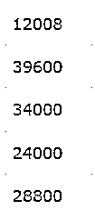

# MongoDB 按多个字段分组

> 原文：<https://www.educba.com/mongodb-group-by-multiple-fields/>

## 通过多个字段介绍 MongoDB 组

Mongo DB 按多个字段分组是通过使用各种方法完成的。对 MongoDB 文档中的多个字段进行分组的一种有效方法是使用$group 操作符，这有助于对分组后的数据执行各种其他聚合功能。

在本文中，我们将讨论使用 Mongo DB 中的操作符对文档中不同的多个字段进行分组的三种方式，这三种方式分别被列为单用户聚合操作、聚合管道和 MapReduce 编程模型。我们还将看看与聚合一起使用的操作符列表，以及我们如何在某些示例的帮助下实现它。

<small>Hadoop、数据科学、统计学&其他</small>

**组运算符的语法:**

用于聚合 MongoDB 中多个字段的$group 操作符的输入和输出只不过是 Mongo DB 数据库的文档记录。它接受单个文档并返回单个或多个文档。在使用 Mongo DB 中的任何字段时，我们将通过在字段名前面加上美元符号($)来引用它，比如字段的$name。我们可以使用不同种类的运算符对多个字段进行分组，如下所示

*   $ first–该操作符用在“按多个字段分组”操作中，从执行排序时最常用的分组文档中只获取一个第一个文档。
*   $ push–该操作将在结果字段中插入一个新的字段值。
*   $ last–该操作将在最后的结果字段中插入一个新的字段值。
*   $ addToSet——它有助于向结果文档数组的现有值添加一个新值，而不会发生任何重复。
*   $ min——该操作符有助于找出并返回最小的整数值或提供并传递的整数值中的最小值。
*   $ avg–它将计算字段之间所有指定数值的平均值。
*   $ max——该操作符有助于找出并返回最大的整数值或提供并传递的整数值中的最大值。
*   $ sum–它将计算字段之间所有指定数值的总和或总值。

### 聚合管道

当多线程 POSIX 模式设置为 true 时，对 MongoDB 中的字段进行分组的另一种方法是使用管道。当由特定的一组线程执行流水线中的数据流时，考虑特定的顺序。用于聚合的管道由阶段组成。当文档在特定阶段被处理时，结果被转移到下一个阶段，以此类推。
使用聚合管道时。我们可以通过使用聚合物管功能过滤出满足标准的文档。它还用于改变输出文档的格式并进行转换。
为聚合管道的每个级别定义阶段运算符。阶段操作符可以在内部使用表达式操作符，在级别的每个阶段之前换行，甚至计算平均值或总和，或者连接一个特定值。聚合管道的最终结果被认为是要返回的最终输出，如果需要，甚至可以存储在集合中。

### 处理流程

对多个字段进行分组的第三种方式是利用处理流程，我们需要考虑以下几点

通过使用 Db.collection.aggregate()函数，我们可以利用多个通道同时处理数据。

如果我们使用 Db.collection.aggregate()函数，我们不需要编写任何自定义 JS 例程来实现 group by 的功能，就像 SQL group by 的功能一样，因为它在内部高效地进行聚合，并且还支持在其中使用多个操作。

管道中每个阶段的限制是 100 MB。如果我们试图使用超过 MongoDB 中 100 MB 限制的短语，就会出现错误。处理大量数据的解决方案是使用 allowDisk 属性，该属性可以设置为 true，如果我们在聚合管道节点中使用 100 MB 的内存限制，则所有需要的数据都应该写入临时文件。

Db.collection.aggregate()操作可以以非常有效的方式用于一系列切片，而不会丢失结果中的任何数据，而在使用一系列切片进行 map-reduce 的情况下，有可能会丢失结果。

Db.collection.aggregate()函数以游标的形式返回内存中存储的数据，可以直接作为 MongoShell 使用。

BSON 文档的大小限制为 16 MB，该函数的输出只能存储在一个文档中。

### 分组方法

这与 SQL Group By 子句非常相似，因为它有下面列出的三个参数:

*   key–用于显示组密钥
*   initial–这将有助于为代表文档组的文档字段提供初始值。
*   reduce–这将返回接受参数的元素总数，包括当前元素和聚合 pf 结果文档。

还存在其他可选参数。

**例子**

让我们考虑一个例子。我们有客户的详细信息文档，其内容如下所示—
我们必须计算每个商店的总账单金额。

考虑以下语句，其输出将是

`js > db.users.group ({key: {store_id : true}, initial: {totalBillAmount : 0}, reduce : function (currentValue, result){result.totalBillAmount += 1}}) ``

其输出如下所示

### 结论

我们可以使用各种方法对 MongoDB 中的多个字段进行分组，其中一些方法包括使用聚合管道、$group 操作符和 map-reduce。

### 推荐文章

这是一个由多个字段组成的 MongoDB 组的指南。这里我们分别用实例来讨论 MongoDB 中多个字段的引入、分组的各种方法。您也可以看看以下文章，了解更多信息–

1.  [MongoDB 加入](https://www.educba.com/mongodb-join/)
2.  [MongoDB findOne()](https://www.educba.com/mongodb-findone/)
3.  [MongoDB 分组依据](https://www.educba.com/mongodb-group-by/)
4.  [MongoDB 数据库](https://www.educba.com/mongodb-database/)

