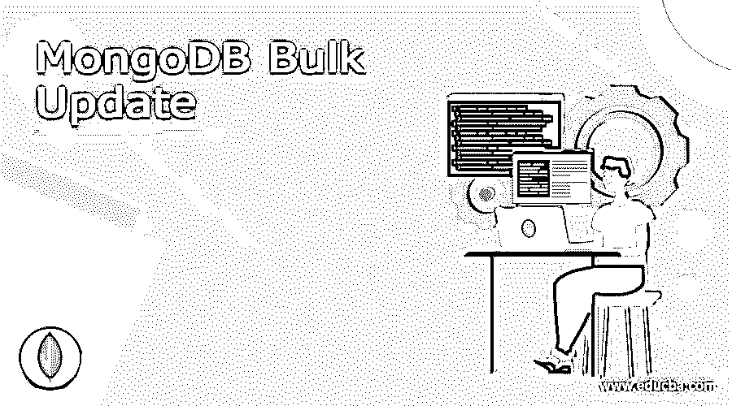
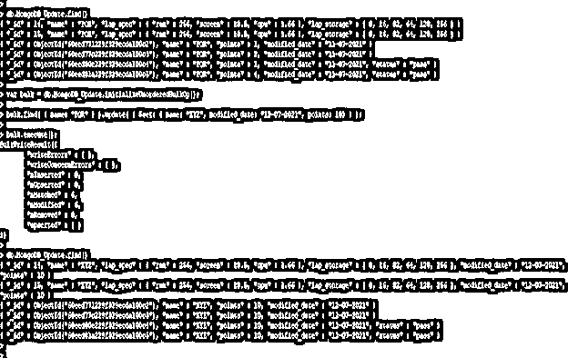

# MongoDB 批量更新

> 原文：<https://www.educba.com/mongodb-bulk-update/>

## MongoDB 批量更新的定义

Mongodb 批量更新方法将多个更新操作添加到批量更新操作列表中，该方法将从现有文档中更新指定的字段。我们用散装的。find()方法来查找我们从 collection 和 bulk 中更新了哪些文档。find.update()方法将更新集合中所有匹配的文档。我们也可以使用散装。find.updateOne()方法更新集合中的单个文档。我们使用集合操作符和批量更新方法来设置字段的更新值。

**语法:**

<small>Hadoop、数据科学、统计学&其他</small>

下面是 MongoDB 批量更新的语法。

`Var bulk = db.collection_name.initializeOrderedBulkOp ();
Bulk.find ( { field_name: value } ) .update ( { $set { field_name1: updated_value, field_name1: updated_value } });
bulk.execute ();`

**MongoDB 批量更新的参数描述语法**

1)集合名称–这被定义为我们用来更新批量文档的集合的名称。我们可以通过使用 MongoDB 中的批量更新方法来更新集合中的多个文档。

2)InitializeOrderedBulkOp–该方法与批量更新方法一起使用，从集合中更新多个文档。我们需要在 MongoDB 中使用批量更新方法时调用这个方法。

3)散装。find–该方法用于从集合中查找我们想要更新的文档。找到文档后，我们在集合中对其进行了更新。

4)字段名——这被定义为一个集合字段，以便从中更新值。我们必须将旧值更新到我们在查询中使用的字段中。

5)Value–使用此参数，我们用集合字段的新值替换了旧值。我们需要在从集合字段更新文档时定义旧值和新值。

6)散装。find . update——这个方法将更新从我们的查询中匹配的多个文档。使用这种方法，我们可以从集合中更新多个文档。

7) Set 操作符–我们已经将该操作符与 update 方法一起使用，以设置文档的新值。在 MongoDB 中更新文档时，我们需要使用一个集合运算符。

8)散装。execute–该方法在一个命令中执行批量查询。我们已经在批量生产中使用了这种方法。MongoDB 中的 find.update 方法。

### MongoDB 中批量更新是如何工作的？

*   MongoDB 批量更新方法，主要用于从集合中更新多个文档。
*   使用 MongoDB 中的 bulk 方法，我们可以对 MongoDB 集合执行批量操作，如更新、删除和插入。
*   我们需要使用 initializeOrderedBulkOp()方法来构造 MongoDB 将运行批量操作的写操作顺序列表。
*   MongoDB 中有两种类型的批量操作构建器可以用来构建有序和无序的操作列表。

1)initialize ordered bulkop()
2)initialize unused dbuskop()

第一种方法用于从 MongoDB 中的集合构造写操作的有序列表。

第二种方法用于从 MongoDB 中的集合构造一个无序的写操作列表。

我们还使用 bulk 方法从 MongoDB 中的一个集合更新多个文档。bulk 方法用于创建写操作列表，以便对单个集合执行批量操作。

我们可以使用 initializeOrderedBulkOp()或 initializeUnorderedBulkOp()方法在 MongoDB 中执行批量操作。

我们需要使用散装。execute()方法来运行由批量方法构建的所有操作。

从 MongoDB 版本开始，4.2 批量更新方法将接受管道聚合。在 4.2 版之前，管道聚合不可用于批量更新方法。

批量更新方法中的 Set 阶段将提供与 set 运算符相同的行为。

要在批量更新方法中使用聚合变量，我们需要在变量前面加上$$符号。

如果不使用前缀$$我们就不能在 MongoDB 的批量更新方法中使用聚合变量。

我们还可以将 upsert 方法与 bulk update 方法结合使用，以便在集合中插入不可用的文档。

批量更新方法将从我们需要从集合中更新的文档中更新特定的字段。

我们用散装的。find()方法来使用我们已经从集合中更新了哪些文档的条件。

我们已经用 MongoDB 中的批量更新方法传递了更新参数。

### 例子

下面是 MongoDB 中批量更新的一个例子。

#### 1)使用 initializeUnorderedBulkOp()生成器进行 MongoDB 批量更新

在下面的例子中，我们必须使用 initializeUnorderedBulkOp()builder 从 MongoDB_Update 集合中更新多个文档。

我们可以看到，我们已经更新了所有包含 PQR 名称的文档。所有文件的名称都从 PQR 更新为 ABC。

**代码:**

`db.MongoDB_Update.find ()
var bulk = db.MongoDB_Update.initializeUnrderedBulkOp ();
bulk.find( { name: "PQR" } ).update( { $set: { name: "ABC"} } );
bulk.execute ();
db.MongoDB_Update.find ()`

**图–使用 initializeUnorderedBulkOp()构建器进行 MongoDB 批量更新的示例。**

#### 2)使用 initializeOrderedBulkOp()生成器进行 MongoDB 批量更新

在下面的例子中，我们使用 initializeOrderedBulkOp()builder 更新了 MongoDB_Update 集合中的多个文档。

我们可以看到，我们已经更新了名称中包含 ABC 的所有文档。所有文件的名称都从 ABC 更新为 PQR。

**代码:**

`db.MongoDB_Update.find ()
var bulk = db.MongoDB_Update.initializeOrderedBulkOp ();
bulk.find( { name: "ABC" } ).update( { $set: { name: "PQR"} } );
bulk.execute ();
db.MongoDB_Update.find ()`

**图–使用 initializeOrderedBulkOp()构建器进行 MongoDB 批量更新的示例。**

#### 3)使用多个字段的 MongoDB 批量更新

在下面的示例中，我们必须通过使用具有多个字段的 initializeOrderedBulkOp()生成器来更新 MongoDB_Update 集合中的多个文档。

我们可以看到，我们已经更新了名称中包含 PQR 的所有文档。所有包含字段名作为名称的文档都从 PQR 更新到 XYZ，我们还可以看到修改日期更新为“12-07-2021 ”,积分字段更新为 10。

**代码:**

`db.MongoDB_Update.find ()
var bulk = db.MongoDB_Update.initializeUnorderedBulkOp ();
bulk.find( { name: "PQR" } ).update( { $set: { name: "XYZ", modified_date: "12-07-2021", points: 10} } );
bulk.execute ();
db.MongoDB_Update.find ()`

**图–使用多个字段的 MongoDB 批量更新示例。**

### 结论

MongoDB 批量更新在 MongoDB 中非常有用，它可以更新集合中符合选择标准的多个文档。我们已经将 initializeOrderedBulkOp()和 initializeUnorderedBulkOp()方法与批量更新方法一起使用。在 MongoDB 中，我们还可以在 4.2 版之后使用带有批量更新方法的聚合管道。

### 推荐文章

这是 MongoDB 批量更新的指南。这里我们讨论定义，MongoDB 中批量更新是如何工作的？并分别举例说明。您也可以看看以下文章，了解更多信息–

1.  [MongoDB findOne()](https://www.educba.com/mongodb-findone/)
2.  [蒙戈布排序()](https://www.educba.com/mongodb-sort/)
3.  [MongoDB 数据库](https://www.educba.com/mongodb-database/)
4.  [蒙戈布进口](https://www.educba.com/mongodb-import/)

