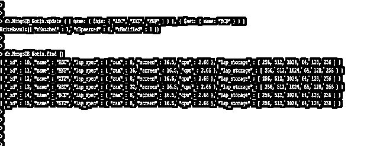

# MongoDB 不在

> 原文：<https://www.educba.com/mongodb-not-in/>

## MongoDB 的定义不在

MongoDB not in is 比较运算符 not in 运算符主要用于选择值与给定值不匹配的文档。我们也可以在数组字段上使用 not in 运算符，使用数组字段 not in 运算符是选择数组元素不存在于我们的选择标准中的数组字段。我们在 MongoDB 中使用了带有$符号的 not in 操作符，它的缩写形式是$nin。我们可以使用 not in 运算符，通过 find 方法选择文档，通过 update 方法更新文档。

**语法**

<small>Hadoop、数据科学、统计学&其他</small>

下面是 MongoDB 中 not in 运算符的语法。

1) MongoDB 不在具有 find 方法的运算符中–

`db.name_of_collection.find ( { field_name: { $nin: [ "value1", "value2" ] } } ).pretty ()`

2) MongoDB 不在具有更新方法的运算符中–

`db.name_of_collection.update ( { field_name: {$nin: ["value1", "value2" ] } }, { $set: { field_name: “value” } } )`

MongoDB 中 not in 运算符的参数描述语法。

1)集合名称–该参数定义为集合的名称，该集合用于选择和更新与给定选择标准不匹配的文档。

2)Find–该方法与 not in 运算符一起使用，用于选择那些不符合我们选择标准的文档。

3)字段名–这是集合的一个字段，与 not in 运算符一起使用，用于从我们的选择标准中更新或选择不匹配的文档，我们在查询中使用了该选择标准。

4)Not in——这个操作符在 MongoDB 中用于从集合中检索或更新不符合我们选择标准的文档。

5)Value–这被定义为我们在 MongoDB 中使用 not in 运算符更新的字段的值。如果我们想在 MongoDB 中搜索任何文档，我们可以使用字段值进行搜索。

6)更新–该方法与 not in 运算符一起使用，更新那些不符合我们选择标准的文档。

7)漂亮——基本上，MongoDB 输出是一种使用查找和更新方法的非结构化格式。当使用 pretty 方法时，我们可以以结构化的格式显示文档输出。

8)Set——在 MongoDB 中对文档进行更新操作时，这是一个重要的参数。我们在 MongoDB 中使用了一个带有 not in 操作符的集合操作符来更新来自给定标准的不匹配文档。

### 如何在 MongoDB 中不工作？

MongoDB not in 操作符主要用于检索不在我们的选择标准中的文档。我们也可以使用 not in 条件来检索数组字段。数组字段以每个元素为基础进行检索，那些我们不需要的数组文档结果我们需要将该元素放入选择标准中。

当我们在选择标准中找到所有匹配的文档时，Not in 操作符将返回空结果。

在下面的示例中，我们可以看到，在 remove_field 集合上使用 not in 运算符后，它将给出空结果，因为我们使用了数组元素 55 和 60，它们出现在所有文档中，所以它将返回空结果。

**代码:**

`db.remove_field.find ( { marks: { $nin: [ 55, 60 ] } } )
db.remove_field.find ()`

当我们在选择标准中找到所有匹配的文档时，figure-not in 操作符将返回一个空结果。

当我们根据选择标准从集合中找到所有匹配的文档时，Not in 操作符不会更新任何文档。

在下面的示例中，我们可以看到，在对 query_array 集合使用 not in 操作符后，它不会更新任何文档，因为我们使用了数组元素 50 和 70，它们出现在所有文档中，所以它不会更新集合中的任何文档。

**代码:**

`db.query_array.update ( { marks: { $nin: [ 50, 70 ] } }, { $set: { name: "MNP" } } )
db.query_array.find ()`

figure–not in 操作符在我们从集合中找到所有匹配的文档时不会更新任何文档。

### 例子

下面的例子显示了 MongoDB 中的 not in 操作符。

#### 1) MongoDB 不在使用匹配值的运算符中–

以下示例显示了具有匹配值的 not in 运算符如下。我们找到了名字不在“ABC”中的学生名字。

我们必须使用 query_array 集合中的 not in 运算符来查找学生姓名。

**代码:**

`db.query_array.find ( { stud_name: { $nin: [ "ABC" ] } } )
db.query_array.find ()`

图-使用匹配值的 MongoDB not in 运算符示例。

#### 2) MongoDB 不在使用数组字段的运算符中–

以下示例显示了 not in 运算符与数组字段的关系。我们必须找到不在 85 分和 95 分的学生分数。

我们必须使用 not in 操作符从 query_array 集合中找到学生标记。

**代码:**

`db.query_array.find ( { stud_name: { $nin: [ "ABC" ] } } )
db.query_array.find ()`

图 MongoDB not in 操作符使用数组字段的例子。

#### 3) MongoDB 不在使用嵌入式文档的操作符中

下面的例子表明，在嵌入文档的操作符中没有。我们已经找到了 lap_spec.ram 在 8 和 16 中没有的名字。

我们使用 MongoDB_Notin 集合中的 not in 运算符找到了名称。

**代码:**

`db.MongoDB_Notin.find ( { "lap_spec.ram": { $nin: [ 8, 16 ] } } )
db.MongoDB_Notin.find ()`

图 MongoDB 不在使用嵌入式文档的操作符中的例子。

#### 4)使用 not in 运算符更新文档

下面的例子显示了使用 not in 操作符更新文档。我们已经更新了不在“ABC”、“XYZ”和“MNP”中的文件。

我们已经使用 MongoDB_Notin 集合中的 not in 操作符更新了名称。

**代码:**

`db.MongoDB_Notin.update ( { name: { $nin: [ "ABC", "XYZ", "MNP" ] } }, { $set: { name: "BCD" } } )
db.MongoDB_Notin.find ()`

图-使用 not in 运算符更新文档的示例。

### 结论

Not in 运算符用于从与我们的选择标准不匹配的集合中选择文档。在 MongoDB 中使用 not in 操作符时，我们需要使用前缀作为“$”符号。not in 运算符的值列表可以包含数组字段、嵌入式文档、文字和正则表达式。

### 推荐文章

这是 MongoDB 的指南，不在。这里我们讨论定义，语法，如何在 MongoDB 中不工作？代码实现示例。您也可以看看以下文章，了解更多信息–

1.  [MongoDB 删除收藏](https://www.educba.com/mongodb-delete-collection/)
2.  [MongoDB 分组依据](https://www.educba.com/mongodb-group-by/)
3.  [MongoDB 数据库](https://www.educba.com/mongodb-database/)
4.  [蒙戈布进口](https://www.educba.com/mongodb-import/)

