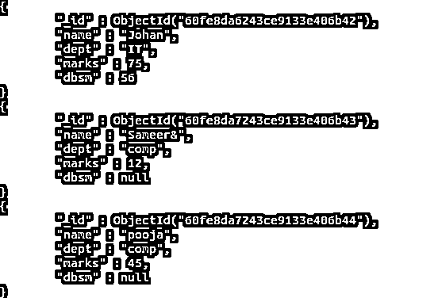

# MongoDB 不为空

> 原文：<https://www.educba.com/mongodb-not-null/>

## MongoDB 的定义不为空

MongoDB 为用户提供了不同的功能，MongoDB not null 是 MongoDB 提供的功能之一。Basically not null 用于在插入操作期间避免空值。在插入操作期间，我们可以将空值插入到集合中，这意味着文档包含空值。有了“非空”约束，我们可以根据需要实现不同的方法。根据我们的要求，我们还可以使用带有“not null”约束的 MongoDB 比较操作符。当我们需要显示非空值时，我们需要$exists 方法。

**语法:**

<small>Hadoop、数据科学、统计学&其他</small>

`db.specified collection name.find({specified field name: {“comparison operator” or ”Boolean value ”}} )`

**解释**

在上面的语法中，我们使用 find 方法来实现具有不同参数的 not null 约束，如下所示。

*   指定的集合名称:指定的集合名称是指我们已经创建的集合的实际名称。
    Find: find 是一种搜索字符串的方法。
*   指定的字段名:指定的字段名是指我们需要显示的没有 null 的字段名。

之后，我们需要根据需要使用比较运算符或布尔运算符。

### not null 在 MongoDB 中是如何工作的？

现在让我们看看 not null 在 MongoDB 中是如何工作的，如下所示。

如果我们在表格和分类之间建立关联，我们会看到行-报告和部分-字段之间的相似之处。最大的区别在于，来自相同分类的每个档案可以包含完全不同的字段排列。因此，该字段可以包含 invalid，但也可能不存在。有时，我们需要区分这两者。进行检查的方法还取决于利用率和您想要完成的任务。

基本上“not null”约束用于根据我们的要求显示集合中没有 null 的文档，这意味着根据我们的要求，我们可以选择任何带有不同比较运算符和布尔运算符的字段名。基本上，我们可以使用$exists a 方法在 MongoDB 中实现 not null。当<boolean>有效时，$exists 与包含该字段的记录相协调，包括字段尊重无效的报告。如果<boolean>是假的，问题只返回不包含该字段的记录。
首先，试着理解什么是算子。MongoDB 提供了不同种类的操作符，如比较、逻辑、元素数组和按位等等。但是我们通常在不同的操作符之间使用比较操作符。同样，我们有不同类型的比较运算符，如 eq、gt、lt 和 gte 等，我们可以根据需要使用这些运算符。</boolean></boolean>

通常，“不等于”运算符用于将指定值与集合中的所有文档进行比较，如果在集合中找到任何匹配的文档，则显示集合中的所有文档。

“不相等”运算符的工作很简单；我们只需要提到指定的字段名和我们想要的指定值。指定的字段名称和指定的值取决于用户。在执行时，它将所有指定的值与集合中的所有文档进行比较，如果文档的值不等于指定的值，则显示指定的记录。

### 例子

现在让我们看看 MongoDB 中 not null 的不同例子，以便更好地理解如下。

首先，我们需要创建新的集合，但在此之前，我们需要使用如下语句创建新的数据库。首先，我们使用如下语句创建了一个示例数据库。

使用样本

**解释**

在上面的语句中，我们使用命令来创建新的数据库，这里我们成功地创建了一个示例数据库并使用它。最终的结果或者我们可以说是上面的语句的输出，我们用下面的截图来说明。

成功创建数据库后，我们需要使用如下语句创建集合。

`db.createCollection(“student_sample”)`

**解释**

在上面的语句中，我们使用 createCollection 命令来创建新的集合；这里我们创建了一个名为 student_sample 的新集合，如下所示。最终的结果或者我们可以说是上面的语句的输出，我们用下面的截图来说明。

现在我们有了一个新的集合，所以现在我们需要将不同的文档插入到新创建的具有空字段的集合 student_sample 中，这样我们就可以得到结果。对于文档的插入，我们可以使用如下语句。

`db.student_sample.insert({ name: "Johan", dept: "IT", marks: 75, dbsm:56})
db.student_sample.insert({ name: "Sameer", dept: "comp", marks: 12, dbsm:null})
db.student_sample.insert({ name: "pooja", dept: "comp", marks: 45, dbsm:null})
db.student_sample.insert({ name: "Rohit" dept: "mech", marks: 71, dbsm:87})
db.student_sample.insert({ name: "Sachin", dept: "IT", marks: 98, dbsm:null})`

**解释**

通过使用上面的语句，我们将一个文档插入到 student_sample 集合中，在该集合中，我们插入学生的姓名、学生所在的系以及带有空字段的 dbsm 标记，如下所示。现在，我们可以使用下面的语句查看集合中的所有文档，如下所示。

`db.student_sample.find()`

**解释**

最终的结果或者我们可以说是上面的语句的输出，我们用下面的截图来说明。

假设我们需要显示 student_sample 集合中的 not null 字段，那么我们可以使用如下语句。

`db.student_sample.find({"dbsm": {"$ne": null}});`

**解释**

在上面的示例中，我们尝试实现它们 not null，这里我们使用带有$ne 比较运算符的 find 方法，如下所示。最终的结果或者我们可以说是上面的语句的输出，我们用下面的截图来说明。

通过使用如下语句，我们可以以结构化的方式看到相同的输出。

`db.student_sample.find().pretty();`

**解释**

最终的结果或者我们可以说是上面的语句的输出，我们用下面的截图来说明。

所以这样我们就可以在 MongoDB 中用$exists，find 等不同的方法实现 not null。

### 结论

我们希望通过这篇文章，您可以了解更多关于 MongoDB not null 的知识。从上面的文章中，我们已经了解了 not null 的基本语法，我们还看到了不同的 not null 的例子。从本文中，我们了解了如何以及何时使用 MongoDB not null。

### 推荐文章

这是一个 MongoDB not null 的指南。这里我们讨论一下定义，not null 在 MongoDB 中是如何工作的？分别举例说明。您也可以看看以下文章，了解更多信息–

1.  [MongoDB findOne()](https://www.educba.com/mongodb-findone/)
2.  [MongoDB Skip()](https://www.educba.com/mongodb-skip/)
3.  [MongoDB GridFS](https://www.educba.com/mongodb-gridfs/)
4.  [MongoDB 关系](https://www.educba.com/mongodb-relationships/)

