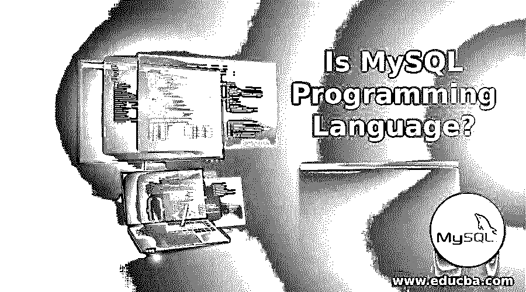

# MySQL 是编程语言吗？

> 原文：<https://www.educba.com/is-mysql-programming-language/>

## MySQL 编程语言介绍

MySQL 是一个开源的数据库管理系统，用于管理数据库系统，从数据库表中检索数据等。许多人可能会问 MySQL 是否是一种编程语言？在我看来，管理数据库系统的是服务器端软件。SQL 是一种结构化查询语言，它是 ANSI 标准，由大多数数据库系统实现。SQL 是一种编程语言，用于操作数据库中的数据。而 MySQL 实现了 SQL 语言的附加特性，这些附加特性不是标准版本和标准版本的特性，而是经过了变化和修改。

让我们看看 MySQL 到底是不是一种编程语言，MySQL 的主要特性和 MySQL 的历史如下:

<small>Hadoop、数据科学、统计学&其他</small>

### 什么是 MySQL？

下面给出了什么是 MySQL:

#### 1.MySQL 是一个数据库管理系统

数据库是以结构化方式排列的数据集合。借助 MySQL 服务器等数据库管理系统，我们可以对存储在计算机数据库中的数据进行添加、删除、修改和处理。使用数据库管理系统，我们可以在计算机的帮助下控制和处理大量的数据。

#### 2.MySQL 数据库是关系型的

关系数据库是数据存储在不同的表中而不是存储在同一个存储器中的数据库。这些表通过逻辑模型(如数据库、表、行、列、视图等)进行逻辑关联。通过使用这些关系，我们可以访问数据库中的数据。我们使用 SQL(结构化查询语言)来查询数据库，它是访问数据库最常用的语言。

#### 3.MySQL 是开源的

MySQL 数据库管理系统是开源软件。我们可以修改软件并重新发布，还可以免费使用。我们也可以有一个 MySQL 的许可版本，通过它可以获得高级支持和一些高级功能支持。因此，根据我们的业务需求，我们可以决定使用软件的免费版本或付费版本。

#### 4.MySQL 可靠、快速且可扩展

MySQL 数据库管理系统非常快，我们可以在台式机、笔记本电脑、服务器以及其他应用程序上运行。如果我们将它安装在专用机器上，那么我们可以通过利用 CPU 和 I/O 能力从 MySQL 中获得更多。它可扩展到机器集群、通过网络连接的机器等。MySQL 的开发是为了比具有不同类型功能的现有解决方案更高效、更快地处理数据库中的大量数据，并成为市场上最受欢迎和要求最高的软件。

#### 5.MySQL 可以在客户机/服务器或嵌入式环境中使用

MySQL 数据库管理系统软件可以在任何客户端/服务器/ [嵌入式系统](https://www.educba.com/what-is-embedded-systems/)中使用，支持多种应用程序、程序、库、多线程 SQL server，支持不同的软件和各种应用程序编程的 API。MySQL 可以作为多线程库提供，可以链接到任何应用程序，并且可以作为产品快速、方便地使用。

### MySQL 的主要特性

以下是 MySQL 的主要特性:

#### 1.数据类型

MySQL 支持不同的数据类型，其中一些是赋值和无符号整数、浮点、双精度、CHAR、VARCHAR、二进制、文本、BLOB、日期、时间、日期时间、年份、集合、枚举、地理空间类型、固定和可变字符串。

#### 2.便携性和内部功能

MySQL 是用 C 和 C++编程语言开发的，在各种编译器上进行了测试。MySQL 工作并支持不同类型的编程语言平台。它旨在支持多线程内核，采用多层服务器设计来使用多个 CPU。它能够使用优化非常快速地执行连接，并为事务性和非事务性提供单独的存储。在内部使用将被用作临时表的哈希表。

#### 3.功能支持

MySQL 在查询的 SELECT 和 where 子句中支持 Function 和 Full 运算符。它支持基本语法和 ODBC 语法的左外连接和右外连接。按照标准 SQL，它支持表和列的别名。它支持 curd 操作，如 Insert、Delete、Replace 和 Update 语句，这些语句返回更新、插入的行数，并删除符合条件的行。

#### 4.连通性

任何人都可以使用不同类型的协议连接到 MySQL 数据库管理系统，例如 TCP/IP 套接字、使用带有 enable-named-pipe 的命名管道、使用带有 enable-shared-memory 的共享内存连接以及在 Linux 系统上使用 UNIX 域套接字。MySQL 客户端可以用多种语言编写程序，因为它有对不同编程语言的库支持。使用 connector / J 接口 Java 客户端程序可以连接 MySQL 并执行操作。

#### 5.安全性

MySQL 通过密码机制和特权来处理安全性，这对于基于主机的验证是简单、快速和安全的。当我们连接到服务器时，它通过对所有密码进行密码加密来处理安全性。

#### 6.可量测性

MySQL 支持非常大的数据库，例如，我们可以有一个服务器，MySQL 在其上托管和处理 5000 万条记录，服务器有 2 个包含 500 万条记录的 lakh 表。它支持每个表最多 64 个索引，其中每个表的列可以从 1 到 16 列不等。

### MySQL 的历史

MySQL 最初被设计为使用自己的快速低级例程连接到表，但最终失败了，因为它们没有获得预期的结果，这导致了一个新的 SQL 接口，称为 MySQL，具有类似 MySQL 的接口，并具有为 MySQL 移植第三方代码的能力。它是以创始人的女儿名字“My”命名的。MySQL dolphin 的名字叫“sakila”，是通过一个名为“给海豚命名”的比赛决定的。

### 结论 MySQL 是编程语言吗？

最后，它是 MySQL 的概述，它不是一种编程语言，而是用于数据库管理系统的软件。我希望您在阅读这篇关于 MySQL 编程语言的文章后，对 MySQL 有一个很好的了解，因为我们已经详细讨论了它对不同编程语言的支持，为不同的客户端提供库，安全性，可伸缩性，功能支持，内部开发，以及实现标准 SQL 编程语言中的所有功能和标准 SQL 中不支持的附加功能。

### 推荐文章

这是 MySQL 编程语言的指南。这里我们讨论了 MySQL 及其特性，比如数据类型、功能支持、安全性和历史。您也可以阅读以下文章，了解更多信息——

1.  [MySQL 查询命令](https://www.educba.com/mysql-query-commands/)
2.  [备忘单 MySQL](https://www.educba.com/cheat-sheet-mysql/)
3.  [MySQL 开源](https://www.educba.com/MySQL-OpenSource/)
4.  [MySQL 用户](https://www.educba.com/mysql-users/)

