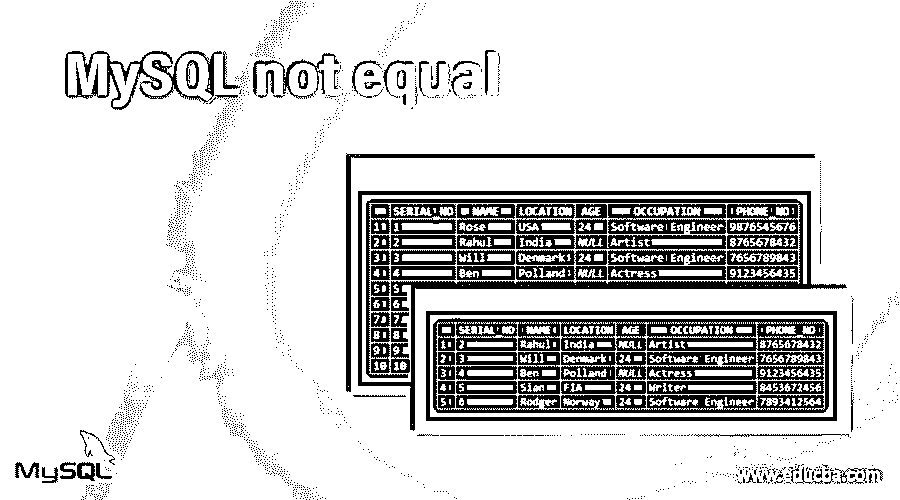
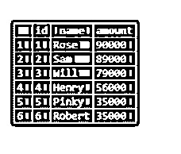
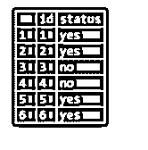
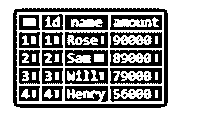
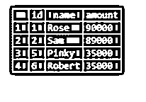
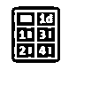
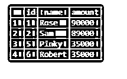
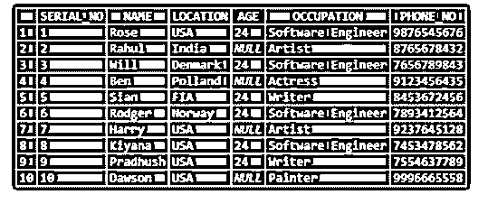
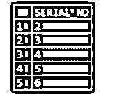

# MySQL 不等于

> 原文：<https://www.educba.com/mysql-not-equal/>

## MySQL 介绍不等于

MySQL Not Equal 用于过滤“不等于”指定“值”的行。代表'不等于'的符号是'<>'或'！='.上述符号用于利用运算符的运算。“不等于”运算符的简单操作是，我们指定表达式，满足的行将被显示，其余的将被省略。例如，如果您计划排除 salary = 35000 这样的值。我们指定为工资<> 35000。

在本节中，我们将学习更多关于“不等于”运算符的知识，它是如何工作的，以及一些示例:-

<small>Hadoop、数据科学、统计学&其他</small>

**语法**

下面是“不等于”运算符的语法。

`<select statement>
< where clause>
<column><> ‘value’;
[or] <select statement>
< where clause>
<column> !=  ‘value’;`

### MySQL 不等于如何工作？

现在让我们创建一个表，应用“不等于”操作符，并检查它是如何工作的。

`create table Not_equal_demo
(
id int,
name varchar(20),
amount int
);`

将以下行插入上表:-

`insert into Not_equal_demo values ( 1, 'Rose', 90000 );
insert into Not_equal_demo values ( 2, 'Sam', 89000 );
insert into Not_equal_demo values ( 3, 'Will', 79000 );
insert into Not_equal_demo values ( 4, 'Henry', 56000 );
insert into Not_equal_demo values ( 5, 'Pinky', 35000 );
insert into Not_equal_demo values ( 6, 'Robert', 35000 );`

让我们从上表中选择数据:–

`Select * from Not_equal_demo;`

相同的截图:–

考虑下面的另一个表:-

`create table job_status
(
id int,
status varchar(15)
);`

将数据插入如下表格:–

`insert into job_status values ( 1, 'yes');
insert into job_status values ( 2, 'yes');
insert into job_status values ( 3, 'no');
insert into job_status values ( 4, 'no');
insert into job_status values ( 5, 'yes');
insert into job_status values ( 6, 'yes');`

现在让我们从上表中选择数据:–

`Select * from job_status;`

相同的截图:–

现在让我们过滤上表中的数据。但是，首先，让我们从金额不等于 35000 的表中获取数据。

`SELECT * FROM NOT_EQUAL_DEMO WHERE AMOUNT <> 35000;`

在上面的查询中，我们过滤数据并提取所有不等于 35000 的行。

[OR]

`SELECT * FROM NOT_EQUAL_DEMO WHERE AMOUNT != 35000;`

这两个符号的行为相似，都从表中获取数据。所以截图也是为了一样。

在子查询中使用不等于:–

`Select * from not_equal_demo
where id not in( select id from job_status where status != 'yes') ;`

这里让我们先看看内部查询的输出。下面也是一样的。

`select id from job_status where status != 'yes';`

相同的截图:–

这里，内部查询的输出是 3，4。这个输出将被传递给外部查询，外部查询获得不等于 3，4 的 id 行数据。这意味着我们得到 id = 1，2，5，6 时的输出。

`Select * from not_equal_demo
where id NOT IN( select id from job_status where status != 'yes') ;`

相同的截图:–

### MySQL 不相等的例子

现在让我们考虑下面的另一个表，并找出“不相等”的工作原理。

`CREATE TABLE test_not_equal
(
SERIAL_NO INT
, NAME VARCHAR(20)
, LOCATION VARCHAR(20)
, AGE INT
, OCCUPATION VARCHAR(20)
, PHONE_NO VARCHAR(10)
);`

现在让我们将数据插入表中:–

`INSERT INTO TEST_NOT_EQUAL VALUES (1, 'Rose', 'USA', 24, 'Software Engineer', '9876545676' );
INSERT INTO TEST_NOT_EQUAL VALUES (2, 'Rahul', 'India', NULL , 'Artist', '8765678432' );
INSERT INTO TEST_NOT_EQUAL VALUES (3, 'Will', 'Denmark', 24, 'Software Engineer', '7656789843' );
INSERT INTO TEST_NOT_EQUAL VALUES (4, 'Ben', 'Polland', NULL , 'Actress', '9123456435' );
INSERT INTO TEST_NOT_EQUAL VALUES (5, 'Sian', 'FIA', 24, 'Writer', '8453672456' );
INSERT INTO TEST_NOT_EQUAL VALUES (6, 'Rodger', 'Norway', 24, 'Software Engineer', '7893412564' );
INSERT INTO TEST_NOT_EQUAL VALUES (7, 'Harry', 'USA', NULL, 'Artist', '9237645128' );
INSERT INTO TEST_NOT_EQUAL VALUES (8, 'Kiyana', 'USA', 24, 'Software Engineer', '7453478562' );
INSERT INTO TEST_NOT_EQUAL VALUES (9, 'Pradhush', 'USA', 24, 'Writer', '7554637789' );
INSERT INTO TEST_NOT_EQUAL VALUES (10, 'Dawson', 'USA', NULL, 'Painter', '9996665558' );`

现在让我们看看表格中的数据

`Select * from test_not_equal;`

相同的截图:–

现在让我们从 Location 不等于“USA”的表中获取数据。

`SELECT * FROM TEST_NOT_EQUAL WHERE LOCATION <> 'USA';`

相同的截图:–

您可以看到输出已经过滤了‘USA’数据，并返回了上面输出的其余数据。

我们可以对同一个表执行子查询，并应用“不等于”。

`SELECT * FROM TEST_NOT_EQUAL
WHERE SERIAL_NO IN ( SELECT SERIAL_NO FROM TEST_NOT_EQUAL WHERE
LOCATION <> 'USA');`

内部查询的输出如下所示，它将从 location 不等于“USA”的表中获取数据。

`SELECT SERIAL_NO FROM TEST_NOT_EQUAL WHERE LOCATION <> 'USA';`

相同的截图:–

这里基于内部查询的输出。我们使用了“IN”操作符，它将检索“等于”内部输出的数据。

`SELECT * FROM TEST_NOT_EQUAL
WHERE SERIAL_NO IN( SELECT SERIAL_NO FROM TEST_NOT_EQUAL WHERE LOCATION **<>**'USA');
[or] SELECT * FROM TEST_NOT_EQUAL
WHERE SERIAL_NO IN( SELECT SERIAL_NO FROM TEST_NOT_EQUAL WHERE LOCATION **!=**'USA');`

下面是相同的输出:–

### 结论

MySQL Not Equal 用于过滤“不等于”指定“值”的行。代表'不等于'的符号是'<>'或'！='.上述符号用于利用运算符的运算。“不等于”操作符的简单操作是，我们指定表达式，满足的行将被显示，其余的将被省略。

### 推荐文章

这是一个 MySQL 不平等的指南。在这里，我们讨论了 MySQL 如何不等于作品和输出的例子。您也可以看看以下文章，了解更多信息–

1.  [MySQL 位](https://www.educba.com/mysql-bit/)
2.  [MySQL DDL](https://www.educba.com/mysql-ddl/)
3.  [MySQL CURDATE](https://www.educba.com/mysql-curdate/)
4.  [MySQL 展示](https://www.educba.com/mysql-show/)

