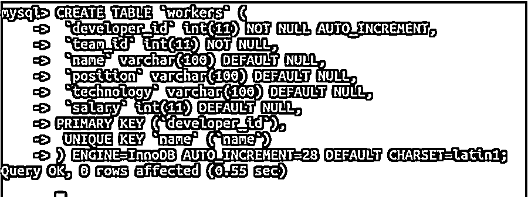
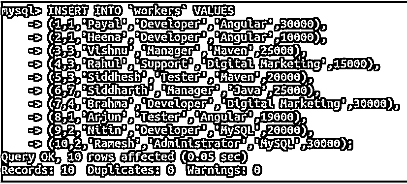
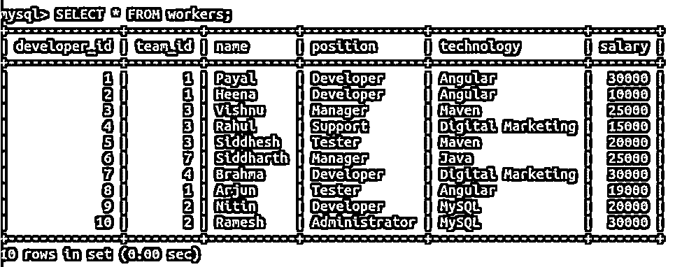
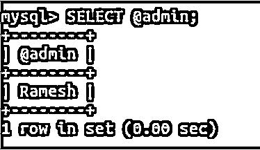
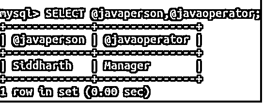

# MySQL SELECT INTO 变量

> 原文：<https://www.educba.com/mysql-select-into-variable/>

## MySQL SELECT INTO 变量简介

有时需要将检索到的字段的值存储在 MySQL 的变量中。为此，我们可以使用 INTO 子句来存储检索到的字段的值，无论它们是聚合值的列值还是在 SELECT 查询语句中检索到的任何其他表达式。MySQL 中的变量是以@的格式在变量名前访问和声明的。在本文中，我们将学习如何将查询语句的取值保存到 MySQL 的变量中，并借助一些例子学习它的语法和实现。

**语法:**

<small>Hadoop、数据科学、统计学&其他</small>

将所选值存储到选择查询的变量中的语法如下

`SELECT column1, column2, column3, ... INTO @variable1, @variable2, @variable3,... FROM tablename WHERE condition or restriction;`

*   **column1、column2、column3、…**–这些是您要从名为 tablename 的表中检索的列的名称。您可以从 select 语句中检索任意数量的列。
*   **@variable1、@variable2、@variable3、…**–这些是要存储检索到的列值的变量的名称。请注意，列和变量的数量应该相同。另外，请注意，检索列和指定变量的顺序应该是正确的，因为每一列都将存储到其对应的变量中。与检索到的列 1 值将被存储到@variable1 中一样，检索到的列 2 值将被存储到@variable2 中，依此类推。
*   **tablename**–这是要从中检索列值的表的名称。
*   **条件或限制**–这在使用中是可选的，如果您希望在列上指定某些条件或限制，并在检索时相应地过滤掉结果，可以使用它。

### MySQL SELECT INTO 变量的使用

查询的检索结果集应该包含一条或不包含任何记录。如果从查询语句中提取了多条记录，MySQL 将会产生一个错误。如果查询没有返回任何行，那么 MySQL 会发出警告，用于存储的变量的值保持不变。只有在检索到单个记录的情况下，才会将正确的检索值设置为变量。

因此，为了避免检索多个记录时出现的错误，我们可以使用 MySQL LIMIT 子句。该子句帮助我们只检索指定数量的行，即使实际的查询结果集可能检索太多行。为了避免错误，我们可以在 select 查询的末尾指定 LIMIT 1。这有助于我们确保从查询语句中最多只能检索到一行。

### MySQL SELECT INTO 变量的例子

考虑一个名为 workers 的表，它具有以下结构，

`CREATE TABLE `workers` (
`developer_id` int(11) NOT NULL AUTO_INCREMENT,
`team_id` int(11) NOT NULL,
`name` varchar(100) DEFAULT NULL,
`position` varchar(100) DEFAULT NULL,
`technology` varchar(100) DEFAULT NULL,
`salary` int(11) DEFAULT NULL,
PRIMARY KEY (`developer_id`),
UNIQUE KEY `name` (`name`)
) ENGINE=InnoDB AUTO_INCREMENT=28 DEFAULT CHARSET=latin1;`

在执行查询后，它会给出以下输出

让我们使用下面的 insert query 语句在 workers 表中插入一些记录

`INSERT INTO `workers` VALUES
(1,1,'Payal','Developer','Angular',30000),
(2,1,'Heena','Developer','Angular',10000),
(3,3,'Vishnu','Manager','Maven',25000),
(4,3,'Rahul','Support','Digital Marketing',15000),
(5,3,'Siddhesh','Tester','Maven',20000),
(6,7,'Siddharth','Manager','Java',25000),
(7,4,'Brahma','Developer','Digital Marketing',30000),
(8,1,'Arjun','Tester','Angular',19000),
(9,2,'Nitin','Developer','MySQL',20000),
(10,2,'Ramesh','Administrator','MySQL',30000);`

在执行查询后，它会给出以下输出–

让我们使用下面的查询语句检索 worker 表中的所有记录

`SELECT * FROM workers;`

在执行查询后，它会给出以下输出–

我们将看到第一个在选择查询中只获得一个变量的例子。让我们使用以下查询语句将管理员的姓名存储在变量 admin 中

`SELECT name INTO @admin FROM workers WHERE position = 'Administrator';`

在执行查询后，它会给出以下输出–

我们可以看到，成功执行的查询现在影响了一行，@admin 变量将包含管理员的姓名。从上面的表记录结果集中，我们可以观察到名为 Ramesh 的工人是管理员，因此，Ramesh 值应该存储在@admin 变量中。让我们选择那个变量，观察得到什么值。

`SELECT @admin;`

在执行查询后，它会给出以下输出–

在这里，Ramesh 是存储的值，现在从变量@admin 中检索。

让我们再看一个例子，我们将从 select 查询语句的选定内容中插入两个变量值。我们将使用以下查询语句将使用 java 技术的工人的姓名和职位存储在变量@javaperson 和@javaoperator 中

`SELECT name, position INTO @javaperson, @javaoperator FROM workers WHERE technology = 'Java';`

在执行查询后，它会给出以下输出–

我们可以看到成功执行的查询影响了一行，因为现在，@javaperson 和@javaoperator 变量将包含 java 技术相关人员的姓名和职位。从上面的表记录结果集中，我们可以观察到名为西达尔特的工人是经理，并且与 java 技术相关联，因此，西达尔特值应该存储在@javaperson 变量中，经理值应该存储在@javaoperator 变量中。让我们选择那个变量，观察得到什么值。

`SELECT @javaperson, @javaoperator;`

在执行查询后，它会给出以下输出–

让我们尝试用 Angular 技术存储值，与 java 的技术相同，但其中有多个记录。

`SELECT name, position INTO @angularperson, @angularoperator FROM workers WHERE technology = 'Angular';`

在执行查询后，它会给出以下输出–

我们可以观察到它抛出了一个错误，表示检索到了多行。让我们用极限 1。

`SELECT name, position INTO @angularperson, @angularoperator FROM workers WHERE technology = 'Angular' LIMIT 1;`

在执行查询后，它会给出以下输出–

`SELECT @angularperson,@angularoperator;`

在执行查询后，它会给出以下输出–

我们可以观察到，名为 payal 和 position developer 的使用 angular 技术的第一条记录分别存储在@angularperson 和@angularoperator 变量中。

### 结论

我们可以利用 SELECT INTO 子句将 SELECT 查询语句的检索值放入变量中。在这样做的时候，我们需要注意变量和列的数量和顺序。此外，检索的行数不应超过一条记录。

### 推荐文章

这是一个 MySQL 选择变量的指南。在这里，我们还将讨论 mysql select into 变量的介绍和工作原理，以及不同的示例和代码实现。您也可以看看以下文章，了解更多信息–

1.  [MySQL 数据类型](https://www.educba.com/mysql-data-type/)
2.  [MySQL 拆分](https://www.educba.com/mysql-split/)
3.  [MySQL 锁表](https://www.educba.com/mysql-lock-table/)
4.  [MySQL WEEKDAY](https://www.educba.com/mysql-weekday/)

