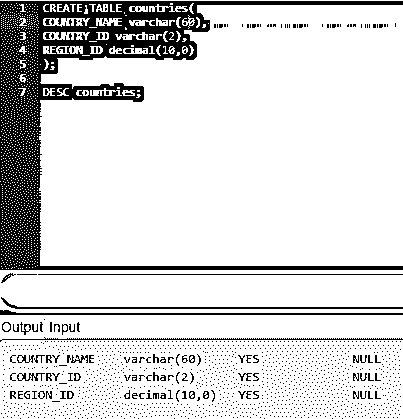
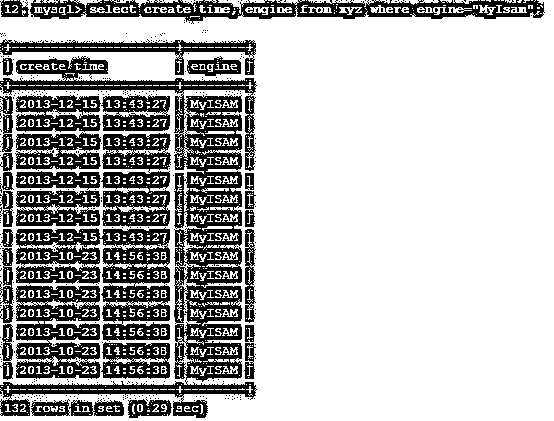
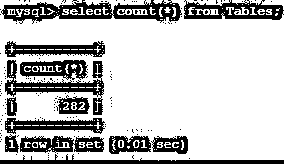
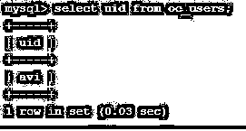

# MySQL 命令

> 原文：<https://www.educba.com/mysql-commands/>

## MySQL 命令简介

MySQL 是一个广泛使用的开源关系数据库管理系统，它有助于向客户提供高性能的应用程序，以及可扩展的基于 web 的嵌入式数据库应用程序。它被广泛用作 web 应用程序软件栈的数据库组件。MySQL 命令非常强大，我们将研究一下 MySQL 命令，这些命令对于每个开发人员来说都非常有帮助，并且有助于了解和使用这些查询来与系统和 MySQL 数据库进行交互。它基于结构化查询语言(SQL ),支持并运行在 Linux、UNIX 和 Windows 上。

### 基本 MySQL 命令

#### 1.编写一个查询来创建一个表 country，其列名为 country name、country id 和 region id。

使用下面的查询在 MySQL 中创建一个国家表，输出如下:

<small>Hadoop、数据科学、统计学&其他</small>

**查询:**

`CREATE TABLE countries(
countryname varchar(60),
countryid varchar(4),
regionid decimal(10,0));`

**输出:**

#### 2.如何获得当前所有数据库的列表？

我们可以使用下面的查询获得 MySQL 中所有正在运行的数据库的列表

**查询:**

`Show databases;`

**输出:**
T3】

#### 3.如何使用 MySQL 获取一个数据库中的所有表？

我们可以使用下面的查询获得 MySQL 数据库中的所有表:

**查询:**

`Show tables;`

**输出:**
T3】

#### 4.如何知道 MySQL 中所有的字段名和表的类型？

使用下面的查询，我们可以在 MySQL 命令中获得一个[表的所有文件名和类型](https://www.educba.com/table-in-mysql/)

**查询**
`describe os_users;`

这里，os_users 是一个包含文件名 u_id 和密码的表，输出如下:

**输出:**
T3】

#### 5.如何在 MySQL 中删除一个表和一个数据库？

我们可以使用下面的 MySql 命令查询删除一个表

**查询删除表:**

`Drop table lookup;`

其中 lookup 是表名。我们可以使用下面的查询删除数据库

**查询删除数据库:**

`Drop database users;`

当用户是数据库时

**删除表格的输出为**:

#### 6.如何从特定字段填充了数据“MyIsam”的表中获取数据。我们需要获得创建时间和引擎字段，其中引擎字段填充了“MyIsam”。

我们可以为上述需求编写一个 MySQL 命令查询，如下所示:假设我们有一个包含字段 creation_time 和 engine 的 XYZ 表，engine 字段填充有字符串数据，creation_time 字段填充有日期和时间。

**查询:**

`Select create_time, engine from xyz where engine=”MyIsam”;`

上面的查询将给出 creation_time 和 engine，其中 engine 字段用“MyIsam”填充

**输出**:

#### 7.从名称为“tecmint”且网址为“tecmint.com”的表中获取所有字段的查询？

让我们把一个表想象成 XYZ，它有字段 id、名称和网址。

我们将获得一个表的字段，其中名称匹配为“tecmint ”,网址匹配为“tecmint.com”

**查询**:

`Select * from xyz where name=”tecmint” and webaddress=”tecmint.com”;`

上述查询将显示字段名与 tecmint 匹配、网址与 tecmint.com 匹配的所有字段

**输出:**

#### 8.如何知道一个表格的总行数？

我们可以使用下面的查询来确定表中的行数:

**查询:**

`Select count(*) from Tables;`

**输出:**

#### 9.如何在表格中选择特定的字段行？

我们可以从一个名为 os_users 的表中选择一个特定的字段，比如说 uid

**查询:**

`Select uid from table os_users;`

**输出:**

#### 10.如何在 MySQL 中使用特定的数据库？

我们可以使用下面的查询切换到使用特定的数据库

**查询:**

`Use a database cloud;`

**输出:**

### 中间 MySQL 命令

PHP 开发人员也使用其他几个流行的 MySQL 命令，它们不是很基本，但更适合 MySQL。以下一些类型的中间 MySQL 命令:

#### 11.从匹配约束的表中获取特定字段的查询(emp_id=100)？

**查询:**

`Select emp_id, emp_name from table employee where emp_id=100;`

#### 12.基于特定约束并使用“order by”对表中的结果进行排序的查询？

使用 with orderby 对表中的结果进行排序的查询是

**查询:**

`Select emp_id, emp_name from employee where city="Hyderabad" order by emp_id;`

#### 13.基于某种约束并使用“Group by”对表中的结果进行排序的查询？

使用“分组依据”对表中的结果进行排序的查询如下:

**查询:**

`Select name, age from patients where age > 45 group by age order by name;`

#### 14.从客户表中获取客户总数的查询。

从客户表中获取所有客户的查询是:

**查询:**

`Select count(customer_id), country from customers group by country;`

#### 15.查询计算公司中每个员工的工资总额？

**查询:**

`Select sum(salary) from employee where emp_age > 30;`

#### 16.列出模式中所有可用视图的查询？

**查询:**

`Select * from myschema.views;`

#### 17.如何从表中创建视图？

创建视图的查询如下:

**查询:**

`Create view A_students as select student_name, student_id from student where GPA > 80;`

#### 18.如何更新视图？

更新现有视图的查询如下:

**查询:**

`Create or replace view product_list As select product_id, Product name, category from products where discount=no;`

#### 19.查询以显示表中的主键。

下面显示了表的主键中的所有字段:

**查询:**

`Select * from Sys. objects where type=’PK’;`

#### 20.显示系统中所有用户表的查询？

**查询:**

`Select * from Sys. objects where type=’u’;`

### 高级 MySQL 命令

#### 21.MySQL 中为什么使用 IFNULL()语句？

IFNULL()语句将检查它的第一个参数，如果它不是 NULL 或第二个参数，则返回。

**查询:**

`Select name, IFNULL(id,’unknown’) As ‘id’ from the taxpayer;`

#### 22.在 MySQL 中只显示 5 行查询结果的查询？

为了达到这个目的，我们需要在查询中使用 LIMIT，如下所示:

**查询:**

`Select * from students limit 5`

#### 23.使用 not 运算符选择除一个用户之外的所有用户的查询？

使用 not 运算符的查询是:

**查询:**

`Select * from users where user_name !=SAM;`

#### 24.在 MySQL 中查询得到当前日期？

以下查询将给出当前日期

**查询:**

`Select current_date();`

#### 25.如何在 MySQL 中将所有表格导出到一个 XML 文件中？

我们需要使用–e 选项将所有表导出到一个 XML 文件，如下所示:

**查询:**

`Mysql –u user_name -xml -e ‘select * from table_name’ > tables.xml`

### 使用 MySQL 命令的提示和技巧

一些经常使用 MySQL 命令的普通用户通常会使用一些提示和技巧来正确使用 MySQL 命令输出。这些类型的技巧通常解决一些特定于用户的查询，并显示执行输出以正确理解它。一些最常用的关键技巧是:

*   在 select 查询之前添加 Explain 语句，因为它更好地解释了查询具体在做什么。
*   需要启用查询缓存，因为它可以提高查询的执行性能，并且是提高数据库性能的最佳方法之一。
*   使用 MySQL 中的 stack_trace，它将帮助您区分错误，跟踪并修复它们。
*   我们可以使用 MySQL 中的 mysqldump 命令进行数据库备份，这将帮助您跟踪和备份。

### 结论

这是对不同级别的 MySQL 命令以及使用它们的技巧和诀窍的概述。我希望你在读完这篇文章后，对 MySQL 命令以及如何使用它们有一个很好的理解和认识。

### 推荐文章

这是 MySQL 命令的指南。我们在这里讨论了基本命令和一些 MySQL 高级命令。您也可以查看下面的文章了解更多信息:

1.  [硒命令](https://www.educba.com/selenium-commands/)
2.  你应该试试猪的命令
3.  [最顶层的 Sqoop 命令](https://www.educba.com/sqoop-commands/)
4.  [Tableau 命令](https://www.educba.com/tableau-commands/)

