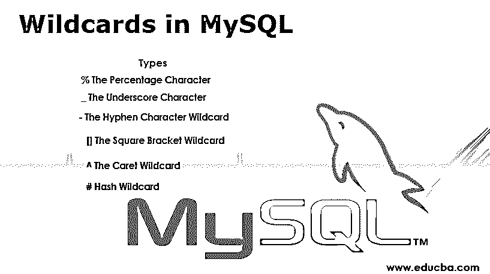
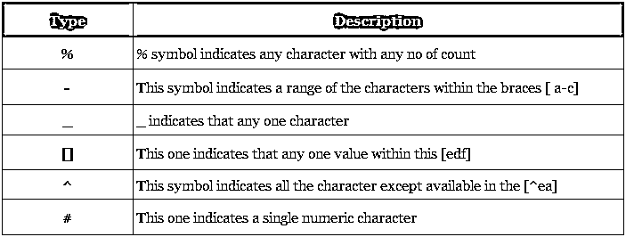

# MySQL 中的通配符

> 原文：<https://www.educba.com/wildcards-in-mysql/>




## MySQL 中通配符的介绍

一种操作符，其功能是在字符串中替换零到任意数量的字符，在查询中被指定时用相关的符号表示，通常在 WHERE 子句中与 LIKE 操作符一起使用，以便从文本字段的所有必需值中识别字符的特定排列，并且以百分号和下划线两种形式存在，在 SQL 中称为通配符。

### 通配符的功能

通配符的一些重要特性如下所示

<small>Hadoop、数据科学、统计学&其他</small>

1.  在 MySQL 中使用通配符可以提高应用程序的性能
2.  它可以减少从数据库中过滤记录的时间
3.  使用通配符可以将复杂的 SQL 查询转换成简单的查询
4.  使用通配符，我们可以在大型数据驱动的应用程序中开发强大的搜索引擎。数据驱动应用程序中的搜索更加依赖通配符的使用

### 通配符的类型

以下是一些可以在 SQL 查询中使用的通配符类型，可以单独使用，也可以与其他通配符组合使用




#### 1) %百分比字符

%符号字符可用于搜索或过滤记录。%可以用在字符串的第一个位置、最后一个位置或两端，例如

```
SELECT * FROM ‘items’ WHERE ‘item_description’ LIKE ‘%Motor%’;
```

在上述查询中，将从数据库中提取所有这些行，其中列“item_description”将在描述文本中间包含“Motor”一词。

```
SELECT * FROM ‘items’ WHERE ‘item_description’ LIKE ‘%Motor’;
```

在上述查询中，将从数据库中提取所有这些行，其中列“item_description”将在描述文本的最后包含“Motor”一词。

```
SELECT * FROM ‘items’ WHERE ‘item_description’ LIKE ‘Motor%’;
```

在上述查询中，将从数据库中提取所有这些行，其中列“item_description”将在描述文本的开头包含“Motor”一词。

**示例# 1—**一个“项目”表，包含以下表格中的以下记录


在给定的表格中，所有包含“电机”名称的项目。因此，SQL 查询将使用通配符“%”从数据库中搜索所需的数据。

```
SELECT * FROM ‘items’ WHERE ‘item_description’ LIKE %Motor%;
```


执行上面的 SQL 查询后，给定的记录将可用。

#### 2) _ 下划线字符

一个字符可以用作通配符，当需要从数据库中过滤记录时，因为单个字符在任何位置都可能是字符串中的任何字符，那么这个 _(下划线)通配符可以在 SQL 查询中发挥重要作用。

**示例#1:** 在下面给定的“项目”表中，当需要过滤记录时，有 4 个项目可用，其中前 4 个字符是“ah00”&后 3 个字符是“2ec”&只有第 5 个位置的字符可以是任何字符，在这种情况下，在 SQL 查询的第 5 个位置需要通配符 _ 以从数据库中过滤记录。


为了从数据库中找出期望的记录，下面给出了查询

```
SELECT * FROM `items` WHERE `item_code` LIKE 'AH00_2EC';
```


在下面给出的查询中使用 _(下划线)组合 2。这里

```
SELECT * FROM `items` WHERE `item_code` LIKE 'AH00__EC';
```


这个通配符 _(下划线)可以根据需要在 SQL 查询中的任何位置多次使用，也可以与其他通配符组合使用。

#### 3)–连字符通配符

(-)字符可以用作通配符，当您需要将数据库中的记录作为某个范围内任何位置的字符进行过滤时，那么这个–(连字符)通配符可以有效地用在 SQL 查询中。

**示例# 1-**在上面给出的“项目”表中，在一个场景中，需要名称从 a 到 j 开始的所有项目。在这种情况下，查询将如下所示

```
SELECT * FROM `items` WHERE `item_description` LIKE '[a-j]%';
```

#### 4) []方括号通配符

([])方括号字符可在查询中使用，以选择在特定位置可能有字符串(如 C & I)的所有数据；

**示例# 1-**在上面给出的“项目”表中，在一个场景中，需要所有那些名称与起始字符 C & Ij 匹配的项目。在这种情况下，查询如下所示

```
SELECT * FROM `items` WHERE `item_description` LIKE '[CI]%';
```

#### 5) ^插入符号通配符

^可以在查询中使用脱字符号来取消选择所有以字符 C & I 开始的记录

```
SELECT * FROM `items` WHERE `item_description` LIKE '[^CI]%';
```

#### 6) #散列通配符

#可以在查询中使用散列字符来选择在#通配符位置包含任何数字字符的所有记录。

### 结论

通配符用于所有类型的数据库，如 MySQL、MS Access、Oracle。通配符的工作原理与正则表达式相同。在数据库中搜索、过滤时，可以同时使用多个通配符。所有通配符都可以在 SQL 查询中单独使用，也可以与任何其他通配符组合使用。

### 推荐文章

这是 MySQL 中通配符的指南。这里我们分别讨论通配符的基本概念、特征和类型，并给出一些例子。您也可以阅读以下文章，了解更多信息——

1.  [MySQL 服务器](https://www.educba.com/mysql-server/)
2.  [MySQL 字符串函数](https://www.educba.com/mysql-string-functions/)
3.  [MySQL 操作符](https://www.educba.com/mysql-operators/)
4.  [MySQL 间](https://www.educba.com/mysql-between/)


