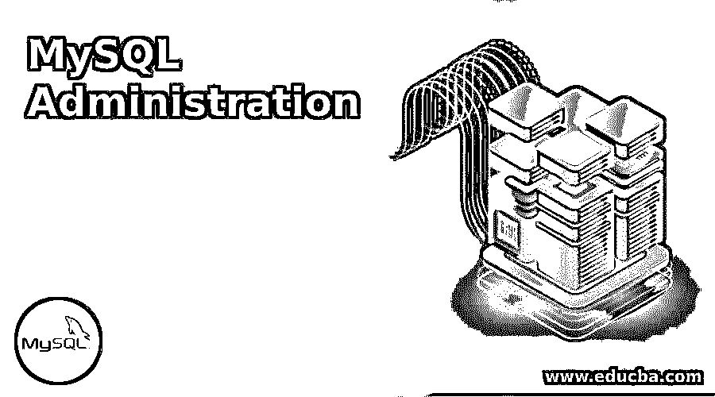
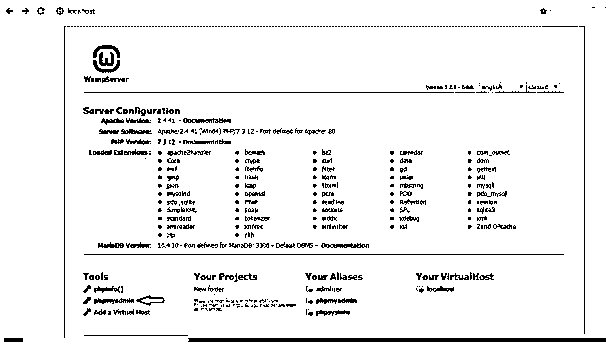
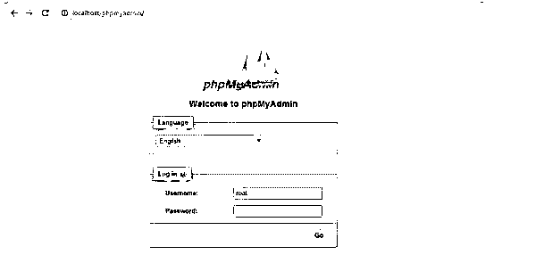
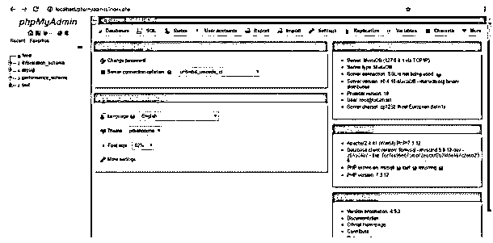
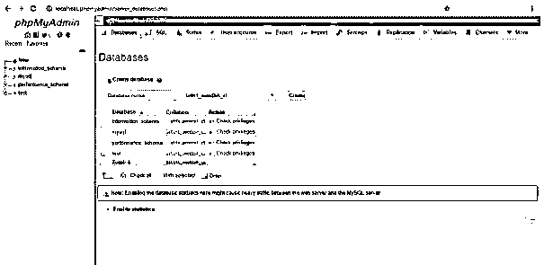

# mysql 管理员

> 原文：<https://www.educba.com/mysql-administration/>

## MySQL 管理简介

MySQL 管理被定义为用于执行管理任务的程序或操作，如配置、监控、管理用户及其角色、启动和停止 MySQL 服务器的备份以及其他此类管理过程。MySQL 管理旨在与 MySQL 4.0 版本和更高版本一起工作。MySQL 管理指导您如何在 Windows 和 Linux 上启动、暂停和恢复 MySQL 服务器。MySQL 是 GNU 许可下的开源 RDBMS 软件，广泛用于 PHP 编程和其他 web 应用程序。MySQL 是一个数据库管理系统，运行在一个快速、安全、易于使用的服务器上，用于小型或大型数据应用程序的存储和访问。MySQL 服务器可以在以相关行和列的形式排列的 MySQL 表中积累大量的海量数据。为了获取和管理 MySQL 数据，MySQL Administration 使用一种称为 SQL 结构化查询语言的标准查询语言，该语言在操作服务器中的记录或表行方面起着重要作用。此外，SQL 查询有助于组织所有数据库，以维护服务器及其数据隐私。

### 为什么我们需要 MySQL 管理？

MySQL 管理用于运行不同的操作，并为用户分配数据库服务器管理活动的权限，从而维护和保护 MySQL。MySQL 管理提供了许多工具，帮助服务于服务器维护、服务器配置、数据库备份、安全、用户角色、初始化/关闭、复制监督、修复、恢复、资源管理、性能检查、状态报告、访问记录、CRUD 操作 SQL、授予权限等。因此，MySQL 管理是一个管理员级别的责任，负责处理服务器上执行的所有任务，使事情正常运行，并确保数据完整性、安全性和快速管理，以允许用户以更好的方式进行交互。

<small>Hadoop、数据科学、统计学&其他</small>

### MySQL 管理是如何工作的？

我们可以安装 WAMP 或 XAMPP 的 MySQL 服务器来使用 PHPMyAdmin，即 MySQL 的管理面板。PHPMyAdmin 致力于通过 web 应用程序管理 MySQL，这是用 PHP 编写的免费软件。

你甚至可以从**下载 MySQL 数据库。你可以看到下面的 WAMP 本地主机页面和 PHPMyAdmin 页面:**

 **

在单击 PHPMyAdmin 时，我们需要使用登录凭证，但默认情况下，这里的 root 是用户名，密码为空:

PHPMyAdmin 服务器页面:

显示所有数据库:

MySQL Administration bench 允许我们将工具集成到一个更简单友好的图形用户界面中。MySQL DBA 使我们能够创建和管理数据库。使用 MySQL 命令，我们可以成功地管理数据库及其记录。

我们有下面描述的一些命令:

*   **显示数据库:**列出 MySQL 服务器中的所有数据库。
*   **显示表格:**显示存储在特定 MySQL 数据库中的所有表格。
*   **显示列:**显示数据库服务器中特定表的列列表。
*   **Show Processlist:** 查找 MySQL 服务器中当前运行的进程或线程。

有了这些特性，DBA 还提供了如下一些特殊工具:

*   **备份:**使用 mysqldump 工具，您可以备份一个或多个数据库。
*   **还原:**甚至，可以用转储文件还原数据库。
*   **维护表:**负责提供命令来维护 MySQL 服务器中的数据库。

### MySQL 管理的角色

MySQL 管理提供了以下角色:

*   **创建用户:**定义如何在 MySQL 服务器中添加新用户。
*   **授予权限:**授予用户权限。
*   **撤销权限:**从账户中撤销用户权限。
*   **管理角色:**组织分配给用户的不同角色及其权限。
*   **显示授予的权限:**呈现与服务器中的用户角色或其各自帐户相关联的权限。
*   **删除用户:**定义知道如何移除或删除用户。
*   **更改密码:**帮助学习如何为 MySQL 服务器用户设置密码。
*   **显示用户:**解释如何在服务器中显示用户帐户。
*   **重命名用户:**允许将用户重命名为另一个用户。
*   **锁定用户帐户:**描述如何锁定 MySQL 服务器用户或他们各自的帐户。
*   **解锁用户账户:**定义如何解锁 MySQL 用户账户。

因此，MySQL 管理活动有助于检索和管理数据。它提供了不同的功能来执行许多工具来组织 MySQL 服务器。大多数情况下，这些任务可以通过使用命令行客户端(如 MySQL 或 MySQLAdmin)来实现。

请记住，在 MySQL 管理中，您将发现用户的详细信息，这些信息存在于一个 MySQL 命名的数据库和由用户名命名的表中。尽管主要特权存在于用户表本身中，但是您可以根据不同数据库的特权级别在不同的表中获得用户特权。我们需要管理员用户权限才能通过 MySQL 管理角色访问 MySQL 服务器。

### MySQL 管理的优势

下面让我们看到一些优点:

*   MySQL 管理显示对 MySQL 服务器性能至关重要的设置的改进结构或摘要。因此，它有助于通过图形表示来显示这一点，这有助于读取和指示 MySQL 服务器的调优设置。
*   定义创建新用户、授予访问用户帐户的权限、取消用户权限、组织用户角色以及数据库服务器中的管理活动的规则。
*   它决定安全风险管理，维护用户帐户及其密码，删除用户，并在需要时锁定或解锁用户。
*   它定义了具有可伸缩性、连续正常运行时间、安全交易支持的高性能，提供了开源的灵活性和成本效益。
*   MySQL 管理包括受控的工作流和存储过程。
*   我们使用标准且非常流行的易于使用的友好语言来处理 SQL 查询，以便与记录操作和访问进行交互。
*   它为我们提供了从服务器轻松导入和导出数据文件的功能，但这取决于有限的文件大小。

### 结论

MySQL 管理应用于 MySQL server，它是一个关系数据库，将所有数据与某些条件相关联，可以使用 SQL 进行检索。该管理流程有助于实现多种目的，如数据仓库、电子商务、日志应用程序、Web 应用程序，并存储所有领域的大量数据，如 IT、医疗、政府、商业、教育等。因此，MySQL 管理很容易与基于 web 的管理工具 PHPMyAdmin 或崇拜者进行交互，并开始学习 SQL 的基本知识

### 推荐文章

这是一个 MySQL 管理指南。这里我们分别讨论 MySQL 管理的介绍以及工作、需求、角色和优势。您也可以浏览我们的其他相关文章，了解更多信息——

1.  [什么是 MySQL 模式？](https://www.educba.com/what-is-a-mysql-schema/)
2.  [MySQL 开源](https://www.educba.com/mysql-opensource/)
3.  [MySQL 中的运算符](https://www.educba.com/mysql-in-operator/)
4.  [MySQL 约束](https://www.educba.com/mysql-constraints/)

**