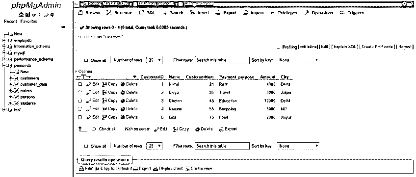
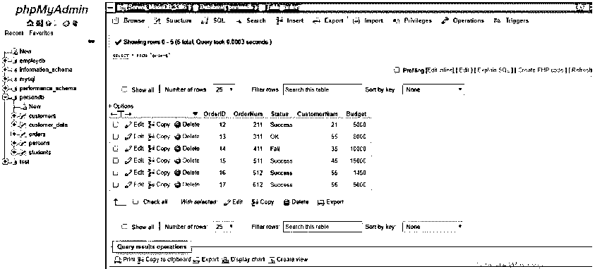
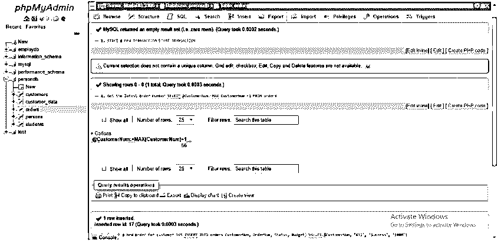
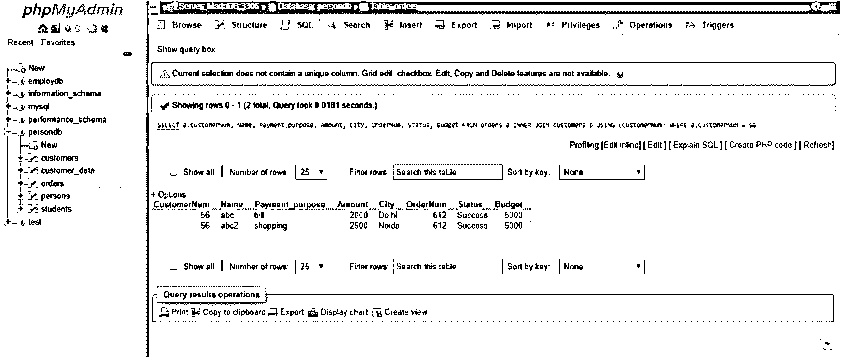
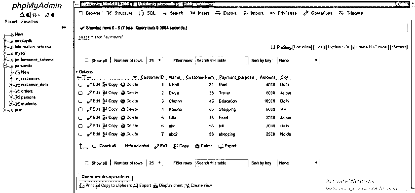
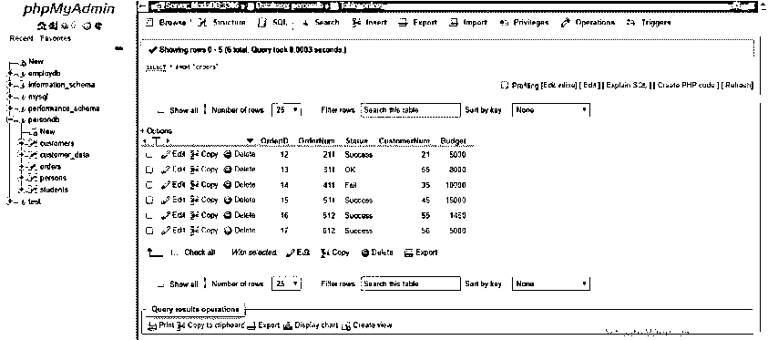

# MYSQL 提交

> 原文：<https://www.educba.com/mysql-commit/>

## MySQL 提交简介

COMMIT 关键字是一个 MySQL 命令，用于控制和管理事务行为。事务被定义为一组连续的操作，用于操作看起来像一个单元的数据库。它在逻辑上与多个要么成功要么失败的原子操作单元结合在一起。

同时，为了使事务成功执行，我们需要确保每个单独的操作都已完成并提交。如果有时某个逻辑操作单元失败了，我们需要知道整个事务也失败或回滚了。

<small>Hadoop、数据科学、统计学&其他</small>

让我们讨论 MySQL 中事务的一些属性，通常称为 ACID 属性:

*   **原子性:**该属性确保构成单个单元的 SQL 查询或操作被成功提交。但是，如果它没有显示任何错误，那么事务将在失败点终止，而先前的操作将被回滚强制恢复到原始状态。
*   **一致性:**它决定了通过一个成功的事务对数据库所做的任何更改都会改变数据库的状态。
*   **隔离:**这个属性保证了所做的事务是相互独立和透明的。
*   **持久性:**即使系统出现故障，也能提供已完成的提交交易结果的交易持久性。

### MySQL 提交的语法

在 MySQL 中，我们可以学习以下管理事务的重要语句:

我们需要使用 START TRANSACTION 命令来启动一个事务。它的别名可以是 BEGIN 或 BEGIN WORK。

然后，COMMIT 命令被用来使表中的变化产生由于当前事务而产生的效果。

同样，使用 ROLLBACK 语句来回滚所做的更改，并取消已提交的更改。

要更改自动提交模式，您可以启用或禁用当前事务状态，并使用设置自动提交。

但是在 MySQL 中，默认情况下，提交会自动显示表中的更改。要在数据库中避免这种情况，可以按如下方式设置自动提交命令的限制:

`SET AUTOCOMMIT = 0;`

或者，

`SET AUTOCOMMIT = OFF;`

和下面的代码来显式地自动提交:

`SET AUTOCOMMIT = 1;`

或者，

`SET AUTOCOMMIT = ON;`

### 如何在 MySQL 中提交作品？

通常，事务以 BEGIN WORK SQL 语句开始，以 COMMIT 或 ROLLBACK SQL 语句结束。在这些开始和结束术语之间，输入执行事务的 SQL 命令。

在 MySQL 事务中，COMMIT 和 ROLLBACK 关键字主要用于陈述表中变化的行为。

COMMIT 命令有助于向所有相关的表显示成功的事务完成后的效果。而 ROLLBACK 命令允许在出现故障时将事务中涉及的表返回到其先前的状态。

因此，我们还可以通过在 MySQL 中定义一个名为 AUTOCOMMIT 的会话变量来控制事务的状态。这里，当我们将 AUTOCOMMIT 设置为 1(这也是默认值)时，它接受事务中的每个 SQL 语句，或者不完成，并在最后提交。

但是，当通过命令 SET AUTOCOMMIT = 0 发出的 AUTOCOMMIT 值为 0 时，随后的一系列 SQL 语句将作为一个事务执行，除非执行了一个明确的 COMMIT 语句，否则不会提交事务中的任何活动。

### 在 MySQL 中实现提交的示例

为了更清楚地理解提交，让我们举一个例子，在创建的名为“Customers”和“Orders”的示例表中插入一行数据值。

这是客户表:

以下是订单表:

我们将通过添加构成 SQL 语句的 SQL 查询部分来解释 MySQL 事务中的提交，并找出何时需要提交或回滚行。

*   **以下是执行交易的脚本代码:**

1.开始一个新的 MySQL 事务

`START TRANSACTION;`

2.获取最新的客户编号

`SELECT
@CustomerNum:=MAX(CustomerNum)+1
FROM Orders;`

3.为 OrderNum 612 插入新行

`INSERT INTO orders (CustomerNum, OrderNum, Status, Budget)
VALUES(@CustomerNum,  '612',  'Success', '5000');`

4.插入订单行项目

`INSERT INTO customers(CustomerNum, Name, Payment_purpose, Amount, City) VALUES(@CustomerNum,'abc', 'bill', '2000','Delhi'),       (@CustomerNum,'abc2', 'shopping', '2500','Noida');`

5.提交更改将反映在表格中。

**输出:**

在这里，我们已经开始了我们的事务，接下来从 orders 表中选择最新的客户编号，并申请下一个编号作为新的客户编号，并将其插入到该表中。同样，在 customers 表中插入客户号，然后最后使用 COMMIT 语句提交事务。

或者，您可以查看从 Orders 和 Customers 表中选择的订单项目的新行。

*   **为了查看新创建的行，我们将使用下面的 SQL 查询:**

`SELECT a.CustomerNum, Name, Payment_purpose,  Amount, City, OrderNum,  Status, Budget FROM Orders a INNER JOIN Customers b USING (CustomerNum) WHERE  a.CustomerNum = 56;`

**输出:**

如果我们分别查看这两个表，我们可以看到表中的以下变化:

客户表:

订单表:

*   要使用 MYSQL 中的事务处理，表应该以特殊的方式形成。支持事务操作的最流行的表是 InnoDB。
*   我们需要有一个 MySQL 版本，应该有一个特殊的编译功能。
*   基本上，当使用 COMMIT 提交事务时，修改将被永久保存。您可以使用 ROLLBACK 命令取消所有事务更改，并在表中执行 COMMIT 之前回滚状态。
*   但是，在 MySQL 中，没有回滚，因为这里启用了 AUTOCIMMITT 模式。因此，在 MySQL 中，几乎所有的语句都不能还原。
*   我们需要数据库备份来恢复提交的事务，还可以使用 DBA 工具来重放日志中的所有数据修改符，或者可以跳过这个问题。

### 结论

从逻辑上讲，在为 COMMIT 编写 SQL 语句以执行事务时，我们会将许多 SQL 查询组合到一个组中，并将它们作为单个事务一起执行。

当在假设插入订单或库存记录的表中成功完成任何事务时，COMMIT 命令用于提醒在事务期间所涉及的表中发生的变化。

### 推荐文章

这是一个 MySQL 提交指南。这里我们讨论在 MySQL 中实现提交的例子，以及客户表、订单表和脚本代码。您也可以看看以下文章，了解更多信息–

1.  [MySQL 外部连接](https://www.educba.com/mysql-outer-join/)
2.  [自然连接 SQL](https://www.educba.com/natural-join-sql/)
3.  [安装 PostgreSQL](https://www.educba.com/install-postgresql/)
4.  [MySQL 中的 MIN()](https://www.educba.com/min-in-mysql/)

