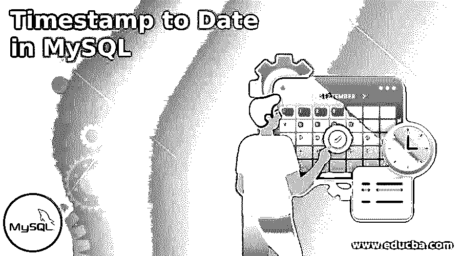
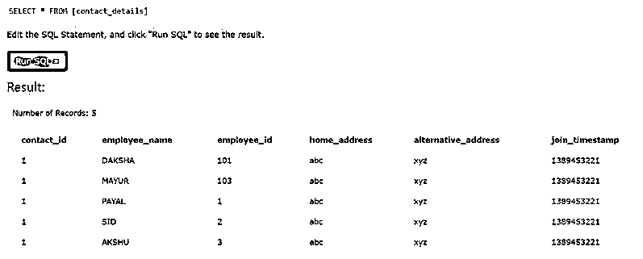

# MySQL 中的时间戳

> 原文：<https://www.educba.com/timestamp-to-date-in-mysql/>

## MySQL 中的时间戳简介

下面的文章提供了 MySQL 中时间戳的概要。在 SQL 中，时间戳值可以通过多种方法转换成日期格式。其中一些包括使用 FROM_UNIXTIME()函数和 format 函数。时间戳值可以是整数，其表示从被认为是参考的标准日期的特定日期起已经过去的秒数，该特定日期是 1970 年 1 月 1 日的午夜时间 12:00，这在计算中不涉及闰秒的考虑，并且被称为历元。

通过使用一个名为 FROM_UNIXTIME()的函数，将时间戳的整数值转换为 YYYY DD MM 格式的日期格式。在这里，我们将看到如何实现 FROM_UNIXTIME()函数来转换以时间戳格式存储在特定表中的值，并借助一个示例尝试在 MySQL 中检索该时间戳的相应日期。

<small>Hadoop、数据科学、统计学&其他</small>

### MySQL 中时间戳的语法

MySQL 中 FROM_UNIXTIME()函数的语法如下所示:

`FROM_UNIXTIME (UNIX timestamp value [, required format])`

在上述语法中，指定的术语如下所述:

*   **UNIX 时间戳值:**UNIX 时间戳值是一个整数值，表示从 1970 年 1 月 1 日的标准时间开始的特定时间(以秒为单位)的时间戳，在数据库内部被视为时间戳值。这个整数也可以是函数 UNIX_TIMESTAMP()的输出，因为这个函数也返回 UNIX 时间戳值。
*   **要求的格式:**要求的格式是可选参数，可以指定输出所需的日期或时间格式。未指定时，默认格式为“YYYY-MM-DD hh:mm:ss”，也可以是 YYYYMMDDhhmmss。检索到的默认格式取决于 FROM_UNIXTIME()函数是用于字符串上下文还是数值上下文。

**输出:**

FROM_UNIXTIME()函数的输出将当前会话的时区视为显示日期和时间值时的时区。

**需要考虑的点:**

如果我们同时使用 FROM_UNIXTIME()函数和 UNIX_TIMESTAMP()函数，同时尝试将非 UTC 时区的时间戳值转换为日期值，则可能会丢失数据，因为数据可能无法正确映射，因为两个方向都没有一对一的映射。

### 如何在 MySQL 中将时间戳转换成日期？

*   为了将 MySQL 中的时间戳值转换为日期值，我们可以使用 FROM_UNIXTIME()函数。在第一步中，您可以取一个表示 UNIX 时间戳值的静态整数值，这意味着自 1970 年 1 月 1 日以来的秒数。
*   或者，您也可以采用一个数据类型为 unix timestamp 的列来存储秒的整数值。现在，为了转换一列静态值，我们需要将 FROM_UNIXTIME()函数的第二个参数指定为“%Y %D %M ”,因为我们希望输出为日期格式。
*   第一个参数是需要转换的列名或静态时间戳值。返回的输出值将是由所提供的时间戳值的日期值组成的字符串值。

### MySQL 中迄今为止的时间戳示例

下面是 MySQL 中迄今为止的时间戳示例:

让我们考虑一个名为 contact_details 的表，它有一个名为 join_timestamp 的列，存储数字格式的整数值。现在，第一步将是使用下面的查询语句检索 contact_details 表的所有值，以检查其内容。

**代码:**

`SELECT * FROM [contact_details] ;`

**输出:**

正如我们所看到的，join_timestamp 列包含所有表示 UNIX 时间戳值的整数值，它实际上是从 1970 年 1 月 1 日开始的秒数。因此，当对同一列应用 FROM_UNIXTIME()函数时，会给出以下输出，我们的查询语句如下所示。

**代码:**

`SELECT contact_id, employee_name, home_address, alternative_address, FROM_UNIXTIME (join_timestamp) FROM [contact_details] ;`

上述查询语句的输出如下所示，显示了存储在 join_timestamp 列中的相应时间戳值的默认日期时间格式值。

**输出:**

现在，我们将看到如何使用 FROM_UNIXTIME()函数从时间戳值中只检索日期值。这可以简单地通过指定所需的 format 参数来完成，这是 FROM_UNIXTIME()函数的第二个可选参数，给出如下所示的日期格式。

**代码:**

`SELECT contact_id, employee_name, home_address, alternative_address, FROM_UNIXTIME (join_timestamp,'%Y %D %M') FROM [contact_details] ;`

%Y 表示年份，%D 表示日期值，%M 表示日期格式的月份值。上述查询语句的输出如下所示，它只检索存储在 contact details 表的 join_timestamp 列中的时间戳值的日期值。

**输出:**

我们还可以更改需要检索日期值的日期格式。让我们再举一个例子，同样的 join_timestamp 列值需要转换成不同的日期格式。要求的格式是月值、日期值和年值。月份应该是字符串格式，显示月份的名称而不是数字。

我们的查询语句现在变成如下所示。

**代码:**

`SELECT contact_id, employee_name, home_address, alternative_address, FROM_UNIXTIME (join_timestamp,'%M %d %Y') FROM [contact_details] ;`

上述查询语句的输出如下所示，日期值以所需的格式检索。

**输出:**

因此，我们的任务实现了，即从 MySQL 的时间戳中检索日期值。

### 结论

FROM_UNIXTIME()函数用于将 UTC 的时间戳值转换为日期值，方法是将适当的日期格式指定为其第二个参数。时间戳值应该是一个 UNIX 时间戳，由从标准时间戳 1970 年 1 月 1 日到当前时间值的秒数的整数表示组成。

### 推荐文章

这是 MySQL 中的时间戳指南。这里我们讨论一下入门，如何在 MySQL 中把时间戳转换成日期？还有例子。您也可以看看以下文章，了解更多信息–

1.  [MySQL 性能调优](https://www.educba.com/mysql-performance-tuning/)
2.  [MySQL 表转储](https://www.educba.com/mysql-table-dump/)
3.  [MySQL 格式化程序](https://www.educba.com/mysql-formatter/)
4.  [MySQL Concat](https://www.educba.com/mysql-concat/) 的实现

