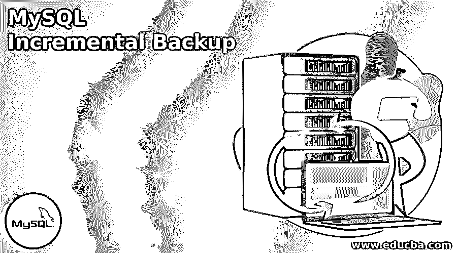

# MySQL 增量备份

> 原文：<https://www.educba.com/mysql-incremental-backup/>

## MySQL 增量备份的定义

众所周知，备份一个巨大的数据库可能会导致服务器超负荷工作。此外，在晚上进行备份，如果发生故障，数据可能会丢失一整天或更长时间。因此，为了避免这种情况，为点对点备份处理创建了增量备份概念。在 MySQL 中，时间点备份有时被认为是一种增量备份，这种备份应运而生。因此，MySQL 增量备份被定义为仅复制自上次备份以来更改过的数据的备份。这可以定期执行，因为它们的大小很小，不会给服务器带来负担。

**语法**

<small>Hadoop、数据科学、统计学&其他</small>

MySQL 增量备份是通过备份 MySQL 二进制日志来执行的。我们应该检查以确认 MySQL 服务器中的二进制日志是否受支持，因为服务器实现了这些二进制日志来保存数据更改。之后，我们可以编辑名为 my.cnf 的 MySQL 配置文件，并按如下方式确认这一行:

`Log_bin = /var/log/mysql/mysql-bin.log`

还有这条线，

`expire_logs_days = 8`

这里，第一行传达了 MySQL 激活二进制日志记录，然后将日志文件保存在路径目录:/var/log/mysql 中。之后，第二行表示必须自动删除所有超过 8 天的日志。

假设我们有一个创建为 test_db 的数据库，那么我们可以将备份作为:

`mysql@mysqlhost 1$ mysql –u-root-p test_db<full_backup.sql`

对于增量备份类型，可以使用以下语法创建二进制日志并添加开始或停止日期时间:

`mysql@mysqlhost 1$ mysqlbinlog – stop-datetime=”2021-05-29 17:00:00” mysql-bin.0000005 | mysql –u-root-p test_db`

### 如何在 MySQL 中进行增量备份？

MySQL 增量备份不同于完整备份过程。在完整备份方法中，备份由任何 MySQL 服务器控制的所有数据组成，但在一个提供的时间点。而在增量备份方法中，备份包括在规定的时间跨度内，即从一点到另一点，对数据完成的所有改变。

几个数据库提供了增量备份的几种实现。例如，在 SQL Server 中，它提供事务和差异日志备份。此外，在 Oracle 数据库中，您可以发现这是通过 RMAN 执行的。另一方面，在 PostgreSQL 中，这个过程是通过 WAL 文件作为备份来进行的。

现在，谈谈 MySQL，它提供了许多创建增量备份的方法。除此之外，交钥匙解决方案是可用的，允许用户机械化的过程。但是，在本系列中，在我们考虑进行增量备份之前，应该记住 MySQL 增量备份不包括消除对完整类型备份的需求。

MySQL 企业备份提供差异和增量备份。用户应通过查看一些因素(如用户拥有的存储空间、能够恢复数据记录的速度等)来决定实施哪种策略。

因此，为了提高速度并减少 MySQL 中用于定期备份的存储容量，我们可以假设一些好的部分随着时间的推移保持不变。这可以通过仅备份随时间发生的数据更改来实现，而不是备份整个数据，这可能会使服务器过载。这可以通过以下步骤之一来实现，但在此之前，我们需要先进行一次完整备份，包括所有数据，然后执行以下操作:

*   执行一系列差异备份
*   执行一系列增量备份

### MySQL 增量备份示例

让我们讨论一下这些 MySQL 增量备份的一些实用程序、过程和工具。最终，因为我们可以将备份定义为一个文件或一组文件。MySQL 提供了三种生成增量备份的方法，概述如下:

#### 1.二元日志

在这些二进制日志文件中，MySQL 数据库中发生的所有更改都由 MySQL 服务器顺序写入。二进制日志包含在整个服务器中名为 mysql.cnf 的文件中。<name of="" binary="" log="">将显示在配置中确定的目录中。这样，用户就能够通过 mysqlbinlog 实用程序从二进制日志文件中提取 SQL 声明。当提取的 SQL 声明连续应用于数据库时，就可以将数据库修复到任何特定的日期。但是对于恢复，我们需要一个完整的备份，这个备份是通过 mysqldump 创建的，带有参数——flush-logs，然后是创建的任何二进制日志文件。这是一种非常快速的备份技术，因为它只是复制文件。</name>

#### 2.Xtrabackup

对于 MySQL 服务器备份，这个 Xtrabackup 工具是由 Percona 作为开源工具提供的。与生成 SQL 脚本的 mysqlbinlog 和 mysqldump 相反，Xtrabackup 通过将数据库文件加倍来创建物理备份。通常，要复制数据库的文件，需要关闭 MySQL 服务器；然而，Xtrabackup 的独特之处在于它复制了数据库的实时文件。在完整备份之前，Xtrabackup 还允许制作 MySQL 增量备份，这些备份依赖于可能物理存储在文件系统某处的另一个备份。

#### 3.MySQL 企业备份

这是一个解决方案，是 MySQL 企业版的一部分，由 Oracle 提供。MySQL 企业版是由 mysqlbackup 实用程序产生的，它允许用户执行恢复和备份操作。使用 mysqlbackup，通过在过程中将参数值指定为–incremental-base 并定义 LSN(即日志序列号)来创建增量备份。

#### 4.SQLBak

SQLBak utility 提供了一种服务，可以产生 SQL 实例备份，然后将它们定向到云存储，如亚马逊 S3、Azure Storage、OneDrive、Dropbox、Backblaze B2、Google Drive 等。它包括基于二进制日志创建 MySQL 增量备份的服务特性之一。此外，它还提供压缩、加密以及电子邮件通知。

### 结论

*   如果您直到现在才意识到备份 MySQL 数据库，那么在您丢弃宝贵的数据信息之前，让我们开始执行它。
*   很少有人认为他们在存储副本时可能不需要备份，但这是不对的。这种复制可以在硬件灾难时保存数据，但 MySQL 中的备份可以防止人为错误。
*   因此，MySQL 增量备份有助于创建这样的重复数据，而不会使服务器过载，并且可以在需要时恢复使用。

### 推荐文章

这是一个 MySQL 增量备份的指南。在这里，我们讨论如何在 MySQL 中执行增量备份，以及语法和示例。您也可以看看以下文章，了解更多信息–

1.  [MySQL 性能调优](https://www.educba.com/mysql-performance-tuning/)
2.  [MySQL 表转储](https://www.educba.com/mysql-table-dump/)
3.  [MySQL 全文搜索](https://www.educba.com/mysql-full-text-search/)
4.  [MySQL 默认端口](https://www.educba.com/mysql-default-port/)

