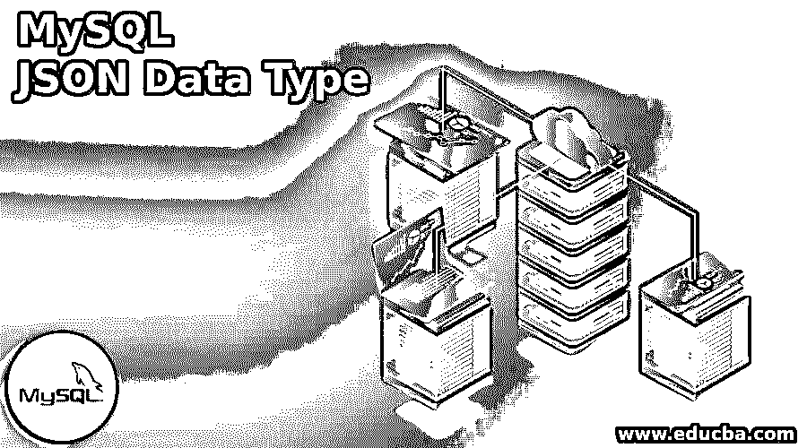
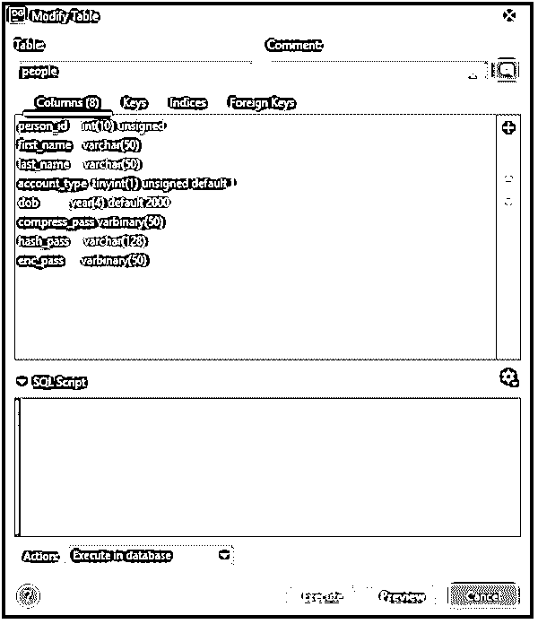
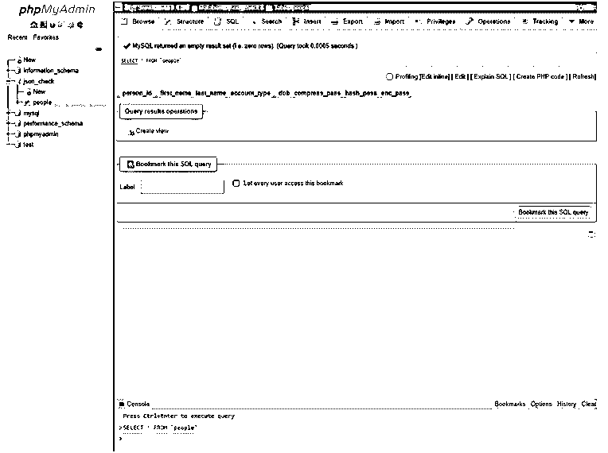

# MySQL JSON 数据类型

> 原文：<https://www.educba.com/mysql-json-data-type/>

## MSQL JSON 数据类型介绍

MYSQL 是一个开源的关系数据库管理系统，在本文中，我们将看到它如何处理 JSON 数据类型。我们将看看如何将 JSON 数据类型插入到 MYSQL 表中，我们还将看到 MYSQL 中各种可用的函数来进一步选择和查询 JSON 文档或对象。从版本 5.7.8 开始，我们甚至可以本地存储 JSON 数据，MYSQL 有一大堆数据类型和函数来管理它。

### JSON 入门

JSON 或 JavaScript 对象符号是一种数据交换格式，通常由对象、数组、字符串、数字和布尔值组成。这种格式也是独立于语言的，所以不管你使用的是 java、SQL、kotlin、ruby 还是其他兼容的语言。要了解更多关于 JSON 格式的信息，你可以参考 https://www.json.org/json-en.html.的这篇文章，我们将看到 MYSQL 如何与 JSON 交互，以及有哪些功能可用。下面是我们用于演示的表格，显示了 MSQL 对 JSON 的用法。

<small>Hadoop、数据科学、统计学&其他</small>

然后，我们将添加一个 JSON 类型的列来存储原生 JSON 数据。数据库是在 phpMyAdmin 中建立的，为了方便访问，Jetbrains 中的 Datagrip 用于查询和修改数据库。

首先，我们将使用以下查询添加一个 JSON 类型的 person_data 列。

`alter table people
add column person_data JSON`

那么我们将使用下面的 insert 语句。在使用它之前，确保 person_id 是一个主键，并且是自动递增的。

`insert into people(first_name, last_name, person_data)
values ('Clark', 'Kent', '{"identity": "Superman"}'),
('Bruce', 'Wayne', '{"identity": "Batman"}'),
('Bruce', 'Banner', '{"identity": "Hulk"}')`

在这个查询中，我们添加了名、姓和 person_data，这是一个 JSON 对象，我们添加了它的字符串表示，通常是键和值对的形式。该值可以由 null、true 或 false 组成，但都必须是小写，并且区分大小写，而 mysql 是不区分大小写的，如 Select Null、NULL、NULL，这一切都可以正常工作。

正如我们所看到的，我们的数据是以 JSON 形式添加的。

下一个问题是我们如何从整个 json 数据中选择所需的数据，为此，MYSQL 中有许多帮助方法，第一个是 JSON_EXTRACT

**语法:**

`JSON_EXTRACT(json_doc, path[, path] ...)
JSON_UNQUOTE(json_val)`

**代码:**

`select person_data,
JSON_EXTRACT(person_data, '$.identity') as secret_id,
JSON_UNQUOTE(JSON_EXTRACT(person_data, '$.identity')) as super_secret_id
from people
where JSON_UNQUOTE(JSON_EXTRACT(person_data, '$.identity')) = "Superman";`

**输出:**

在这个查询中，我们选择 json 格式的 person_data，然后使用 JSON_EXTRACT 方法，通过美元符号获取 identify 属性的值。它有两个参数:列名或表达式以及位置或属性。请注意，结果用引号括起来。因此，我们可以使用 JSON_UNQUOTE 并提供提取的值来获得一个未加引号的值。我们甚至可以在 where 子句中使用它来比较结果的值。

### 使用 MYSQL 创建数组和对象

**语法:**

`JSON_ARRAY([val[, val] ...])
JSON_OBJECT([key, val[, key, val] ...])
JSON_TYPE(json_val)`

**代码:**

`select json_array(1, true, "name", "2009-09-12") as array,
json_object("a", 1, "b", "Steve", "c", true, "d", "null") as object,
json_type(person_data) as type
from people;`

**输出:**

在这个查询中，我们使用了 3 个函数，JSON_ARRAY 将获取所有有效的 JSON 类型，并创建一个数组，正如您在结果中看到的方括号。JSON_OBJECT 将接受逗号分隔的键和值对，并确保键总是在引号中。然后 JSON_TYPE 将给出存储的数据的类型，在这种情况下，我们已经存储了整个 JSON 对象。

### MYSQL for JSON 中的合并函数

mysql for json 中的合并函数解释如下:

#### 1.合并补丁

**语法:**

`JSON_MERGE_PATCH(json_doc, json_doc[, json_doc] ...)`

**代码:**

`select json_merge_patch('{"name":"Steve"}', '{"name":"Steve"}');`

**输出:**

**代码:**

`select json_merge_patch('{"name":"Steve"}', '{"name":"Dave"}');`

**输出:**

在这两个查询中，我们使用了 JSON_MERGE_PATCH 函数，它将通过修补或替换现有值来合并新值。正如我们在第一个查询中看到的，值是相同的，在第二个查询中，新值被替换。

#### 2.合并保留

**语法:**

`JSON_MERGE_PRESERVE(json_doc, json_doc[, json_doc] ...)`

**代码:**

`select json_merge_preserve('{"name":"Steve"}', '{"name":"Steve"}');`

**输出:**

**代码:**

`select json_merge_preserve('{"name":"Steve"}', '{"name":"Dave"}')`

**输出:**

在这两个查询中，我们保留了旧值和新值，因为我们可以看到，在第一个查询中，值是重复的，而在第二个查询中，新值是附加的。

### 搜索 JSON 值

**语法:**

`JSON_CONTAINS(target, candidate[, path])`

**代码:**

`SET @test_string_object = '{"a": 1, "b": 2, "c": {"d": 4}}';
SET @search_value = '1';
SELECT JSON_CONTAINS(@test_string_object, @search_value, '$.a') as check_if_exist;`

**输出:**

在这个查询中，我们创建了一个表示 JSON 对象的测试字符串和另一个我们想要在对象中搜索的变量。然后我们使用了 JSON_CONTAINS 函数，它有 3 个参数，第一个是要搜索的目标，然后是搜索值，最后是属性。如果找到，返回值为 1，如果没有找到，返回值为 0。如果任何参数为空或者路径无效，则返回空值。

**语法:**

`JSON_CONTAINS_PATH(json_doc, one_or_all, path[, path] ...)`

**代码:**

`SET @test_string_object = '{"a": 1, "b": 2, "c": {"d": 4}}';
SELECT JSON_CONTAINS_PATH(@j, 'all', '$.a', '$.e');`

**输出:**

**代码:**

`SET @test_string_object = '{"a": 1, "b": 2, "c": {"d": 4}}';
SELECT JSON_CONTAINS_PATH(@j, 'one', '$.a', '$.e');`

**输出:**

在这些查询中，我们使用 JSON_CONTAINS_PATH，它接受输入 JSON，并根据 one 或 all 参数确定是所有路径都存在还是其中一个路径存在，并返回 1 或 0。在第一个查询中，我们使用了所有参数，并且只有一个 exist，所以它返回 0；在第二个查询中，我们使用了一个参数，并且有一个 path exist，所以它返回 1。

### 结论——MySQL JSON 数据类型

希望现在您已经知道如何在 MYSQL 数据库中使用 JSON 数据，我们已经学习了如何在 MYSQL 表中插入 JSON 值，同时我们还学习了各种帮助器方法，使得操作存储的 JSON 值变得容易。

### 推荐文章

这是 MSQL JSON 数据类型指南。在这里，我们还将讨论简介，并使用 mysql 创建数组和对象，同时给出解释。您也可以看看以下文章，了解更多信息–

1.  [MySQL vs MSSQL](https://www.educba.com/mysql-vs-mssql/)
2.  [MySQL 新的](https://www.educba.com/mysql-uuid/)
3.  [MySQL 数据类型](https://www.educba.com/mysql-data-type/)
4.  [SQL 数据类型](https://www.educba.com/sql-data-types/)

