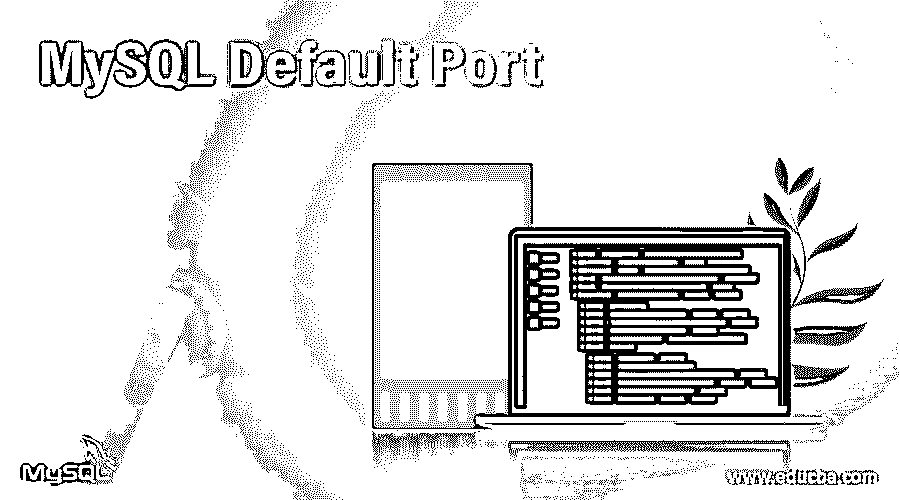
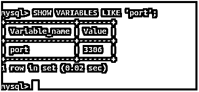
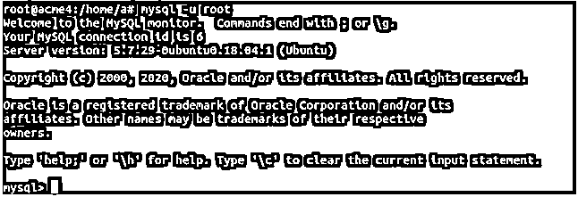
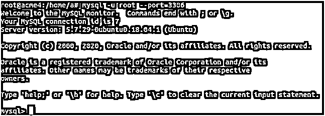
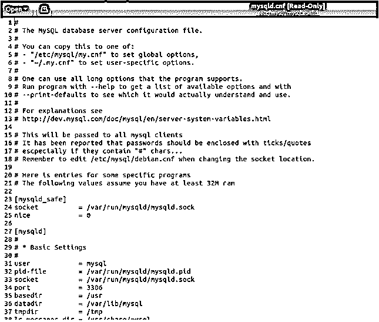
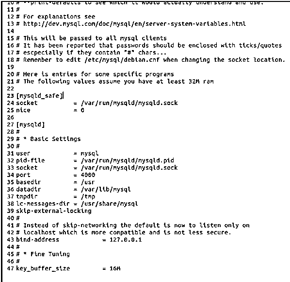

# MySQL 默认端口

> 原文：<https://www.educba.com/mysql-default-port/>

## MySQL 默认端口介绍

MySQL 端口是网络协议中的一种机制，它允许服务器处理和管理特定网络中多个客户端的连接和会话。MySQL 的默认端口是 3306。端口由 16 位大小的 2 字节数值表示和标识。其中，65536 个端口号被命名为端口，这些端口根据用于传输的协议进一步分类为 TCP 或 UDP 端口。

有四种类型的协议值，即所有操作系统中使用的 TCP、Windows 操作系统中使用的管道和内存以及 Unix/Linux 操作系统中使用的套接字。所有这些协议值都用于建立和维护到远程或本地服务器的连接。在 MySQL 中，TCP/IP 套接字用于连接位于远程的客户端。

<small>Hadoop、数据科学、统计学&其他</small>

在本文中，我们将了解如何检索当前正在使用的端口，如何检查您的 MySQL 端口并使用您的默认 MySQL 端口连接 MySQL 数据库服务器，以及如何使用配置文件更改用于连接 MySQL 的默认端口。

### 检查您正在使用的 MySQL 端口

当您连接到 MySQL 服务器并希望检查客户端用来连接 MySQL 服务器的端口时，可以检索名为 port 的变量的值，该变量存储用于连接的端口号。这可以通过以下方式实现

`SHOW VARIABLES LIKE 'port';`

您可以在 Unix/Linux 平台上使用上述命令，并了解用于连接 MySQL 服务器的端口号。在我们的例子中，输出如下

我们可以看到端口变量的值是 3306。这是 MySQL 端口号的默认值。

在 windows 中，以下命令用于了解 MySQL 端口的值。

`Mysql -u your_username -e “SHOW GLOBAL VARIABLES LIKE ‘PORT’”`

多个客户端和用户访问 Mysql 数据库，这导致创建多个连接和会话。所有这些都由 MySQL 支持，MySQL 使用 TCP/IP 套接字、命名管道或 Unix 套接字与网络连接。远程连接总是使用 TCP/IP 套接字和 3306 作为 Mysql 的默认端口号。

要在 Unix/Linux 平台上检查我们网络上的 MySQL 端口，我们可以使用以下命令

`netstat -a |grep mysql;`

在我的例子中，输出如下

它告诉我们有 2 个 MySQL 连接，其中一个连接在监听。在上面的命令中，netstat 用于显示网络的状态，而-a 代表所有连接，而|运算符用于指定过滤器和附加信息。在我们的例子中，我们使用 grep 语句来搜索进一步指定的关键字“mysql”。

或者，您可以使用以下命令–

`netstat -na |grep 3306;`

这将产生以下输出–

在 windows 中，您可以使用以下查询–

`netstat -na | find “3306”`

这将显示所有与 3306 端口的连接。输出表明端口号为 3306 的端口正在侦听 localhost 127.0.0.1 地址，并使用 TCP 套接字和协议进行连接。

### 连接到 Mysql 数据库服务器

我们可以在 TCP/IP 协议连接的帮助下，使用命令行终端连接到我们的 MySQL 数据库服务器，方法是连接到侦听网络连接的特定端口，正如我们在上述命令的输出中看到的，3306 端口正在侦听。使用数据库服务器的默认端口和 root 访问权限连接到数据库服务器的命令如下

`mysql -u root`

这给出了以下输出–

通过指定要用来建立到 MySQL 数据库服务器的 TCP/IP 连接的特定端口，您可以使用以下命令

`mysql -u root –port=3306`

这将产生以下输出–

对于这两个命令，我们必须首先使用 su 命令作为超级用户登录。

这样，我们可以在任何平台上使用命令行连接到 MySQL 数据库服务器。

### 更改 MySQL 的默认端口

现在，我们将看到 MySQL 的默认端口是在哪里配置和指定的，以及我们如何将它更改为我们想要的任何其他端口。关于 MySQL 配置的信息存储在 my.cnf 文件的 my.ini 中。该文件位于安装数据库的文件夹中。更换端口非常容易。我们所要做的就是改变文件的设置。

根据您机器上安装的 MySQL 服务器包，文件的扩展名可能会改变，但它将始终是 ini 或 cnf，名称为 my 或 mysql.cnf 或 mysqld.cnf。在我的例子中，该文件位于以下位置

/etc/MySQL/MySQL . conf . d/mysqld . CNF

它包含以下内容——

可以看到，在线号码 34 在我的例子中，文件包含一个名为 port 的变量，其值为 3306，如下所示

`port = 3306`

要更改默认端口，我们只需将 3306 的值更改为您希望 MySQL 数据库服务器监听的端口号，然后保存文件。在此之前，有必要使用以下查询来执行当前正在运行的 MySQL 服务

`service MySQL stop`

在 unix/linux 平台和

`stop mysql.exe`

适用于 windows 平台。

然后打开配置文件。假设，我们想要将默认端口从 3306 更改为 4000，那么我们将在配置文件中将端口值更改为 4000，如下所示，并保存该文件。

如果文件处于只读模式，首先通过使用 chmod 命令或更改属性来更改权限，然后保存文件。

然后使用以下命令重新启动 MySQL 服务

`service mysql start`

在 Unix/Linux 平台和

`start mysql.exe`

适用于 windows 平台。

### 结论

Mysql 被分配了默认端口号 3306，服务器在这里监听客户端连接的建立。可以通过更改配置文件中的端口变量值来进一步配置和更改它。

### 推荐文章

这是一个 MySQL 默认端口的指南。在这里，我们讨论如何检索当前正在使用的端口，以及如何检查您的 MySQL 端口。您也可以看看以下文章，了解更多信息–

1.  [MySQL 展示](https://www.educba.com/mysql-show/)
2.  [MySQL 偏移量](https://www.educba.com/mysql-offset/)
3.  [授予 MySQL 特权](https://www.educba.com/grant-privileges-mysql/)
4.  [MySQL Binlog](https://www.educba.com/mysql-binlog/)

