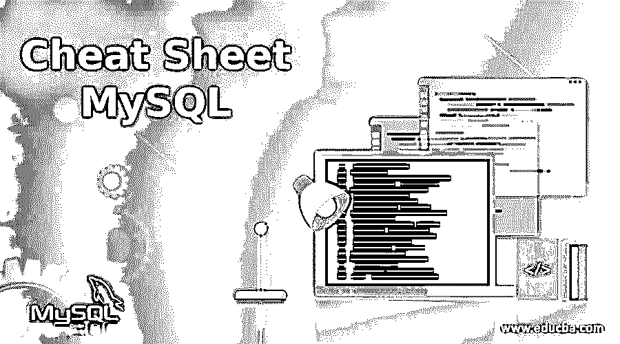

# 备忘单 MySQL

> 原文：<https://www.educba.com/cheat-sheet-mysql/>

## Cheatsheet MySQL 简介

MySQL 是一个开源的数据库管理系统。Cheatsheet MySQL 有很多特性，这些特性使它更加灵活和可扩展。MySQL 是免费的，这意味着使用它不需要付费。它有能力处理昂贵而强大的数据库包的大量功能。它主要针对大量数据快速有效地工作。备忘单 MySQL 的一个很大的特点是可定制的，它可以被修改成特定的环境。

### 关系型数据库

MySQL 主要适用于各种编程语言，如 C、PHP、Perl 等。PHP 主要只和 MySQL 一起使用。它是一个最可靠的数据库，在通过不同的模式与编程语言连接时，它提供了很好的性能并确保了数据的安全性。MySQL 被称为关系数据库管理系统(RDBMS)。MySQL 数据库主要只支持一种语言，即英语。它由甲骨文公司开发，并于 1995 年发布。它支持多种操作系统，如 Windows、Mac OS、Linux、Solaris、免费 BSD 等。 [C 和 C++](https://www.educba.com/c-vs-c-plus-plus/) 用于开发 MySQL。

<small>Hadoop、数据科学、统计学&其他</small>

### 备忘单 MySQL 上的命令和内容

Cheatsheet MySQL 有一个丰富的库，可伸缩、可扩展、可交互，并包含许多计算常见操作的内置方法。有不同的命令可用于执行命令行操作，每个命令都有长格式和短格式。长格式不区分大小写，但短格式区分大小写。下面是提到的执行不同类型操作的 MySQL 命令:

| **命令** | **描述** |
| 救命啊，\h，？ | 它将显示可用的 MySQL 命令 |
| 清除，\c | 它清除用户输入 |
| 连接，\r | 连接到服务器。 |
| 分隔符，\d | 它设置语句分隔符。 |
| 编辑，\e | 用$EDITOR 编辑命令。 |
| 自我，g | 它垂直显示结果。 |
| 退出，\q | 它将退出或退出或关闭 MySQL。 |
| 去吧，\g | 它将向 SQL server 发送一个命令。 |
| nop at \ n | 它显示寻呼机，打印到标准输出。 |
| 请注意，\t | 不要写信给 outfile。 |
| 寻呼机，\P | 设置寻呼机并通过寻呼机打印结果。 |
| 打印，\p | 它将打印当前命令 |
| 提示，\R | 更改 MySQL 提示符。 |
| 重新散列，\# | 重建完成哈希。 |
| 三通，\T | 设置输出文件并追加到输出文件中 |
| 来源，\。 | 执行 SQL 脚本文件。 |
| 状态，\s | 它将从服务器获取状态信息 |
| 系统，\！ | 执行系统 shell 命令 |
| 使用，\u | 使用另一个数据库，借助数据库名称作为参数。 |
| 字符集，\C | 定义字符集。 |
| 警告，\W | 它会在每条语句的末尾显示一条警告。 |
| 不警告，\w | 它不会在每条语句后都显示警告。 |
| 重置连接，\x | 它将清除会话上下文。 |

**数据类型** : MySQL 有不同的数据类型，用于在数据库列中插入特定的值。对于整数，使用“int”。类似地，其他如 float、double、timestamp、char、varchar、blob、enum 也用于插入特定的值。

**字符串函数:**也有字符串函数可供使用:

| **字符串函数** | **描述** |
| strcmp(s1，s2) | 比较字符串 |
| 下限(s) | 转换成小写 |
| 鞋帮 | 转换为大写 |
| 子字符串(s，索引 1，索引 2) | 获取子串 od 字符串 |
| Ltrim | 向左修剪 |
| 治愈() | 获取今天的日期 |
| 柯蒂梅() | 获取时间。 |
| Dayname(s) | 如果我们要提取一天的名称。 |
| Dayofweek(s) | 提取特定的日期。 |
| Monthname(s) | 如果需要提取月份。 |

**数学函数:–**MySQL 数学模块中可用的不同函数有:

| **功能** | **描述** |
| 计数(*) | 计算每组的行数 |
| AVG(专栏) | 一组的平均值 |
| 最小值(列) | 一个组的最小值 |
| 最大值(列) | 组的最大值 |
| 总和(列) | 对组中的值求和 |
| Abs(数字) | 绝对值 |
| 舍入(数字) | 路由号码 |
| 楼层(编号) | 该数字是最大的整数，但不能更大 |
| 上限(数量) | 最小整数不更小 |
| Sqrt(数字) | 平方根 |
| 幂(基数，指数) | n 次方 |
| 兰德() | 随机数 |
| Sin(数字) | 正弦函数 |
| Cos(数字) | 价值函数 |

### 使用 Cheatsheet MySQL 命令的免费提示和技巧

1.  在备忘单 MySQL 中，如果需要所有数据库的列表，那么使用命令‘SHOW DATABASES；’来获取可用的数据库。
2.  若要创建数据库，请选择“创建数据库数据库名”命令用于创建新数据库。
3.  要使用特定的数据库，请发出“使用数据库”命令已使用。
4.  “显示表格”命令需要使用 MySQL 数据库中所有表的列表。
5.  描述表格；显示表中的列；'命令用于显示表格的结构。
6.  删除数据库 dbname'命令用于删除数据库。请小心使用此命令，执行后将无法执行回滚。
7.  如果从表中选择数据时不需要重复数据，则应使用 DISTINCT 关键字来避免重复数据。查询可以是:从表中选择不同的列；
8.  还有其他查询，用于插入、更新、删除、排序、分组列、连接两个或多个表。这些使得数据处理更快，检索更容易。

*   插入:插入表值(v1，v2)；
*   插入列:Alter table tablename ADD columntypeoptions；
*   更新:更新表集 column1= **x** 其中 1=1(条件)；
*   删除:从 1=1(条件)的表中删除；
*   删除列:Alter table tablename Drop column name；

9.  如果忘记了根密码，请使用以下命令:

$ /etc/init.d/mysql stop

$ mysqld _ safe–skip-grant-tables &

另一个终端上的$ mysql #

mysql >更新 MySQL . user SET PASSWORD = PASSWORD(' P @ ss w0 rd ')，其中 user = ' root

$ /etc/init.d/mysql start

10.  如果停机后工作台需要维修是不合适的:

mysqlcheck–所有数据库–快速

11.  如果需要从文件中加载数据，请使用以下命令:

mysql >源输入文件

$ mysql 数据库

$ cat filename.sql | mysql 数据库

### 结论

备忘单 MySQL 易于使用，它的语法更容易记忆，查询也容易编写。它可以与任何网络技术一起使用来存储数据。它是安全的，并且执行速度更快。它的结构易于操作和理解。使用简单的语言使初学者更容易学习。

MySQL 主要用于 UNIX 之类的操作系统，非常容易集成。这个可以用在云平台上，这是市面上最新的东西。它可以很容易地移动或托管在亚马逊或 Azure 云平台服务上。

### 推荐文章

这是一个 Cheatsheet MySQL 的指南，在这里我们讨论了 cheat sheet MySQL 的内容和命令以及免费的提示和技巧。您也可以阅读以下文章，了解更多信息——

1.  【UNIX 备忘单
2.  [小抄 CCNA](https://www.educba.com/cheat-sheet-ccna/)
3.  [备忘单 Java](https://www.educba.com/cheat-sheet-java/)
4.  [备忘单 CSS3](https://www.educba.com/cheat-sheet-css3/)

