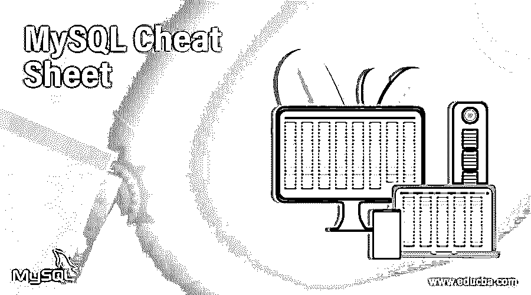
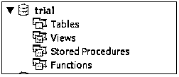
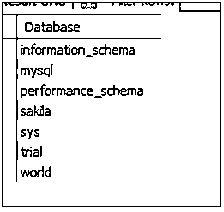
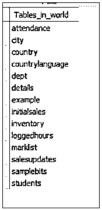

# MySQL 备忘单

> 原文：<https://www.educba.com/mysql-cheat-sheet/>

## MySQL 备忘单介绍

MySQL Cheat Sheet 只是一个页面上所有经常使用的 MySQL 查询的集合。它可以包括使用数据库、表、索引、视图、触发器、存储过程和存储函数的查询。它还可能包括从表中检索数据、在表中搜索数据、修改表中的数据、获取行数等基本查询。这样的查询列表一起形成了 MySQL 的备忘单。备忘单中主要提到了创建、删除、更新和插入的查询。

### MySQL 备忘单的查询

让我们来看看 MySQL 中一些基本的常用查询。

<small>Hadoop、数据科学、统计学&其他</small>

#### 1.数据库相关查询

数据库级最常用的查询如下:

*   **创建数据库:**

语法将是:

`CREATE DATABASE IF NOT EXISTS db_name;`

**样本查询:**

`CREATE DATABASE IF NOT EXISTS trial;`

**输出:**

**新数据库:**

**使用数据库:**

语法将是:

`USE db_name;`

**样本查询:**

`USE trial;`

**输出:**

*   **显示当前服务器中的所有数据库:**

语法将是:

`SHOW DATABASES;`

**样本查询:**

`SHOW DATABASES;`

**输出:**

**所有数据库:**

*   **删除数据库:**

语法将是:

`DROP DATABASE IF EXISTS db_name;`

**样本查询:**

`DROP DATABASE IF EXISTS trial;`

**输出:**

#### 2.表相关查询

表级别最常用的查询如下:

*   要显示数据库中的所有表:

语法将是:

`SHOW TABLES;`

**样本查询:**

`SHOW TABLES;`

确保双击要从中提取表列表的数据库。

**输出:**

**数据库‘世界’中的表格列表:**

*   **创建表格:**

语法将是:

`CREATE TABLE IF NOT EXISTS table_name (
Column_list
);`

**样本查询:**

`CREATE TABLE IF NOT EXISTS SAMPLE (
Id INT,
Emp VARCHAR (50),
JOB VARCHAR (50);`

**输出:**

*   **向现有表格添加新列:**

语法将是:

`ALTER TABLE TABLE_NAME
ADD COLUMN COLUMN_NAME;`

**样本查询:**

`ALTER TABLE SAMPLE
ADD COLUMN TITLE VARCHAR (50);`

**输出:**

*   **将新列拖放到现有表:**

语法将是:

`ALTER TABLE TABLE_NAME
DROP COLUMN COLUMN_NAME;`

**样本查询:**

`ALTER TABLE SAMPLE
DROP COLUMN TITLE;`

**输出:**

*   **显示表格的一列:**

语法将是:

`DESCRIBE TABLE_NAME;`

**样本查询:**

`DESCRIBE SAMPLE;`

**输出:**

*   **显示表格中某一列的详细信息:**

语法将是:

`DESCRIBE TABLE_NAME COLUMN_NAME;`

**样本查询:**

`DESCRIBE SAMPLE  Id;`

**输出:**

*   **删除表格:**

语法将是:

`DROP TABLE IF EXISTS TABLE_NAME;`

**样本查询:**

`DROP TABLE IF EXISTS SAMPLE;`

**输出:**

#### 3.索引相关查询

在索引级别最常用的查询如下:

*   **创建索引:**

语法将是:

`CREATE INDEX index_name
ON table_name (column_name);`

**样本查询:**

`CREATE INDEX TRIAL
ON COUNTRY (CODE,NAME);`

**输出:**

*   **删除索引:**

语法将是:

`DROP INDEX Index_name
ON table_name;`

**样本查询:**

`DROP INDEX TRIAL
ON COUNTRY;`

**输出:**

#### 4.触发相关查询

触发器上最常用的查询如下:

*   **创建触发器:**

语法将是:

`DELIMITER $$
CREATE TRIGGER trigger_name
trigger_time trigger_event
ON table_name FOR EACH ROW
BEGIN
-- statements
END$$
DELIMITER ;
Sample Query:
DELIMITER $$
CREATE TRIGGER Updated_Sales_Data
AFTER UPDATE
ON InitialSales FOR EACH ROW
BEGIN
IFOLD.qty<>new.qtyTHEN
INSERT INTO Sales Updates(sales_Id,InitialQuantity, UpdatedQuantity)
VALUES(old.prodId, old.qty, new.qty);
END IF;
END$$
DELIMITER;`

**输出:**

*   **放下扳机:**

语法将是:

`DROP TRIGGER trigger_name;`

**样本查询:**

`DROP TRIGGER Updated_Sales_Data;`

**输出:**

#### 5.与存储过程相关的查询

存储过程中最常用的查询如下:

*   **创建存储过程:**

语法将是

`DELIMITER $$
CREATE PROCEDURE procedure_name(parameter_list)
BEGIN
body;
END $$
DELIMITER ;`

*   **删除存储过程:**

语法将是:

`DROP PROCEDURE IF EXISTS procedure_name;`

#### 6.存储功能相关查询

对存储函数最常用的查询如下:

*   **创建存储功能:**

`Syntax will be
DELIMITER $$
CREATE FUNCTION function_name(parameter_list)
RETURNS datatype
NOT DETERMINISTIC
BEGIN
-- statements
END $$
DELIMITER ;`

*   **删除存储的功能:**

语法将是:

`DROP FUNCTION IF EXISTS function_name;`

#### 7.从表中检索数据的查询

最常用于从表中检索数据的查询如下:

*   **选择所有数据:**

`SELECT * FROM table_name;`

*   **仅选择特定列:**

`SELECT COLUMN1, COLUMN2 …
FROM TABLE_NAME;`

*   **仅从列中选择不同的值:**

`SELECT DISTINCT COLUMN_NAME
FROM TABLE_NAME;`

*   **根据“WHERE”条件检索数据:**

`SELECT COLUMN_NAMES
FROM table_name
WHERE CONDITION;`

*   基于多个表选择数据:我们有使用连接、内部连接、左连接、右连接等选项。

**内部连接:**

`SELECT COLUMN_NAMES
FROM table_1_name
INNER JOIN table_2_name
ON coindition;`

**左连接**

`SELECT COLUMN_NAMES
FROM table_1_name
LEFT JOIN table_2_name
ON coindition;`

**右连接:**

`SELECT COLUMN_NAMES
FROM table_1_name
RIGHT JOIN table_2_name
ON condition;`

*   **检索表中的行数:**

`SELECT COUNT (*)
FROM TABLE_NAME;`

*   **按照特定的排序顺序检索数据:**

`SELECT COLUMN_NAMES
FROM table_name
ORDER BY column_name ASC|DESC;`

*   升序的 ASC
*   DESC 代表降序
*   **检索分组类中的数据:**

`SELECT COLUMN_NAMES
FROM table_name
GROUP BY column_names ;`

*   **过滤出具有‘having’条件的数据:**

`SELECT COLUMN_NAMES
FROM table_name
GROUP BY column_name
HAVING condition ;`

#### 8.修改表中数据的查询

最常用于修改表中数据的查询如下:

*   要将数据插入表格:
*   一次一行:

`INSERT INTO table_name(column_names)
VALUES(value);`

*   **一次进行多行:**

`INSERT INTO table_name(column_names)
VALUES(value1),
(value2),
(value3);`

*   **更新表格中所有行的数据:**

`UPDATE TABLE_NAME
SET COLUMN_NAME = VALUE;`

*   **根据给定条件更新:**

`UPDATE TABLE_NAME
SET COLUMN_NAME = VALUE;
WHERE CONDITION;`

*   **删除表格中的所有行:**

`DELETE FROM TABLE_NAME;`

*   **根据条件删除行:**

`DELETE FROM TABLE_NAME
WHERE CONDITION;`

### 推荐文章

这是一个 MySQL 备忘单指南。这里我们讨论一些基本的常用查询列表，一起构成 MySQL 的备忘单。您也可以看看以下文章，了解更多信息–

1.  [MySQL EXTRACT()](https://www.educba.com/mysql-extract/)
2.  [MySQL 限制](https://www.educba.com/mysql-limit/)
3.  [MySQL 索引](https://www.educba.com/mysql-index/)
4.  [MySQL 别名](https://www.educba.com/mysql-alias/)

