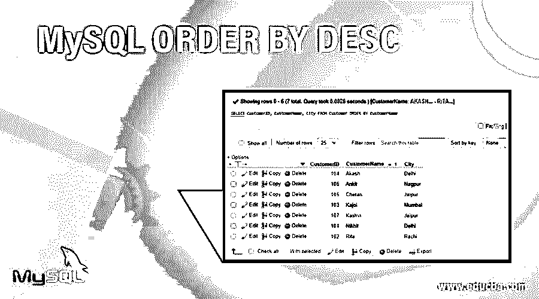
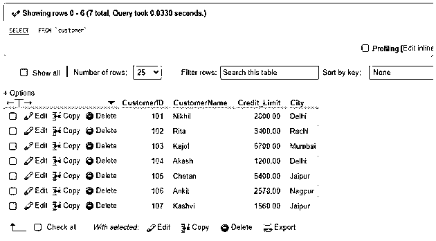
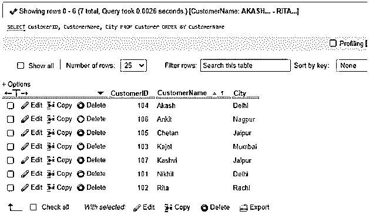
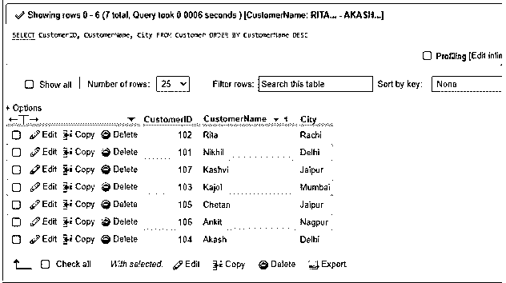
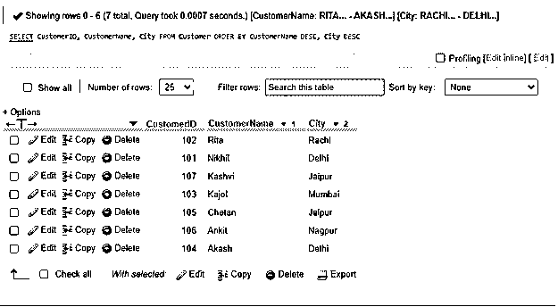
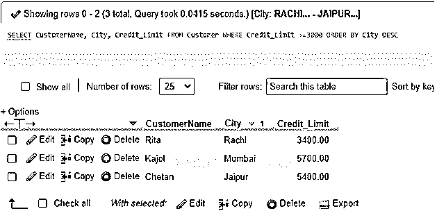
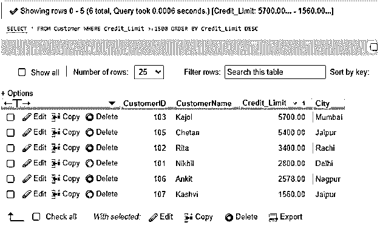
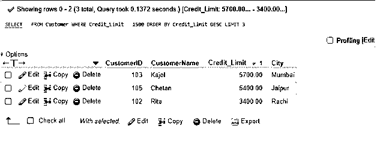

# DESC 订购的 MySQL

> 原文：<https://www.educba.com/mysql-order-by-desc/>

## DESC 的 MySQL 顺序介绍

MySQL ORDER BY DESC 是 MySQL 中的一个 ORDER BY 子句，它负责对作为结果行提取的数据库记录进行排序。

基本上，ORDER BY 子句使用属性来指定表记录的排序顺序。因此，我们需要在这个查询命令的 ORDER BY 子句中包含 ASC 或 DESC 修饰符。

<small>Hadoop、数据科学、统计学&其他</small>

这些属性与 ORDER BY 子句一起，使结果表中的行排列以升序或降序显示。但是默认情况下，当没有向 ORDER BY 子句提供修饰符时，该值将被设置为 ASC。因此，我们将实现 ORDER BY DESC 查询，以降序对行进行排序。

**语法**

随后的语法是用 MySQL 数据库查询申请 ORDER BY DESC 子句的简单结构:

`SELECT ColumnName1, ColumnName2, ….FROM TableName WHERE Cond_Expr ORDER BY ColumnName1 DESC, ColumnName2DESC,….ColumnNameNDESC;`

语法解释如下:

*   为了应用 ORDER BY DESC 子句，我们将使用 SELECT 语句来编写查询。
*   ColumnName 表示用户希望获取的表列的名称。
*   TableName 表示查询中包含的表的名称。
*   WHERE 子句定义应用于表以提供结果的条件表达式，如果需要，这是一个可选条件。但是，如果条件匹配，则选定的行将显示在结果集中。
*   带有 DESC 的 ORDER BY 子句用特定的列名定义排序结构。

### DESC 的订单在 MySQL 中是如何工作的？

*   在 MySQL 查询中实现 SELECT 语句将从特定的表中获取数据记录；然后，您会注意到所提供的结果行表不是有序的。因此，为了以排序列表的形式显示结果集，我们需要在 SELECT 查询中添加 MySQL ORDER BY 子句。
*   在 ORDER BY 子句的帮助下，您可以对具有任何特定列名的行进行排序。为了进一步使结果以排序的形式显示，即升序或降序，我们将使用关键字 ASC 或 DESC，它们定义了 ORDER BY 子句的属性。
*   DESC 关键字与 ORDER BY 子句一起使用，以降序方式检索记录。我们可以在 ORDER BY 子句后指定一个或多个排序所需的表列，但是应该用逗号分隔列列表。在这里，您应该注意到，根据上面提到的语法，在 ORDER BY 之后，可以使用 ASC 或 DESC 关键字对不同的列进行不同的排序。比如下面这个:

`SELECT ColumnName1, ColumnName2, …. FROM TableName ORDER BY ColumnName1 ASC, ColumnName2 DESC,….ColumnNameN [ASC | DESC];`

因此，这将通过以确定的方式重新排列结果行来对它们进行排序。

### DESC 的 MySQL 订单示例

让我们用 ORDER BY DESC 子句演示一些例子，看看它在 MySQL 中的用法和工作原理:

#### 示例 1——desc 使用一个表格列订购 MySQL

假设，为了说明；我们将在数据库中获取一个名为 Customer 的示例表，该表具有字段 CusotmerID、CutomerName、Credit_Limit 和 City。按如下方式查看表格内容:

`SELECT * FROM Customer;`

**输出:**

让我们使用 ORDER BY 子句查询 Customer 表中的数据记录以显示结果，只需不使用属性:

`SELECT CustomerID, CustomerName, City FROM Customer ORDER BY CustomerName;`

**输出:**

正如您在上面的输出中看到的，默认情况下，通过省略 ASC 和 DESC 关键字，结果行按升序排序。

现在，让我们使用 MySQL ORDER BY DESC 子句编写一个查询，按照特定的表列以降序对查询结果集进行排序:

`SELECT CustomerID, CustomerName, City FROM Customer ORDER BY CustomerName DESC;`

**输出:**

可以通过将 DESC 修饰符与 ORDER BY 子句一起使用，以降序排列的方式对内容进行排序，来查看这种差异。例如，查询中的 CustomerName 列被指定为 ORDER BY DESC。

#### 示例 2——desc 使用多个表列的 MySQL ORDER

我们将在查询中对表的多个列使用 MySQL ORDER BY DESC 子句，并在执行时查看结果集。与前一个查询相同的表 Customer 上的 MySQL 语句如下:

`SELECTCustomerID, CustomerName, City FROM Customer ORDER BY CustomerName DESC, City DESC;`

**输出:**

这里，我们在 ORDER BY 子句后的两个列名中使用了 DESC 关键字，以降序生成结果集。因此，在一列添加了 DESC 而另一列没有添加的情况下，它将自动按升序排序。

#### 示例 3–desc 使用 WHERE 子句对 MySQL 进行排序

假设我们需要从使用 ORDER BY DESC 子句获取结果行的同一查询中生成信用限额大于或等于 3000 的客户的结果集。我们将使用 WHERE 子句查询记录，如下所示:

`SELECT CustomerName, City, Credit_LimitFROM Customer WHERE Credit_Limit>=3000 ORDER BY City DESC;`

**输出:**

#### 例 4——desc 使用限制选项订购 MySQL

我们将应用 LIMIT 子句，该子句是可选的，为要获取的结果行提供限制。我们将根据 DESC 条款的顺序和最后的限制选项来看结果。让我们以前面的例子为例，将它稍微修改如下:

`SELECT * FROM Customer WHERE Credit_Limit>=1500 ORDER BY Credit_Limit DESC;`

**输出:**

这里，我们简单地检索了 6 行结果，其中包含 order by column 信用限额和 WHERE 子句。现在，使用 LIMIT，查询变成如下所示:

`SELECT * FROM Customer WHERE Credit_Limit>=1500 ORDER BY Credit_LimitDESC LIMIT 3;`

**输出:**

现在，看输出；如前所述，结果行减少到 3 行，信用额度按降序排列，如上面的查询中所述。

### 结论

带有 DESC 修饰符属性的 ORDER BY 子句定义了使用查询进行提取时表行的排序顺序。如果 ORDER BY 子句的查询中没有指定任何属性，则默认情况下，结果行将按升序排列。

在 MySQL 中，ORDER BY DESC 子句可以应用于 SELECT LIMIT 语句、SELECT 语句和 DELETE LIMIT 语句中。

### 推荐文章

这是 DESC 的 MySQL 订购指南。在这里，我们讨论了 DESC 的订单如何在 MySQL 中工作，并给出了输出的例子。您也可以看看以下文章，了解更多信息–

1.  [MySQL 替换](https://www.educba.com/mysql-replace/)
2.  [MySQL 唯一索引](https://www.educba.com/mysql-unique-index/)
3.  [MySQL SYSDATE()](https://www.educba.com/mysql-sysdate/)
4.  [PostgreSQL 日期 _ 部分()](https://www.educba.com/postgresql-date_part/)

