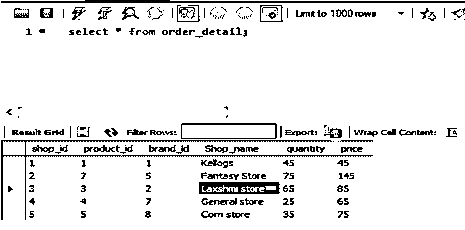
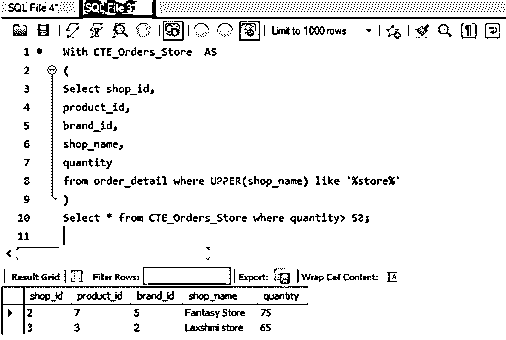
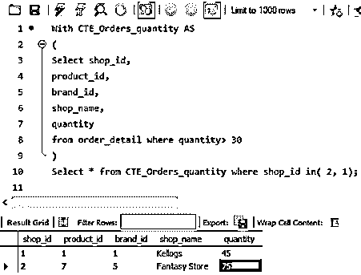
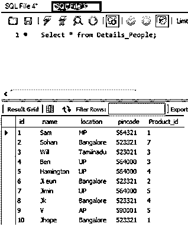
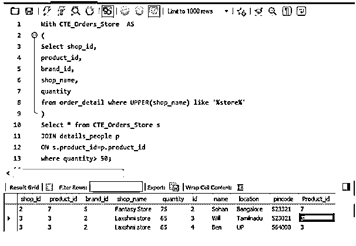
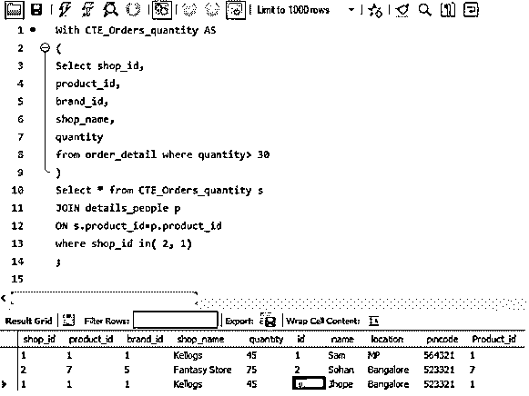
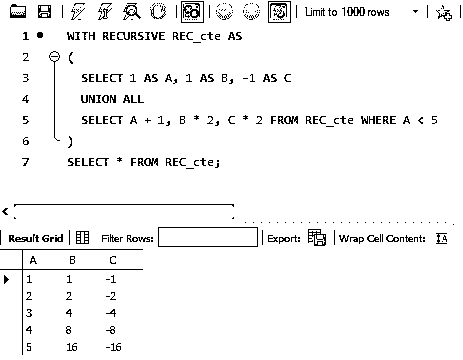

# MySQL 与

> 原文：<https://www.educba.com/mysql-with/>

## MySQL WITH 子句介绍

MySQL WITH 子句用于定义 CTE(公共表表达式)。公用表表达式是可以多次使用的命名临时结果集。可以使用 WITH 子句定义 CTE，并且可以有一个或多个由逗号分隔的子子句。所定义的子子句由与其名称相关联的每个结果集组成。CTE 可以用在其他 CTE 的。我们也有递归 CTE，这将被称为自己。结果集仅存在于 SELECT、INSERT、UPDATE 或 DELETE 等单个语句的范围内。

在本节中，我们将通过一个示例来了解如何使用 WITH 子句定义 CTE。

<small>Hadoop、数据科学、统计学&其他</small>

### MySQL 的语法

现在让我们考虑使用 WITH 子句声明 CTE 的语法:

#### 1.单一 CTE 宣言

**语法:**

`WITH <CTE NAME><COLUMN LIST > AS
<
QUERY STATEMENT
>
SELECT * FROM <CTE NAME>;`

#### 2.多重 CTE 声明

**语法:**

`WITH <CTE NAME1><COLUMN LIST > AS
<
QUERY STATEMENT
>
, <CTE NAME2><COLUMN LIST > AS
<
QUERY STATEMENT
>
SELECT * FROM <CTE NAME1> join <CTE NAME2> ON <Condition>;`

WITH 子句可以在开头用作:

*   用…选择…
*   用…更新…
*   用…删除…

WITH 语句可以紧跟在前面，如下所示:

*   用…选择…创建表格…
*   创建视图…用…选择…
*   用…选择…插入…
*   将…替换为…选择…
*   用…选择…声明光标…
*   解释…用…选择…

### MySQL 中的 WITH 子句是如何工作的？

现在让我们考虑使用 WITH 子句应用 CTE 概念的表格:

**1。**让我们创建一个表，使用上面的语法格式并将数据插入表中。

`create table Order_detail
(
shop_id int,
product_id int,
brand_id int,
Shop_name varchar(20),
quantity int,
price int
);`

**2。**现在让我们将数据插入表中。

`insert into Order_detail (shop_id, product_id, brand_id, Shop_name, quantity, price)
values (1,1,1,'Kellogs',45,45);
insert into Order_detail (shop_id, product_id, brand_id, Shop_name, quantity, price)
values (2,7,5,'Fantasy Store',75,145);
insert into Order_detail (shop_id, product_id, brand_id, Shop_name, quantity, price)
values (3,3,2,'Laxshmi store',65,85);
insert into Order_detail (shop_id, product_id, brand_id, Shop_name, quantity, price)
values (4,4,7,'General store',25,65);
insert into Order_detail (shop_id, product_id, brand_id, Shop_name, quantity, price)
values (5,5,8,'Corn store',35,75);`

**查询:**

`select * from Order_detail;`

**输出:**

**3。**现在让我们在上表中执行简单的 CTE 创建。

**查询:**

`With CTE_Orders_Store AS
(
Select shop_id,
product_id,
brand_id,
shop_name,
quantity
from order_detail where UPPER(shop_name) like '%store%'
)
Select * from CTE_Orders_Store where quantity> 50;`

**输出:**

**解释:**在这里，我们找到了在其“商店名称”中存储了超过 50 件商品的商店。

**4。**现在让我们在上表中执行另一个简单的 CTE。

**查询:**

`With CTE_Orders_quantity AS
(
Select shop_id,
product_id,
brand_id,
shop_name,
quantity
from order_detail where quantity> 30
)
Select * from CTE_Orders_quantity where shop_idin( 2, 1);`

**输出:**

**解释:**在这里，我们找到了销售数量为> 30 的商店，然后我们过滤其余的，只带(2，1)的商店标识。

**5。**现在让我们考虑上面创建的表“order_detail ”,并创建另一个表，如下所示。

**查询:**

`create table Details_People
(
id int,
name varchar(20),
location varchar(20),
pincodeint,
product_idint
);`

**6。**将以下行插入下表。

**查询:**

`insert into DETAILS_PEOPLE values (1, 'Sam', 'MP', 564321,1);
insert into DETAILS_PEOPLE values (2, 'Sohan', 'Bangalore', 523321,7);
insert into DETAILS_PEOPLE values (3, 'Will', 'Tamilnadu', 523021,3);
insert into DETAILS_PEOPLE values (4, 'Ben', 'UP', 564000,3);
insert into DETAILS_PEOPLE values (5, 'Hamington', 'UP', 564000,4);
insert into DETAILS_PEOPLE values (6, 'Ji eun', 'Bangalore', 523321,2);
insert into DETAILS_PEOPLE values (7, 'Jimin', 'UP', 564000,5);
insert into DETAILS_PEOPLE values (8, 'Jk', 'Bangalore', 523321,4);
insert into DETAILS_PEOPLE values (9, 'V', 'AP', 590001,5);
insert into DETAILS_PEOPLE values (10, 'Jhope', 'Bangalore', 523321,1);`

7 .**。**现在让我们从表中选择列

**查询:**

`Select * from Details_People;`

**输出:**

**8。**现在让我们执行两张表之间的复杂 CTE。

**查询:**

`With CTE_Orders_Store  AS
(
Select shop_id,
product_id,
brand_id,
shop_name,
quantity
from order_detail where UPPER(shop_name) like '%store%'
)
Select * from CTE_Orders_Stores
JOIN details_people p
ON s.product_id=p.product_id
where quantity> 50;`

**输出:**

**解释:**在上面的查询中，我们找到了存储在“shop_name”中的商品数量大于 50 的商店。CTE 的输出我们已经加入了“details_people”并得到了输出。

**查询:**

`With CTE_Orders_quantity AS
(
Select shop_id,
product_id,
brand_id,
shop_name,
quantity
from order_detail where quantity> 30
)
Select * from CTE_Orders_quantity s
JOIN details_people p
ON s.product_id=p.product_id
where shop_idin( 2, 1);`

**输出:**

**解释:**在这里，我们找到了销售数量为> 30 的商店，然后我们过滤其余的商店，只带(2，1)的商店 id，然后将其与“详细信息 _ 人员”表连接。

**9。现在让我们看看递归 CTE**

**查询:**

`WITH RECURSIVE REC_cte AS
(
SELECT 1 AS A, 1 AS B, -1 AS C
UNION ALL
SELECT A + 1, B * 2, C * 2 FROM REC_cte WHERE A < 5
)
SELECT * FROM REC_cte;`

**输出:**

### 结论

*   MySQL WITH 子句用于定义 CTE(公共表表达式)。公用表表达式是可以多次使用的命名临时结果集。
*   可以使用 WITH 子句定义 CTE，并且可以有一个或多个由逗号分隔的子子句。
*   所定义的子子句由与其名称相关联的每个结果集组成。CTE 可以用于另一个 CTE。我们也有递归 CTE，这将被称为自己。
*   结果集仅存在于 SELECT、INSERT、UPDATE 或 DELETE 等单个语句的范围内

### 推荐文章

这是一个 MySQL 的指南。这里我们讨论 MySQL WITH 子句的介绍以及实际例子和不同的子查询表达式。您也可以浏览我们推荐的文章，了解更多信息——

1.  [MySQL 操作符](https://www.educba.com/mysql-operators/)
2.  [MySQL 字符串函数](https://www.educba.com/mysql-string-functions/)
3.  [MySQL vs SQLite](https://www.educba.com/mysql-vs-sqlite/)
4.  [MySQL 时间戳](https://www.educba.com/mysql-timestamp/)

