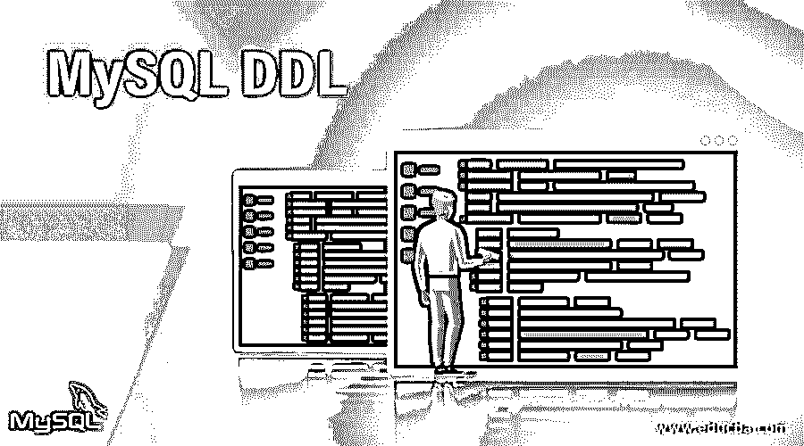
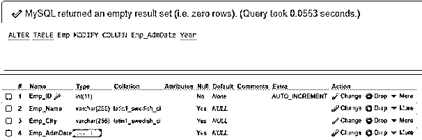
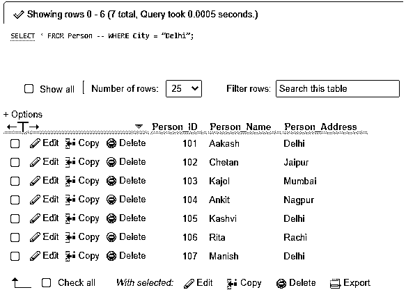
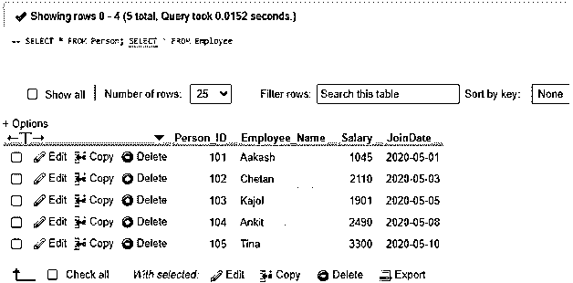
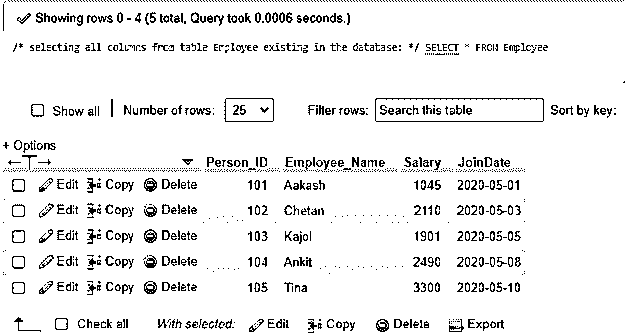
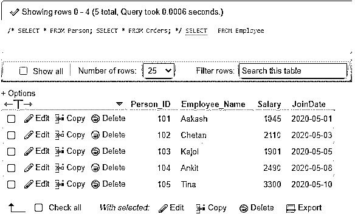
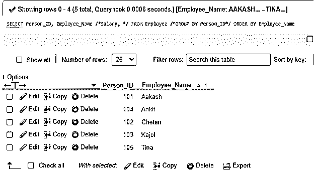
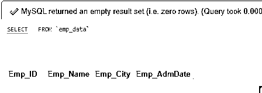

# MySQL DDL

> 原文：<https://www.educba.com/mysql-ddl/>

## MySQL DDL 简介

MySQL DDL 定义了数据定义语言，它是四种 SQL 命令中的一个子组:DDL、DML、DCL、TCL。因为，结构化查询语言(SQL)是数据库的基本语言，它在可用的 MySQL 数据库中执行不同的操作和查询，包括创建数据库或表，删除相同的和其他的，如更新、插入等。MySQL DDL 涉及数据库的模式和解释，以显示数据库数据应该如何存在于服务器中。DDL 命令对于表达和改变数据库表、模式或对象的结构很重要。当在 MySQL 中使用 DDL 命令的语句被执行时，立即生效。

### DDL 命令在 MySQL 中是如何工作的？

*   DDL 命令与 SQL 查询语句一起工作，执行 SQL 查询语句是为了执行和显示所需的结果。DDL 命令一旦被查询和运行，就不能回滚，而是隐式提交。
*   表是存储数据记录的数据库对象。这些数据与其他表数据交互，并在结构级别上形成一种关系。但是存储的数据需要不时地进行一些修改。这是由 MySQL 服务器中的 DDL 和 SQL 的其他子组来完成的。
*   对于 DDL 查询的工作和使用，用户需要拥有所需的特权，例如数据库模式中的 CREATE 或 DROP。我们将在所有的关系数据库中找到 DDL 命令，用于管理和访问数据库中的对象。

### 实现 MySQL DDL 的例子

让我们解释一下 MySQL DDL 命令，每个命令都有一个示例，并展示这些查询在 MySQL 数据库中用于不同管理任务的用途:

<small>Hadoop、数据科学、统计学&其他</small>

#### 1.创建命令

这个 DDL 命令用于创建任何带有不同对象的数据库，如表、索引、触发器、视图、存储过程、内置函数等。

**代码:**CREATE 语句使用以下语法编写:

`CREATE DATABASE DatabaseName;
CREATE TABLE TableName (Column1 Datatype1, Column2 Datatype2,…,ColumnNDatatypeN);`

例如，我们将使用以下查询创建一个名为“Emp”的表，其中包含一些在 MySQL 中有效的字段和类似的数据类型，并在 MySQL 服务器中分别创建一个名为“EmpDB”的数据库:

**代码:**

`CREATE DATABASE EmpDB;`

**输出:**

**代码:**

`CREATE TABLE Emp (Emp_ID INT PRIMARY KEY AUTO_INCREMENT, Emp_NameVARCHAR(255), Emp_City VARCHAR(255), Emp_AdmDate DATE NOT NULL);`

**输出:**

这里，我们已经创建了上面的表，其中包含列名、数据类型、索引和键。对于整数，我们使用 INT 数据类型，对于值的日期类型，我们使用 date 类型，对于具有长度值的字符串，我们使用它作为 Emp 表的数据类型。

#### 2.更改命令

使用 ALTER DDL 命令修改当前数据库和相关表的结构。

使用 Alter query，我们可以添加、更改或删除表或表上的列的现有约束。语法如下所述:

**代码:**

`ALTER TABLE TableName ADD ColumnNameData_Type;
ALTER TABLE TableName DROPColumnName;
ALTER TABLE TableName MODIFY COLUMNColumnNameData_Type;`

让我们用上面的结构执行一些查询:

**代码:**

`ALTER TABLE Emp ADD Emp_Contact INT NOT NULL;`

**输出:**

**代码:**

`ALTER TABLE Emp DROP Emp_Contact;`

**输出:**

**代码:**

`select * from `emp``

**输出:**

**代码:**

`ALTER TABLE Emp MODIFY COLUMN Emp_AdmDateYear;`

**输出:**

#### 3.丢弃命令

这个 MySQL 命令用于删除数据库对象。简而言之，使用 drop query 语法删除数据库中现有的表:

**代码:**

`DROP TABLE TableName;`

**代码:**

`DROP Table Emp;`

**输出:**

我们需要知道，在执行 DROP 命令时应该小心，因为它会导致存储在表中的数据记录丢失。

#### 4.截断命令

执行 Truncate DDL 命令来删除数据库表中的所有数据行，包括删除为这些表记录分配的所有空间。

**代码:**

TRUNCATE 命令的语法与 DROP 语句相同，如下所示:

`TRUNCATE TABLE TableName;`

假设我们在下面的查询中使用了上面的命令:

**代码:**

`TRUNCATE TABLE Emp;`

**输出:**

输出表明 truncate 只会删除特定表中的记录，而不会删除数据库中的表。

#### 5.注释命令

这个注释查询有利于向 MySQL 服务器中的数据字典添加所需的注释。

通常，MySQL 中的注释用于描述语句的各个部分，或者避免执行查询语句。

在 MySQL 中，评论分为两种类型:

*   **单行注释:**这里的注释以-。如果我们将文本放在文本行的–和结尾之间，那么整个文本在代码执行期间都不会被注意到。

为了便于解释，让我们应用如下单行注释，并在服务器中运行以显示结果:

**代码:**

`--We are displaying all records from table Person:
SELECT * FROM Person;`

**输出:**

此外，让我们来看一个示例，演示使用单个注释删除文本的结束行的注释:

**代码:**

`SELECT * FROM Person --WHERE City = “Delhi”;`

**输出:**

同样，我们可以忽略整个陈述:

**代码:**

`--SELECT * FROM Person;
SELECT * FROM Employee;`

**输出:**

正如您所看到的，只执行了第二条语句，表数据显示为输出。

*   **多行评论:**此评论以/*开头，以*/结尾。如果我们在这些标签之间包含任何文本，在特定的语句中不会被注意到。

**代码:**

`/*selectingall columns from table Employee existing in the database: */
SELECT * FROM Employee;`

**输出:**

要忽略多个语句:

**代码:**

`/* SELECT * FROM Person;
SELECT * FROM Orders;
*/
SELECT * FROM Employee;`

**输出:**

忽略给定语句的任何部分:

**代码:**

`SELECTPerson_ID, Employee_Name/*Salary, */ FROM Employee/*GROUP BY Person_ID*/ ORDER BY Employee_Name;`

**输出:**

#### 6.重命名命令

如果任何管理工作需要，Rename DDL 命令查询允许重命名服务器中的任何数据库对象。有时我们想修改现有的表名，并将其重命名。为此，让我们对 ALTER DDL 命令应用以下语法:

**代码:**

`ALTER TABLE TableName_ARENAME TO TableName_B;`

举例说明:

**代码:**

`ALTER TABLE Emp RENAME TO Emp_Data;`

**输出:**

**代码:**

`select * from `emp_data``

**输出:**

### 结论

MySQL DDL 命令允许 admin 用户拥有控制数据库活动的权限，并正确维护流和访问。MySQL 中使用的 SQL 语言提供了创建数据库、表、应用任何变更的管理查询，如果需要，还可以删除数据库对象，这有助于定义数据库的模式和结构。

### 推荐文章

这是一个 MySQL DDL 的指南。这里我们讨论一个 MySQL DDL 的介绍，语法，它是如何工作的，并举例说明以便更好的理解。您也可以浏览我们的其他相关文章，了解更多信息——

1.  [MySQL 中的光标](https://www.educba.com/cursor-in-mysql/?source=leftnav)
2.  MySQL 中的[表](https://www.educba.com/table-in-mysql/?source=leftnav)
3.  [MySQL 触发器](https://www.educba.com/mysql-trigger/?source=leftnav)
4.  [MySQL 中的汇总](https://www.educba.com/rollup-in-mysql/?source=leftnav)

