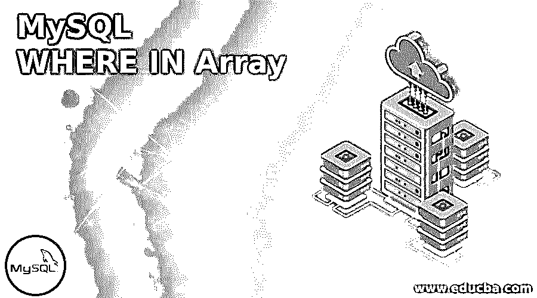
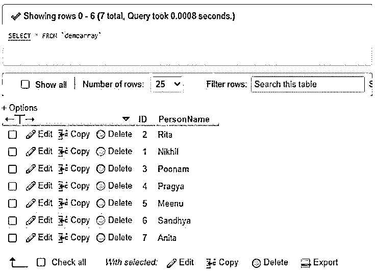
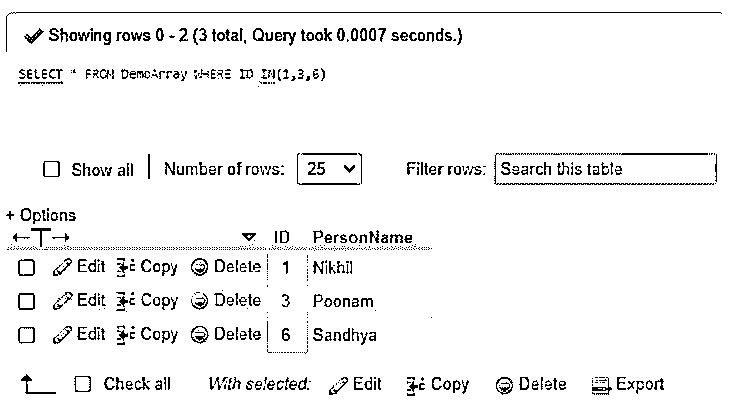
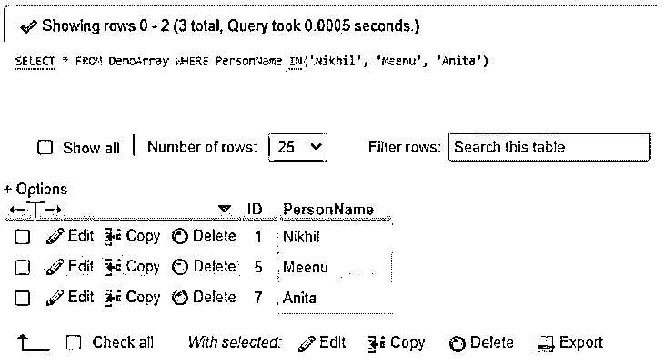
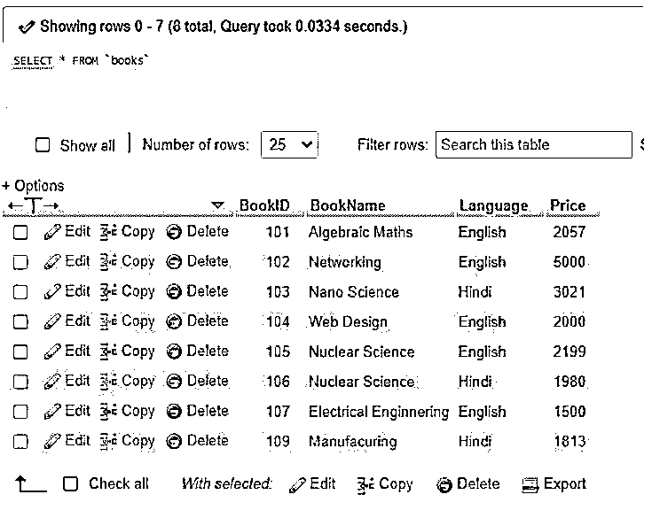
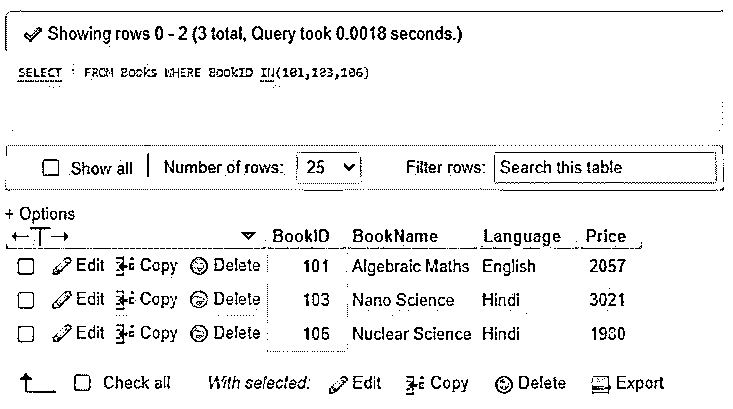
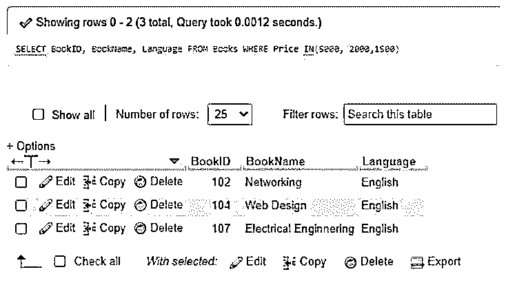

# MySQL 在数组中的位置

> 原文：<https://www.educba.com/mysql-where-in-array/>

## MySQL WHERE IN Array 简介

MySQL 支持不同的数据类型，实现这些数据类型是为了插入不同类型的数据值以存储在数据库中。类似地，数组是负责存储列值的数据类型。数组是 MySQL 中定义的一种数据结构。MySQL 提供了 WHERE IN 子句，在数组变量中应用该子句可以从数据库中的特定表生成查询集。WHERE IN 子句支持从 MySQL 查询语句中提供的参数数组中获取数据值。在这里，WHERE 作为一个条件表达式工作，类似于其他编程语言使用的条件表达式，对于比较 MySQL 数据库中可用的特定字段值的给定数据值是必不可少的。在数组中，WHERE In 用于实现 IN()函数的地方，以便在作为参数提供的列值范围内找出特定值。

**语法:**

<small>Hadoop、数据科学、统计学&其他</small>

以下是 MySQL 服务器中使用数组值和 WHERE IN 子句获取信息的 MySQL WHERE IN Array 命令的基本语法结构:

`SELECT ColumnName1, ColumnName2, …., ColumnNameNFROM TableNameWHERE ColumnName1  IN(ColumnName1_Value1, ColumnName1_Value2, ColumnName1_Value3);`

这里，在上述语法结构中，我们定义了以下术语:

*   ColumnName1 表示表中存在的列的名称。
*   TableName 是数据库中保存数组值的指定表，以使用 MySQL WHERE IN Array。
*   在 WHERE 子句之后，定义了特定的列名，使用 SELECT 语句从该列名中检索数据，并且 IN()函数将该列名中的值范围作为参数。

### MySQL 中的 WHERE IN 数组是如何工作的？

*   MySQL 支持在表中存储数据值，其中非规范化的列或数组被编入索引，以便通过 MySQL 查询进行管理和访问。在正版中，MySQL 不包含任何实际的数组类型存储。由于 MySQL 在数据仓库中也很有用，所以这是一个基本需求，但它在设计非规范化行的存储时带来了问题。然而，我们可以使用索引来访问它们。
*   基本上，数组被定义为存储在相邻内存位置的项的集合，在相邻内存位置可以将多个相同类型的项存储在一起。它以行列结构的设计方式呈现乘法概念。在 array 中，任何对象、值、数字或链接都以行列类型排列。这类似于以行和列的形式存储在数据库表中的数据记录。
*   因此，在结构或存储空间中，当等价的组被组织在等价的行中时，就设计了一个数组。因此，通过使用 WHERE IN 子句，我们可以从数据库表数组中获取行和列，方法是在 MySQL 服务器中遵循并验证一个条件以产生所需的输出表集。
*   但是从 MySQL v5.7 开始，MySQL 通过在 MySQL 中实现 JSON 数据类型来提供存储数组的解决方案，这是一个非常高级的查询过程。现在，我们通过下面提供的例子来说明 MySQL 服务器中的 WHERE IN 数组。
*   对于 MySQL 中带有 WHERE in 子句的数组，MySQL WHERE 子句与函数 IN()一起应用，该函数只影响那些列值与 IN 关键字中作为参数传递的值列表相匹配的行。此外，在 WHERE 子句中使用 IN()函数有时会减少查询中可能使用的关键字或子句的数量。

### MySQL WHERE IN Array 示例

下面是提到的例子:

#### 示例#1

在 MySQL 中，我们实现 WHERE 子句来传递数据库中的数组。让我们用一个有效的例子来说明 MySQL WHERE IN Array，方法是创建一个包含一些条目的表并执行查询。

首先，让我们借助以下示例建立一个表，将名称作为 DemoArray 提供:

**代码:**

`CREATE TABLE DemoArray(ID INT PRIMARY KEY, PersonName VARCHAR (255) NOT NULL);`

同样，我们将借助 insert 命令插入几条记录，如下所示:

**代码:**

`INSERT INTO DemoArray VALUES (1,'Nikhil'), (2,'Rita'), (3,'Poonam'), (4,'Pragya'), (5,'Meenu'), (6,'Sandhya'), (7,'Anita');`*T2】*

现在，使用下面的 SELECT 语句显示表内容:

**代码:**

`SELECT * FROM DemoArray;`

**输出:**

下面是使用 MySQL 中的 WHERE IN 子句发送数组参数的代码结构:

**代码:**

`SELECT * FROM DemoArray WHERE ID IN(1,3,6);`

**由此，MySQL WHERE IN Array 的输出如下:**

**<u>

</u>** 

或者，你也可以试试下面这个:

**代码:**

`SELECT * FROM DemoArray WHERE PersonName IN('Nikhil', 'Meenu', 'Anita');`

**由此，MySQL WHERE IN Array 的输出如下:**

#### 实施例 2

同样，让我们使用另一个示例来演示，假设我们的数据库中有一个名为 books 的表，该表包含 BookID、BookName、Language 和 Price 字段，如下所示:

**代码:**

`SELECT * FROM Books;`

**输出:**

如您所见，有一些记录被插入到 Books 表中。

下面是命令结构，显示了使用 MySQL 中 WHERE IN 子句的数组结果类型。假设我们想要从 in()参数中书籍 id 所在的表中过滤出行。

**代码:**

`SELECT * FROM Books WHERE BookID IN(101,103,106);`

**输出:**

**<u>

</u>** 

正如您所看到的，结果输出提供了行和列的数组类型设计，这是使用表中的 WHERE 子句过滤的。

同样，我们可以使用 price 列并对其应用条件进行查询，以从记录中获得值的指定匹配结果。MySQL WHERE IN Array 命令可以编码如下。

**代码:**

`SELECT BookID, BookName, Language FROM Books WHERE Price IN(5000, 2000,1500);`

**输出:**

因此，查询有助于以数组结构的形式从 MySQL 服务器的数据库中的大型数据集合中检索特定部分的记录，还使用条件来过滤匹配值，并进一步使用应用 in()函数的特定表中列出的数据值范围来检查这一点。

### 结论

使用 MySQL WHERE 子句，我们查询使用条件表达式过滤的结果行，条件表达式定义了一个取值规则。该过滤过程包括任何单个值、子查询或范围。in()函数中传递的参数遵循一系列项，当使用这些项时，以行和列的格式给出了类似数组的结构，因此这个数组类型数据是 MySQL WHERE IN array。

### 推荐文章

这是一个关于 MySQL WHERE IN Array 的指南。在这里，我们将讨论 MySQL 中数组中的 WHERE 是如何工作的？和示例。您也可以看看以下文章，了解更多信息–

1.  [MySQL DDL](https://www.educba.com/mysql-ddl/)
2.  [MySQL 展示](https://www.educba.com/mysql-show/)
3.  [MySQL 案例语句](https://www.educba.com/mysql-case-statement/)
4.  [MySQL 分组依据](https://www.educba.com/mysql-group-by/)

