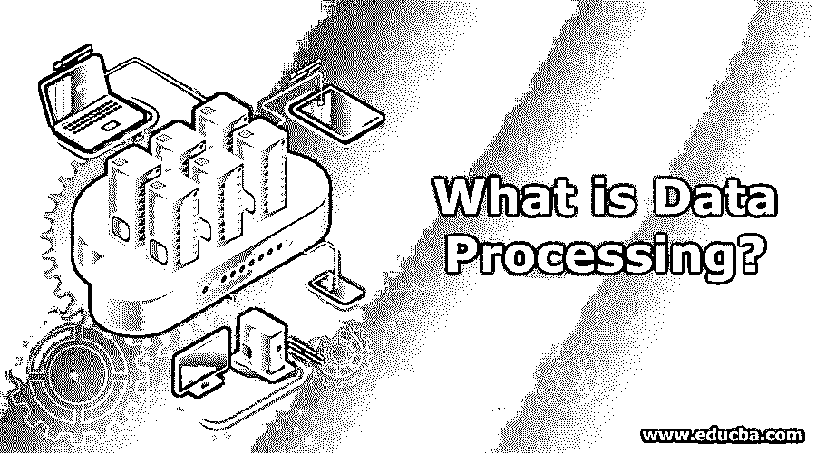
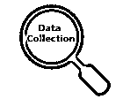
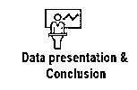

# 什么是数据处理？

> 原文：<https://www.educba.com/what-is-data-processing/>

## 数据处理导论

数据处理是将数据收集和处理成可用的和期望的形式。这种操作只不过是处理，它是以预定的操作顺序手动或自动进行的。在过去，这是由人工完成的，既费时又有可能在处理过程中出错，所以现在大部分处理是由计算机自动完成的，计算机处理速度快，并能给出正确的结果。

下一点是转换成所需的形式，根据应用程序的要求，将收集的数据进行处理并转换成所需的形式，这意味着将数据转换成有用的信息，可以在应用程序中使用这些信息来执行某些任务。处理的输入是从不同来源收集的数据，如文本文件数据、excel 文件数据、数据库，甚至是非结构化数据，如图像、音频剪辑、视频剪辑、GPRS 数据等。常用的数据处理工具有 Hadoop、Storm、HPCC、Qubole、Statwing、CouchDB 等等

<small>Hadoop、数据科学、统计学&其他</small>

数据处理的输出是有意义的信息，可以是不同的形式，如表格、图像、图表、图形、矢量文件、音频等，所有格式取决于所需的应用或软件。

### 数据是如何处理的？

数据处理从收集数据开始。为转换所需形式而收集的数据必须通过逐步处理数据的方式进行处理，例如收集的数据必须被存储、分类、处理、分析和呈现。

因此，这大致分为 6 个基本步骤，如下文所述。

*   数据收集
*   数据存储
*   数据分类
*   资料处理
*   数据分析
*   数据列报和结论

让我们逐一详细讨论:

#### 1.数据收集

我们已经讨论过数据收集的来源，逻辑上相关的数据是从不同来源、不同格式、不同类型收集的，如 XML、CSV 文件、社交媒体、图像、结构化或非结构化数据等。

#### 2.数据存储

现在，收集的数据需要以纸张、笔记本等物理形式存储，或者以任何其他物理形式存储。现在，由于[数据挖掘和大数据](https://www.educba.com/big-data-vs-data-mining/)，即使是结构化或非结构化形式的数据收集也非常庞大。数据将以数字形式存储，以便根据应用要求进行有意义的分析和展示。

#### 3.数据分类

在存储步骤之后，紧接着的步骤将是分类和过滤。需要进行排序和切片，以便按某种有意义的顺序排列数据，并仅过滤出有助于轻松理解、可视化和分析的所需信息。

#### 4.资料处理

一系列的处理或连续的使用和处理，以有用的输出形式验证、转换、组织、整合和提取数据以备将来使用。

#### 5.数据分析

数据分析是使用分析和逻辑推理系统地应用或评估数据的过程，以说明所提供数据的每个组成部分，并获得结论性结果或决策。

#### 6.数据列报和结论

一旦我们得到分析结果，它可以被表示成不同的形式，如图表、文本文件、excel 文件、图形等等。

单个软件或软件组合可用于执行数据的存储、分类、过滤和处理，无论哪一种都是可行的和需要的。它可以由特定软件按照根据应用要求的预定操作集来执行。

### 不同类型的输出

不同类型的输出文件–

*   **纯文本文件**–这些被导出为记事本或写字板文件。这些是最简单的数据文件形式。
*   **表格/电子表格**–在这种文件格式中，数据以行和列的形式表示，这有助于轻松理解和分析数据。这种文件格式可以执行各种操作，如过滤&、升序/降序排序以及统计操作。
*   **图形和图表**–图形和图表格式是大多数软件的标准功能。这种格式非常容易分析数据，不需要读取每一个数值数据，这需要花费很长时间，只需看一眼就能理解和分析数据。
*   **图像文件或** **地图/矢量**–如果应用程序需要存储和分析空间数据，将数据导出为图像文件和地图文件或矢量文件的选项非常有用。

除此之外，其他格式可以是软件特定的文件格式，可以由专用软件使用和处理。

### 不同的方法

主要有三种方法用来处理数据，它们是手工的，机械的和电子的。

**1。手动:**在该方法中，数据被手动处理。整个处理任务，如计算、分类和过滤，以及逻辑操作都是手动执行的，不使用任何工具、电子设备或自动化软件。

**2。机械–**在这种方法中，数据不是人工处理的，而是在非常简单的电子设备和机械设备(如计算器和打字机)的帮助下完成的。

**3。电子-**这是最快的数据处理方法，也是现代技术，具有现代所需的功能，如最高的可靠性和准确性。这种方法是通过在计算机上运行的一组程序或软件来实现的。

### 类型

基于他们执行的步骤或他们执行的过程。它喜欢:

*   批处理(成批)
*   实时处理(在小时间段或实时模式下)
*   在线处理(自动方式输入)
*   多重处理(多个数据集并行)
*   分时(多个数据集分时)

### 为什么我们要使用数据处理？

现在一天的数据更重要了，大多数工作都是基于数据本身，所以越来越多的数据被收集用于不同的目的，如科学研究、学术、私人和个人使用、商业使用、机构使用等等。有必要处理这些收集到的数据，以便上述所有步骤都被用于存储、分类、过滤、分析和以所需的使用格式呈现的处理。处理的耗时和复杂性取决于所需的结果。在收集大量数据或需要处理大量数据以获得最佳结果的情况下，借助数据挖掘和数据管理变得越来越重要。

### 结论

它是将数据转换成有用的信息。数据处理大致分为 6 个基本步骤:数据收集、数据存储、数据分类、数据处理、数据分析、数据展示和结论。主要有三种方法用于处理，即手动，机械和电子。

### 推荐文章

这是什么是数据处理的指南？.这里我们讨论了数据是如何处理的，不同的方法，不同类型的输出，工具，以及数据处理的使用。您也可以浏览我们推荐的其他文章，了解更多信息——

1.  [数据可视化工具](https://www.educba.com/data-visualization-tools/)
2.  [什么是数据仓库？](https://www.educba.com/what-is-data-warehouse/)
3.  [什么是数据可视化](https://www.educba.com/what-is-data-visualization/)
4.  [Python 多重处理|如何创建？](https://www.educba.com/python-multiprocessing/)

