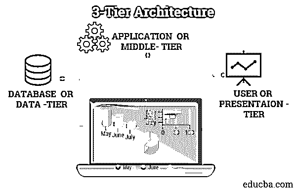

# DBMS 体系结构

> 原文：<https://www.educba.com/dbms-architecture/>

## DBMS 体系结构介绍

数据库是相关数据的集合。数据可以是事实和数字的集合，可以对其进行处理以获得更多信息。一个[数据库管理系统](https://www.educba.com/database-management-system/)存储数据并在需要时检索。用户还可以从现有数据中操作和产生更多信息。数据库具有真实世界的实体、基于关系的表、数据和应用的隔离、数据冗余少和一致性等特征。DBMS 还提供了一种查询语言，这使得它更有效，并且遵循 ACID 属性。多个用户可以同时使用 DBMS。在本主题中，我们将学习 DBMS 体系结构。

### DBMS 体系结构的类型

数据库系统可以是集中式的，也可以是分散式的。这取决于数据库的架构。数据库体系结构有两种逻辑类型:

<small>Hadoop、数据科学、统计学&其他</small>

*   两层 DBMS 体系结构
*   三层 DBMS 体系结构

数据库也可以有单层架构。

#### 一层架构

当使用单层体系结构时，用户可以直接使用数据库。用户可以直接访问数据库并使用数据。这里所做的任何更改都将直接反映在数据库中。它没有提供最终用户可以使用的便利工具。1 层架构主要用于开发本地应用程序，它们可以直接用于与数据库通信并获得快速响应。

#### 两层架构

两层 DBMS 体系结构类似于客户机-服务器体系结构。在两层体系结构中，客户端有应用程序，它们可以很容易地与服务器端的数据库进行通信。为了使这种交互成功，用户可以使用像 ODBC 和 JDBC 这样的 API。所有需要数据进行处理的应用程序和用户界面都位于客户端。服务器负责提供查询处理和事务管理等功能。要连接这两者并与 DBMS 建立连接，客户端应用程序可以与服务器端建立连接。

ODBC 是开放式数据库连接的缩写，它有助于提供一个 API，允许客户端应用程序连接到 DBMS，然后进一步工作。最常见的供应商是 ODBC 驱动程序。这种体系结构还为应用程序提供了 DBMS 额外的安全性和身份验证检查。这种体系结构用于需要通过任何应用程序访问 DBMS 的地方。应用程序在操作、设计和编程方面独立于数据库。表示层可以是 PC、手机、平板电脑等。双层架构的一个例子可以是利用 MS Access 的联系人管理系统。

#### 三层架构

第 1 层、第 2 层和第 3 层之间的区别在于，前两者具有复杂性，这取决于它们如何使用数据库中的数据。第 3 层体系结构被广泛使用，有助于有效地设计数据库。理想情况下，它有三个部分:

*   **数据库或数据层:**现有的数据库与查询处理语言协同工作。关系可以和数据一起定义，约束也可以在这个级别定义。
*   **应用层或中间层:**应用层充当数据库的抽象视图。当使用这一层时，我们可以将应用服务器和程序放在一起，以便可以访问数据库。无论终端用户何时访问数据库，他都不知道数据库的存在。类似地，数据库不受访问它的用户的影响。应用层主要致力于成为中间件或网关，并充当用户和数据库之间的中介。
*   **用户或表示层:**最终用户通过使用这一层与数据库进行交互。可以使用所有不同的表或视图，它们可以提供应用程序所需的所有数据。这种多层数据库可以没有任何瓶颈地进行修改。这种简单的原因是组件是独立的，并且对这些组件的改变也是独立进行的。终端用户会，因为它不知道后端发生的任何事情。这两个实体执行各自的任务，而应用层管理它们。

也可以说是 2 层架构的延伸。应用程序的中间层位于数据库和用户层之间，它理解数据库访问语言，帮助处理最终用户对 DBMS 的请求。有时还可以添加一个附加层，为最终用户提供图形用户界面，以便他们可以与最终用户进行交互。GUI 层充当最终用户的数据库系统。最终用户对应用层或 DBMS 系统一无所知。应用层(业务逻辑层)还在将数据传递给用户或 DBMS 之前处理功能逻辑、约束和规则

**三层架构的目标是:**

*   支持多种数据视图
*   帮助编程数据独立性
*   提议支持 DBMS 架构
*   它将用户应用程序与物理数据库分开

### 结论

DBMS 是存储数据和在需要时使用数据的地方。可以根据用户需要利用、创建和修改数据。数据库管理架构有助于设计、开发、实施和维护数据库。基本上有两个理想架构和一个附加架构。单层架构具有客户端、服务器和数据库，所有这些都驻留在同一台机器上。双层架构是一种数据库架构，其中有一个运行在客户机上的表示层，数据存储在服务器上。第三层也是最后一层是三层架构，由表示层组成，表示层可以包含 PC、平板电脑、移动设备等。、应用层和数据库服务器。应用层用于与其他两层进行交互。因此，这些数据可以得到适当的维护，并且保持安全。

### 推荐文章

这是 DBMS 体系结构的指南。这里我们讨论了 DBMS 体系结构的类型，目标是三层体系结构。您也可以浏览我们推荐的其他文章，了解更多信息——

1.  [什么是 Elasticsearch？](https://www.educba.com/what-is-elasticsearch/)
2.  [数据库管理系统简介](https://www.educba.com/introduction-to-dbms/)
3.  [DBMS 面试问题](https://www.educba.com/dbms-interview-questions/)
4.  [数据库管理系统与关系数据库管理系统](https://www.educba.com/dbms-vs-rdbms/)
5.  [SQL 中 LIKE 查询的完整指南](https://www.educba.com/like-query-in-sql/)
6.  [七大数据库管理系统类型](https://www.educba.com/types-of-dbms/)

