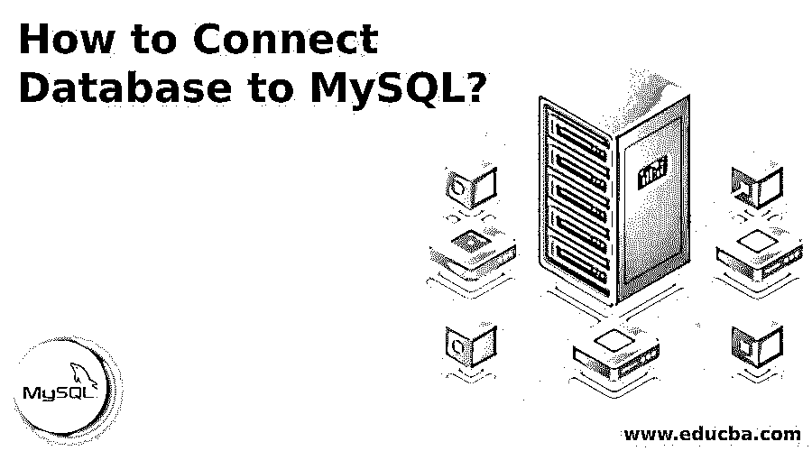
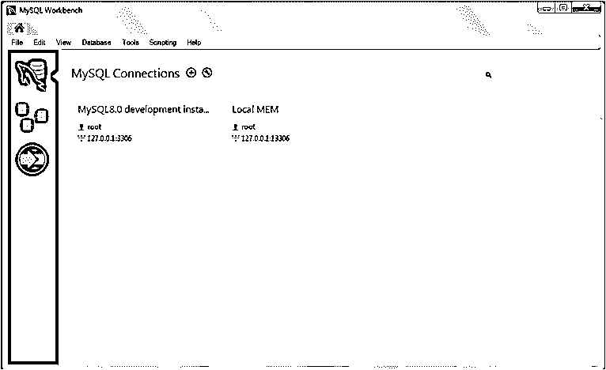
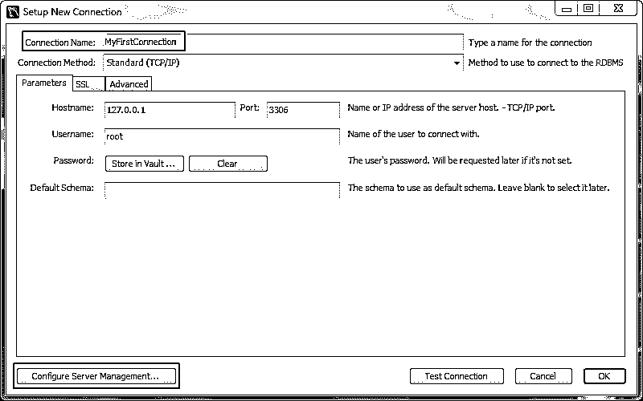
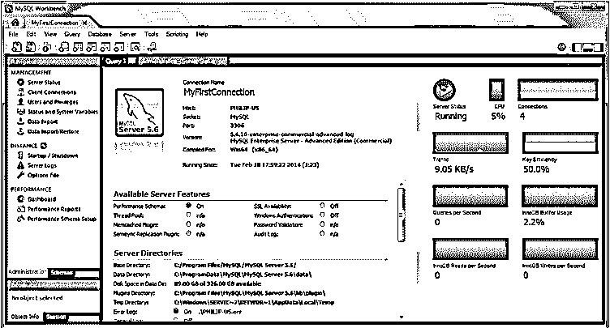
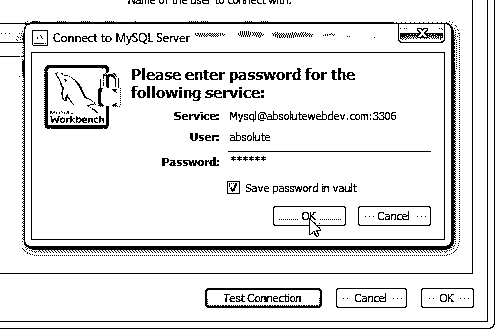
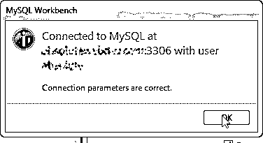
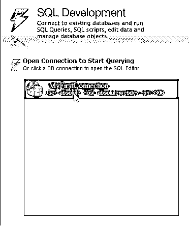
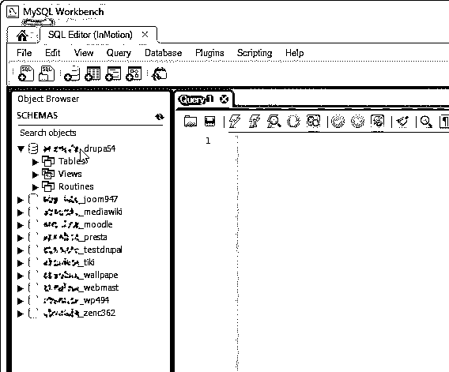
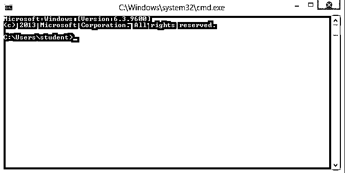

# 如何将数据库连接到 MySQL？

> 原文：<https://www.educba.com/connect-database-to-mysql/>

## 数据库如何连接 MySQL 概述？

在讨论如何将数据库连接到 MySQL 之前，我们先来看看 MySQL 的介绍。MySQL 是一个免费的开源数据库。MySQL 是一个关系数据库管理系统(RDBMS)。

MySQL 是通用公共许可证(GNU)条款下的开源和自由软件，也可以根据专有许可证获得。MySQL 是由瑞典公司 MySQL AB 开发的，后来被太阳微系统公司收购，成为现在的甲骨文公司。

<small>Hadoop、数据科学、统计学&其他</small>

MySQL 在许多基于数据库驱动的 web 应用程序中使用，如现在按需提供的 WordPress、Drupal、phpBB 和 JoomlaMySQL 也被许多流行网站使用，如 Twitter、脸书、YouTube 和 Flickr。

### MySQL 的特性

MySQL 有两个不同的版本:开源的 MySQL 社区服务器和专有的企业服务器。MySQL Enterprise Server 与众不同之处在于一系列专有扩展，这些扩展作为服务器插件安装，但共享版本编号系统，并且基于相同的代码库构建。

MySQL 5.6 中的主要特性:

*   它支持跨平台。
*   可以使用过程语言创建存储过程。
*   可以创建触发器。
*   可以创建游标。
*   视图可以更新。
*   借助 InnoDB 存储引擎可以创建一个在线的[数据定义语言](https://www.educba.com/data-definition-language/)(DDL)；此外，使用 InnoDB 和 NDB 集群存储引擎可以实现 ACID 合规性。
*   它支持内置复制，如异步复制、半同步复制、同步复制、虚拟同步。
*   它还支持优化器中的全文搜索和索引以及分区表，以存储大量数据并在更短的执行时间内运行。
*   联邦、归档、InnoDB、内存(堆)、MyISAM、Merge、Blackhole、CSV 和 NDB 集群是本机存储引擎。

首先要连接到 MySQL 数据库，我们将看到安装 MySQL 的步骤，从这个 URL 下载 MySQL 工作台:[https://www.mysql.com/products/workbench/](https://www.mysql.com/products/workbench/)。

安装后，我们将创建一个新的连接数据库到 MySQL:

创建新连接可以是初始连接或附加连接。在创建新连接之前，必须安装并启动 MySQL server 的[实例，并且 MySQL Workbench 必须可以访问该实例。](https://www.educba.com/mysql-server/)

要创建新连接，请按照下列步骤操作:

**第一步:**启动 MySQL Workbench，上面有双时钟。一旦打开，你会看到 MySQL 连接选项；如果你点击它，你会看到现有的连接；否则，如果是第一次使用，则不存在连接，如下图所示。

**MySql 工作台屏幕**

**步骤 2:** 在 MySQL 工作台屏幕上，点击 MySQL Connections 旁边的[+]图标，然后打开-label option Setup New Connection wizard。提供设置新连接向导连接中要求的所有详细信息，例如连接名称；我们将给出“MyFirstConnection ”,并将所有其他字段保留为默认值，然后单击 Test Connection 按钮。如果测试连接显示成功，则通过单击 ok 按钮创建连接。

**创建新的连接屏幕**

**步骤 3:** 此外，如果您想进行一些配置设置，请单击“配置服务器管理”按钮并提供详细信息，如配置文件的位置、基于 SSH 登录的管理、用于连接的正确启动和停止命令、本机 windows 远程管理，所有这些设置都可以根据需要完成。

**服务器的状态**

一旦你点击确定按钮，它会向你显示下图。

**密码窗口**

**第四步:**在这个窗口中，它要求输入密码，所以提供密码并点击 ok。

点击确定后，会显示一个窗口，显示消息连接参数是否正确；然后再次单击“确定”按钮。

**窗口显示正确的参数信息**

确定后，你就回到连接窗口，再次点击确定按钮。

现在，它向您显示了 SQL development 部分下可用的连接列表，您也可以在这里找到刚刚创建的新连接，因此单击您新创建的连接。

现在你会在左侧区域看到数据库列表。

现在它打开了与对象浏览器和查询编辑器的连接。对象浏览器向您显示一个数据库的所有列表，并且一旦您进一步单击该数据库，您可以看到该特定数据库中所有可用表的列表、可用视图和例程等等。查询编辑器窗口用于编写查询并在数据库上执行，因此，为此，您需要选择查询并单击 run 命令。

连接到 MySQL 数据库的另一种方法是通过命令行，所以接下来，我们将看到如何将数据库连接到 MySQL。

我们需要执行以下步骤来连接 MySQL 数据库

首先，使用 SSH 登录到托管的账户 A2 [。然后打开命令行，要打开命令行从键盘点击开始按钮，然后输入 cmd 并按 enter 键打开黑风。](https://www.educba.com/what-is-hosting/)

接下来，键入以下命令。

`mysql -u name –p`

用你的用户名替换你的名字，然后点击回车；它显示一个密码提示，所以输入您的密码。现在，一旦您输入正确的密码，就会出现 mysql >提示符，这样您就连接到了 MySQL 数据库。

接下来，如果您想查看所有可用数据库的列表，请在 mysql >提示符下键入以下命令。

`mysql> show databases;`

在了解了所有可用的数据库之后，如果您想要访问一个特定的数据库，那么在 mysql >提示符下，键入以下命令。

`use database name;`

用您的 accesses 数据库名称替换数据库名称。

现在你在数据库里面；您可以在数据库上运行 SQL 查询，比如创建表、访问表、创建视图等等。

例如，考虑创建表的查询:

`CREATE TABLE employee (
id INT(6) PRIMARY KEY,
name VARCHAR(50) NOT NULL,
email VARCHAR(20) )`

此外，如果您需要命令和语法的列表，那么您可以在 mysql >提示符下键入 help 获得帮助，并在 mysql >提示符下退出 MySQL 程序。

### 结论

1.从 https://www.mysql.com/products/workbench/.的这个网址下载并安装 MySQL workbench

2.通过双时钟启动 MySQL Workbench，提供连接名并点击 ok。

3.单击您的连接名称，并在查询编辑器中编写查询。

4.将数据库连接到 MySQL 的另一种方法是通过命令行。在命令提示符下依次键入以下命令。

`mysql -u name –p
mysql> show databases;
use database name;`

然后键入并运行所需的 SQL 查询。

### 推荐文章

这是一个关于如何将数据库连接到 MySQL 的指南。这里我们讨论了 Connect Database to MySQL 的简介、特性和安装。您也可以浏览我们推荐的其他文章，了解更多信息——

1.  [MySQL 是编程语言吗？](https://www.educba.com/is-mysql-programming-language/)
2.  [什么是 MySQL？](https://www.educba.com/what-is-mysql/)
3.  [什么是 AWS？](https://www.educba.com/what-is-aws/)
4.  [如何安装 MySQL](https://www.educba.com/install-mysql/)

