# MySQL 窗口函数

> 原文：<https://www.educba.com/mysql-window-functions/>

## MySQL 窗口函数介绍

MySQL 中的 Windows 函数有助于解决一个查询问题。该操作在一组查询行上执行，同时保持行数不变。与集合函数相比，窗口函数很容易理解。更广泛地说，两者都对结果集的子集执行操作。但是这两个函数的主要区别在于，当聚合函数减少结果中的行数时，windows 函数返回相同的行数。

### 句法

常规语法:

<small>Hadoop、数据科学、统计学&其他</small>

`window_function (expression)
OVER ( [partition_definition] [order_defenition] )`

*   window _ function-窗口函数的名称
*   表达式–执行函数的字段
*   partition _ definition–分区约束
*   order _ definition–结果集的顺序

OVER()子句中详细描述的部分不是强制性的，但是使用它将有助于获得更容易的结果。

### MySQL 中的窗口函数是如何工作的？

窗口函数的工作方式类似于聚合函数。让我们比较两个函数的操作。

场景:分离班上每个学生的总分数

**代码:**

`SELECT student_name, SUM (marks)
from students
GROUP BY student_name;`

**输出:**

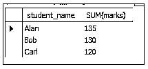

在这里，我们使用聚合函数 SUM()来获得总数，我们看到行数减少了。

**代码:**

使用窗口功能:

`SELECT student_name, subject, marks,
SUM (marks) OVER () AS Total_marks,
SUM (marks) OVER (PARTITION BY student_name) AS perhead_total
From students
ORDER BY subject;`

分析查询:total_marks 列是所有学生在所有科目中的分数总和，而 perhead_total 列是所有三个科目中每个学生的分数总和。

**输出:**

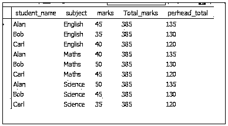

窗口函数只能在选择查询中使用，OVER()子句是必需的。OVER()子句可以留空，也可以包含 PARTITION BY、ORDER BY 等子句。几乎所有允许 OVER()子句和某些非侵略性函数的聚合函数都可以用作窗口函数，OVER()子句是必需的。

### MySQL 中的窗口函数

更多窗口功能如下:

#### 1.行号( )

该函数用于在每一行中插入行号。作为一个窗口函数，它将向结果集的小组中添加行，并将具有以下语法:

**代码:**

`SELECT
ROW_NUMBER() OVER (PARTITION BY student_name) AS row_num,
id,
student_name,
subject,
marks
FROM students
ORDER BY student_name;`

**输出:**

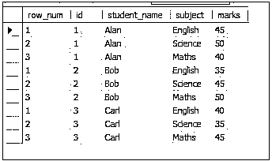

#### 2.排名()

该函数将为每一行提供排名，但它并不总是像 Row_number()那样是一个连续的数字。

**代码:**

`SELECT
ROW_NUMBER() OVER (order by subject) as row_num,
RANK () OVER (ORDER BY subject) as ranks,
student_name,
subject,
marks
FROM students;`

**输出:**

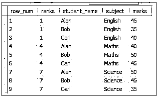

#### 3.稠密秩()

此函数类似于 RANK()函数，只是即使将总结果集分成更小的组，DENSE_RANK()函数也会为每个组分配连续的等级编号。

**代码:**

`SELECT
ROW_NUMBER() OVER (order by subject) as row_num,
RANK () OVER (ORDER BY subject) as ranks,
DENSE_RANK () OVER (ORDER BY subject) as D_ranks,
student_name,
subject,
marks
FROM students;`

**输出:**

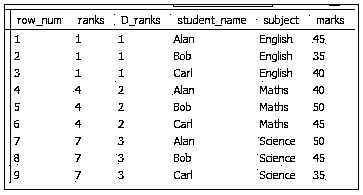

#### 4.百分比排名()

此函数计算小结果集中某一行的百分比，并将为每一行返回一个范围从 0 到 1 的值。另外，请注意，对于第一行集合，该函数将返回 0。

**代码:**

`SELECT
ROW_NUMBER() OVER (order by subject) as row_num,
PERCENT_RANK () over (order by subject) as percentile_rank,
RANK () OVER (ORDER BY subject) as ranks,
DENSE_RANK () OVER (ORDER BY subject) as D_ranks,
student_name,
subject,
marks
FROM students;`

**输出:**

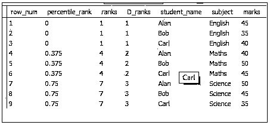

#### 5.DIST CUME()

这将返回结果集中一组值的累积分布。返回值将在 0 到 1 之间，列值中的任何重复将以相同的累积分布结束。

**代码:**

`SELECT
ROW_NUMBER() OVER (order by marks) as row_num,
RANK () OVER (ORDER BY marks) as ranks,
CUME_DIST () over (order by marks) as cume_distribution,
student_name,
marks
FROM marklist;`

**输出:**

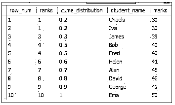

#### 6.NTILE()

这有助于根据提供的 partition_by 和 order_by 子句将结果集行分成指定数量的组。

**代码:**

`SELECT
ROW_NUMBER() OVER (order by marks) as row_num,
NTILE (4) over (order by marks) as group_number,
student_name,
marks
FROM marklist;`

**输出:**

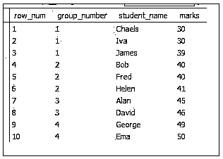

#### 7.滞后()

LAG()是一个窗口函数，它将值返回到经过排序和分区的结果集中前面的行。

**代码:**

`SELECT
employee,
year,
sales,
LAG (sales, 1) OVER (PARTITION BY employee ORDER BY year) prev_year_sales
FROM sales;`

**输出:**

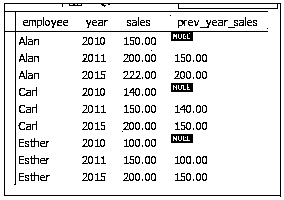

#### 8.铅()

这个函数执行与 lag()函数完全相反的操作。Lead()函数将在经过分区和排序的结果集中提前返回值。

**代码:**

`SELECT
employee,
year,
sales,
LAG (sales, 1) OVER (PARTITION BY employee ORDER BY year) prev_year_sales,
LEAD (sales, 1) OVER (PARTITION BY employee ORDER BY year) next_year_sales
FROM sales;`

**输出:**

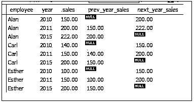

#### 9.第一个值()

此窗口函数返回分区排序结果集中的第一行。

**代码:**

`SELECT
employee,
department,
hours,
FIRST_VALUE (employee) OVER (PARTITION BY department ORDER BY hours) AS least_logged_hours
FROMloggedhours;`

**输出:**

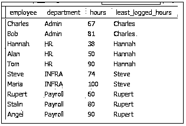

#### 10.最后一个值()

此窗口函数返回分区排序结果集中的第一行。语法如下所示:

**代码:**

`SELECT
employee,
department,
hours,
FIRST_VALUE (employee) OVER (PARTITION BY department ORDER BY hours) AS least_logged_hours,
LAST_VALUE (employee) OVER (PARTITION BY department ORDER BY hours
RANGE BETWEEN UNBOUNDED PRECEEDING AND
UNBOUNDED FOLLOWING) AS highest_logged_hours
FROM loggedhours;`

**输出:**

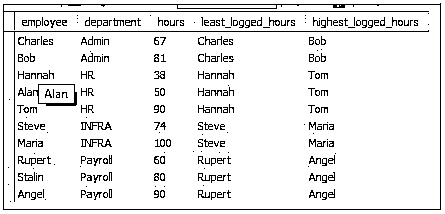

#### 11.第 n 个值()

窗口函数 NTH_VALUE 返回分区排序结果集中的第 n 行。

**代码:**

`SELECT
employee,
department,
hours,
NTH_VALUE (employee, 2)
FROM FIRST
OVER ( PARTITION BY department ORDER BY hours) as NTH_val
FROM loggedhours;`

**输出:**

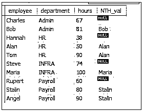

### 结论

窗口函数是对数据库中表格的窗口进行操作的函数。窗口函数的操作非常接近集合函数。通过正确使用 OVER()子句，许多聚合函数和非聚合函数可以被称为各自的窗口函数。OVER()子句可以有值或留空，我们也讨论了结果的差异。

### 推荐文章

这是一个 MySQL 窗口函数的指南。这里我们讨论一个 MySQL 窗口函数的介绍，包括语法、工作、函数和例子。您也可以浏览我们的其他相关文章，了解更多信息——

1.  [MySQL MAX()函数](https://www.educba.com/mysql-max-function/)
2.  [MySQL 中的 MIN()](https://www.educba.com/min-in-mysql/)
3.  [MySQL avg()](https://www.educba.com/mysql-avg/)
4.  [MySQL 中的 ORDER BY](https://www.educba.com/order-by-in-mysql/)

