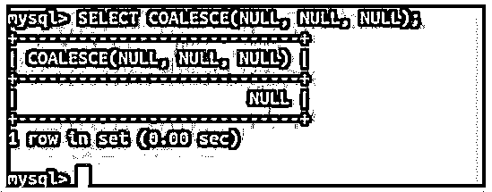
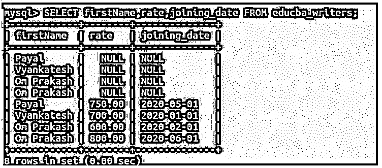
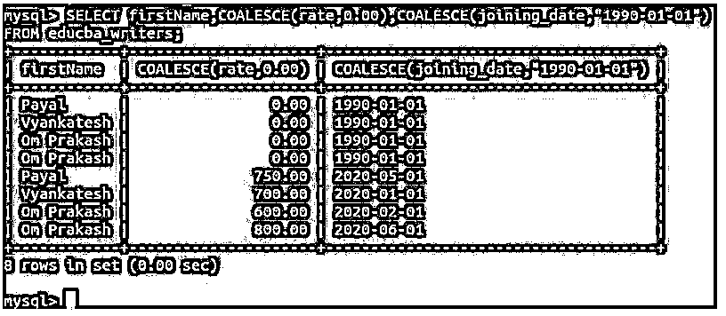
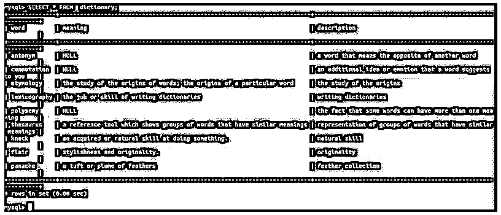
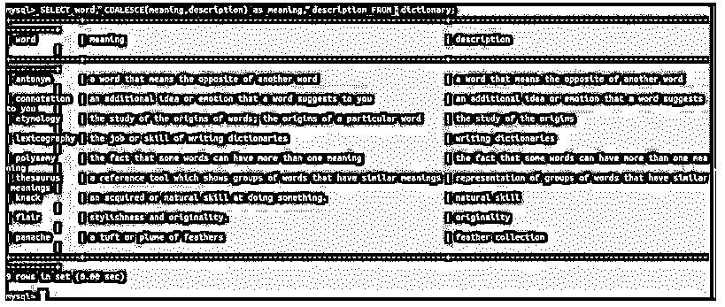

# MySQL COALESCE()

> 原文：<https://www.educba.com/mysql-coalesce/>

## MySQL COALESCE 介绍()

MySQL 的 COALESCE 函数用于处理表列中的空值。每当我们创建一个包含未被赋予默认值或自动递增属性的列的表时，默认情况下插入到该列中的值都是 NULL。从表中检索数据时，向用户显示空值既不方便也不合适。我们应该根据该列的用途以及其中存储的值的类型，将 NULL 值替换为某个适当的值，而不是 NULL 值。

例如，当存储了名称，但是在插入时没有指定列中包含的默认值时，我们应该在检索名称列时使用 coalesce 将空值替换为空字符串。

<small>Hadoop、数据科学、统计学&其他</small>

**MySQL COALESCE()的语法**

下面给出了 MySQL COALESCE()的语法:

`COALESCE(expression1,expression2,...);`

coalesce 函数接受表达式的数量，这些表达式可以是表或其他表达式中的列或值。它将所提供的逗号分隔列表中的第一个非空值作为参数返回。但是，我们在使用它的时候必须小心，因为如果所有的值和表达式都计算为 NULL，那么返回值总是 NULL。

让我们考虑一些例子:

首先，我们将制作一个包含 NULL 和其他有值元素的值列表。

**代码:**

`SELECT COALESCE(NULL, 1, NULL, 0, true, false );`

这将给出以下输出，其结果是第一个非空值为 1。

现在，我们将使用只包含空值的列表中的联合进行查询。

**输出:**

**代码:**

`SELECT COALESCE(NULL, NULL, NULL);`

**输出:**

### 用于替换空值的联合函数

让我们使用下面的查询语句创建一个名为 educba_writers 的表。

**代码:**

`CREATE TABLE `educba_writers` (
`id` int(11) NOT NULL,
`firstName` varchar(10) COLLATE latin1_danish_ci NOT NULL,
`rate` decimal(5,2) DEFAULT NULL,
`joining_date` date DEFAULT NULL
) ENGINE=InnoDB DEFAULT CHARSET=latin1 COLLATE=latin1_danish_ci;`

现在我们将在其中插入一些值。

**代码:**

`INSERT INTO `educba_writers` (`id`, `firstName`, `rate`, `joining_date`) VALUES
(1, 'Payal', NULL, NULL),
(2, 'Vyankatesh', NULL, NULL),
(5, 'Om Prakash', NULL, NULL),
(6, 'Om Prakash', NULL, NULL);`

让我们插入更多具有非空比率和加入日期值的行。

**代码:**

`INSERT INTO `educba_writers` (`id`, `firstName`, `rate`, `joining_date`) VALUES
(1, 'Payal', 750, "2020-05-01"),
(2, 'Vyankatesh', 700, "2020-01-01"),
(5, 'Om Prakash', 600, "2020-02-01"),
(6, 'Om Prakash', 800, "2020-06-01");`

**输出:**

现在，我们将查询 educba_writers 表来检索 firstName、rate 和 joining date 列的值。

**代码:**

`SELECT firstName,rate,joining_date FROM educba_writers;`

**输出:**

现在，我们将使用 coalesce 函数将 rate 列为 NULL 时的值替换为 0.00，将 joining date 列替换为“1990-01-01”，方法是将列名放在列表的第一个元素中，并将当列值为 NULL 时必须替换的值放在参数 coalesce 列表的第二个元素中。

按照我们的要求，我们检索带有替换空值的记录的查询如下。

**代码:**

`SELECT firstName,COALESCE(rate,0.00),COALESCE(joining_date,"1990-01-01") FROM educba_writers;`

**输出:**

我们可以从结果集中看到，rate 和 joining_date 列中的空值分别被替换为 0.00 和“1990-01-01”。这是使用 coalesce 函数最多的地方。

### 当第一列为空时，用其他值替换一列的联合函数

除了用指定的值替换空值之外，还有一个地方可以使用 coalesce 函数。例如，我们可以使用 coalesce 函数将列记录的空值替换为其他一些列值。

让我们创建一个名为 dictionary 的新表，它将包含单词、含义和描述等列。

**代码:**

`CREATE TABLE `dictionary` (
`word` varchar(100) DEFAULT NULL,
`meaning` varchar(5000) DEFAULT NULL,
`description` varchar(5000) DEFAULT NULL
) ENGINE=InnoDB DEFAULT CHARSET=latin1;`

**输出:**

让我们在其中插入一些值。

**代码:**

`INSERT INTO `dictionary` (`word`, `meaning`, `description`) VALUES
('antonym', NULL,'a word that means the opposite of another word'),
('connotation', NULL,'an additional idea or emotion that a word suggests to you'),
('etymology', 'the study of the origins of words; the origins of a particular word','the study of the origins'),
('lexicography', 'the job or skill of writing dictionaries','writing dictionaries'),
('polysemy', NULL,'the fact that some words can have more than one meaning'),
('thesaurus', 'a reference tool which shows groups of words that have similar meanings','representation of groups of words that have similar meanings'),
('knack', 'an acquired or natural skill at doing something.','natural skill'),
('flair', 'stylishness and originality.','originality'),
('panache', 'a tuft or plume of feathers','feather collection');`

**输出:**

让我们检索表中的记录。

**代码:**

`SELECT * FROM  dictionary;`

**输出:**

现在，让我们使用 coalesce 函数将含义列的空值替换为空值的描述列值。

**代码:**

`SELECT word, COALESCE(meaning,description) as meaning, description FROM dictionary;`

**输出:**

我们可以看到，含义列的空值被描述列替换，因为我们使用了包含含义和描述列的参数列表的联合。该函数将搜索第一个非空值。如果含义列包含除 null 之外的值，则在检索 else 时将选择该值。如果发现该值为 null，则 coalesce 将搜索相应的描述列值，如果该值不为 null，则显示该值，如果含义和描述列都为 null，则显示 null。

**IFNULL()函数与 COALESCE 函数:**

*   IFNULL()函数的工作方式与 coalesce 类似。
*   IFNULL()和 COALESCE()函数之间的唯一区别是，IFNULL()函数总是接受两个值作为其参数，而 COALESCE()可以接受其参数列表中任意数量的参数。
*   当 COALESCE()函数与两个参数一起使用时，它与 IFNULL()函数的作用相同。

### 结论

在 SELECT 查询中检索列值时，我们可以使用 coalesce 函数将列中的空值替换为我们需要的任何值，这些值可以是常量字符串或数字，甚至是任何其他列值。

### 推荐文章

这是 MySQL COALESCE()的指南。这里我们讨论的介绍，替换空值和一列与其他值时，第一个是空的。您也可以看看以下文章，了解更多信息–

1.  [MySQL sum()](https://www.educba.com/mysql-sum/)
2.  [MySQL 分区](https://www.educba.com/mysql-partition/)
3.  [MySQL VARCHAR](https://www.educba.com/mysql-varchar/)
4.  [MySQL BLOB](https://www.educba.com/mysql-blob/)

