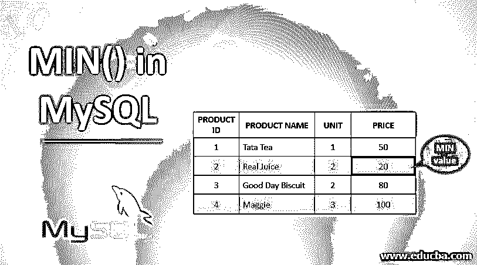
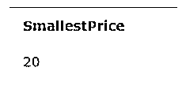
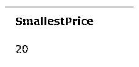
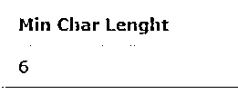

# MySQL 中的 MIN()

> 原文：<https://www.educba.com/min-in-mysql/>

## MySQL MIN()函数介绍

MySQL MIN()函数是一个 SQL 查询，它从数据库表中记录的一组值中返回最小值。通常，MIN()是一个聚合函数，可用于计算 SELECT 查询语句返回的一系列值，以找出表中那些分隔行的最小记录。MIN()函数接收一个条件表达式，该表达式可以是列名或涉及列的有效术语。如果没有匹配的条件，该函数将返回空值。假设我们可以使用这个函数从城市列表中找出一个城市的最少人口。

**带解释的语法:**

<small>Hadoop、数据科学、统计学&其他</small>

`MIN ( [DISTINCT] Expression)`

其中术语**、**表达式表示数值，可以是表格中的字段，也可以是公式，这是必需的。该关键字允许从数据库表的记录列表中删除重复值。但是，如果没有 distinct 关键字，几乎会得到相同的结果，它对 MIN()没有太大的影响，就像对其他 SUM()、COUNT()或 AVG()聚合函数一样。

还有，

`MIN([DISTINCT] expression) [over_clause]`

over_clause 不是强制部分，但它可以与窗口任务相关联。因此，仅当我们没有在 MIN()函数中添加 DISTINCT 关键字时，才使用 over_clause。

### MIN()函数在 MySQL 中是如何工作的？

正如我们所知道的，MIN()函数用于从 select 语句选择的所有行中找出最小值，那么我们现在可以很容易地在我们的业务或产品管理中获得好处。例如，它将允许获得贵公司的低价产品、较便宜的商品或顾客在商店消费的最低数量的产品。

我们可以在数据库中应用这个 SQL 查询来返回结果。MySQL MIN() SQL 语句如下所示:

`SELECT MIN ([Column_Name]) FROM [Source*]*`

因此，使用 MIN()函数可以从数据库表中返回指定列中的最小值作为源。

### 在 MySQL 中实现 MIN()的例子

下面是 MySQL 中 MIN()的例子:

#### 示例# 1–MIN()获取列中的最小值

让我们看一下下面显示的产品表中记录的屏幕截图。

我们应用了 MIN() 在检查了所有产品价格后，得到价格比其他产品低的产品。

`SELECT MIN(Price) AS SmallestPrice FROM Products;`

**输出:**

#### 示例 2–带有 WHERE 子句的 MIN()函数。

在这里，我们使用 MIN()通过 SELECT 语句使用 WHERE 关键字返回特定条件下的最小值。

`SELECT MIN(Price) AS SmallestPrice FROM Products WHERE SupplierID=2;`

**输出:**

我们从 Products 表中获得了 SupplierID 为 2 的唯一价格的最小值。我们也可以使用任何多词别名(如 SmallestPrice)来定义最小值，如上面的查询所示。

#### 示例 3–子查询语句中的 MIn()函数。

为了不仅提供产品表中的最低价格，而且显示包括其他字段在内的行信息，我们在子查询中使用了 MIN()，如下所示:

`SELECT * From Products WHERE Price = (SELECT MIN(Price) AS SmallestPrice FROM Products);`

**输出:**

内部查询返回最低价格，外部查询提供 products 表中最低价格字段的行信息。

#### 示例 4–带有 GROUP BY 子句的 MIN()函数。

带有 GROUP BY 子句的函数有助于根据标准找出每个组的最小值。

`SELECT SupplierID , MIN(Price) FROM Products GROUP BY SupplierID;`

**输出:**

产品字段按产品表中的供应商 ID 分组，但最低价格随机排列，既不升序也不降序。

#### 示例 5–带有 ORDER BY 子句的 MIN()函数。

这个带有 ORDER BY 子句的函数有助于指定列，我们可以使用该列根据条件按每个组的最小值进行排序。

`SELECT SupplierID , MIN(Price) FROM Products
GROUP BY SupplierID
ORDER BY MIN(price);`

**输出:**

现在，字段按 SupplierID 分组，结果集根据 MIN(价格)按升序排序，首先设置第一个小的最小值，最后设置下一个较大的最小值。

NOTE: We can also use ASC or DESC to set an order BY clause like “ORDER BY MIN(Price) ASC”.

#### 示例 6–带有 HAVING 子句的 MIN()函数

我们使用带有 MIN()函数的 HAVING 子句根据特定条件过滤这些组。

`SELECT SupplierID , MIN(Price) FROM Products
GROUP BY SupplierID
HAVING MIN(Price) <50
ORDER BY MIN(price);`

**输出:**

<u>

</u> 

在上面的查询中，首先我们使用 MIN()从一组具有 GROUP BY 子句关联的产品中获取最低价格，然后再次基于 HAVING 子句，我们应用 MIN 函数获取表中小于 50 的最低价格。

接下来，假设如果我们想要供应商的名称而不是供应商 id，那么我们甚至可以在上面的查询中使用 JOIN 子句。我们需要为表 Products 和 Suppliers 应用内部连接。

以下是示例中使用的供应商 ids、2、3 的供应商表数据:

现在，这方面的 SQL 语句如下:

`SELECT SupplierName, MIN(Price) FROM Products
INNER JOIN Suppliers
USING (SupplierID)
GROUP BY SupplierName
HAVING MIN(Price) <50
ORDER BY MIN(price);`

**输出:**
T3】

#### 示例 7–MIN()函数查找最小字符长度。

使用 MIN()我们不仅可以从列字段的数值数据中找出最小值，还可以将其应用到其他区域。我们可以将 MySQL MIN()函数与 CHAR_LENGTH 等其他函数结合使用。

例如，以同一个 Products 表为例，我们可以编写以下查询，并查找 ProductName 列中的最小字符数:

`SELECT MIN(CHAR_LENGTH(ProductName)) AS 'Min Char Length'
FROM Products;`

**输出:**

### 结论

因此，MIN()函数有助于处理许多情况，例如获得最低的数字、最便宜的商品、最便宜的产品、获得最低的信用额度和消费者的最低付款。因此，在本文中，您可能已经发现了 MIN()函数在 MySQL 中的一些重要用法，语法和示例将帮助您处理与商业领域或任何存储大量数据的行业的数据库和表相关的函数查询。

### 推荐文章

这是 MySQL 中 MIN()的使用指南。这里我们讨论一下基本概念，MIN()函数在 MySQL 中是如何工作的？分别举例说明。您也可以看看以下文章，了解更多信息–

1.  [就像 MySQL 中的](https://www.educba.com/like-in-mysql/)
2.  [MySQL 中的 ORDER BY](https://www.educba.com/order-by-in-mysql/)
3.  MySQL 中的[表](https://www.educba.com/table-in-mysql/)
4.  [MySQL 聚合函数](https://www.educba.com/mysql-aggregate-function/)

