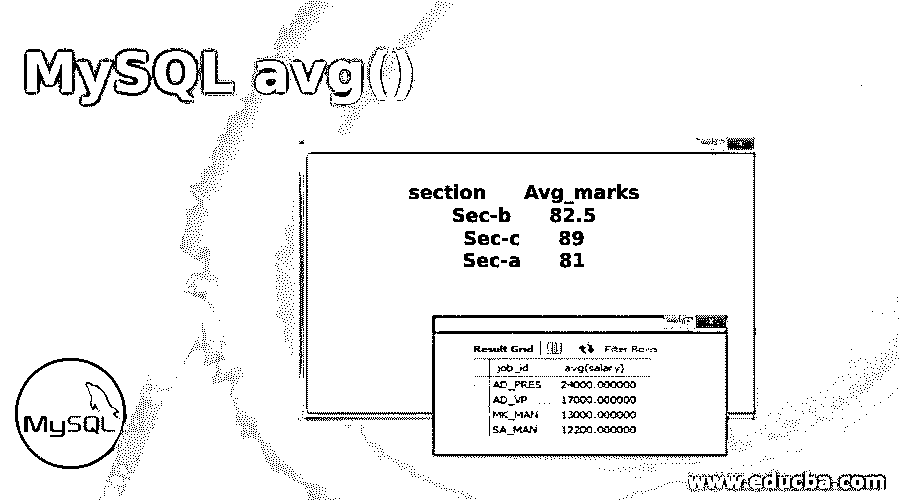
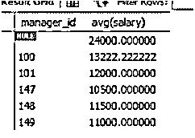
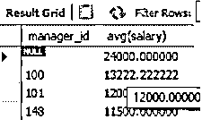
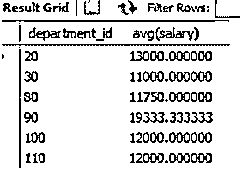
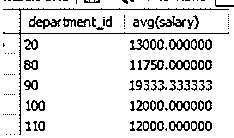
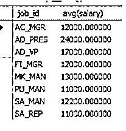
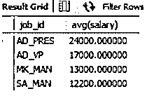

# MySQL 平均值()

> 原文：<https://www.educba.com/mysql-avg/>

## MySQL 中的 AVG()简介

在多种 SQL 语言中，我们在数据查询语言(DQL)中使用带有 SELECT 语句的聚合函数。这种函数作用于多个值或记录，并返回单个值。单个值可以是所有值中的总和、平均值、最小值或最大值。在本主题中，我们将学习 MySQL avg()。

**示例:**如果我们有印度地区和邦的所有公民的记录，忘记了印度的总实力，我们需要使用 SUM()这样的聚合函数。同样，如果我们想知道州或地区的最高、最低或平均人口，我们必须分别使用像 MAX()、MIN()和 AVG()这样的函数。但是除了 COUNT()之类的函数之外，这个聚合函数不对空值采取任何操作。还有一个函数叫做 GROUP BY()，在许多情况下，聚合函数与它一起使用。

<small>Hadoop、数据科学、统计学&其他</small>

**语法:**

`SELECT avg(sales) FROM product;`

运筹学

`SELECT * FROM product
GROUP BY product_name
HAVING avg(sales) > 1000;`

### MySQL 中的 avg()是如何工作的？

现在，让我们讨论一下 avg()在 MySQL 中是如何工作的？

| **节** | **名称** | **标记** |
| Sec-b | 加快收寄投递系统 | Ninety |
| Sec-c | edfg | Eighty-six |
| Sec-C | 我是说... | Ninety-four |
| Sec-c | odjfoi | Seventy-eight |
| Sec-a | lnknc | Sixty |
| Sec-b | lkdjv | Eighty-six |
| Sec-c | jshjdh | Ninety-two |
| Sec-a | jkhcj | Eighty-nine |
| Sec-b | oijcoid | Seventy-six |

以上是学生表数据库。在该表中，有 3 个属性，如节、名称和标记。在聚合函数 avg()的帮助下，我们将执行一些示例来更好地理解这个函数。

为了得到所有学生的平均分:

**语法:**

`SELECT AVG(marks) AS avg_marks
FROM student;`

**输出:**

| **平均分数** |
| Eighty-three point four four |

如果我们想要学生在每个部分的平均分数，那么我们可以使用 AVG()和 GROUP BY 函数。

**语法:**

`SELECT section, AVG(marks) AS avg_marks
FROM student
GROUP BY section;`

**输出:**

| **节** | **平均分数** |
| Sec-b | Eighty-two point five |
| Sec-c | Eighty-nine |
| Sec-a | Eighty-one |

### 在 MySQL 中实现 avg()的例子

让我们用以下属性创建另一个雇员表。通过深入研究该表，我们可以深入了解 avg()聚合函数。

| **emloyee_id** | **名字** | **姓氏** | **电子邮件** | **电话号码** | **雇佣日期** | **作业 id** | **工资** | **佣金百分比** | **经理 id** | **部门标识** |
| One hundred | seabcd | 国王 | 滑雪 | 515.123.4567 | 6/17/1987 | 欧珀莱（化妆品品牌名） | Two thousand four hundred | 空 | 空 | Ninety |
| One hundred and one | 妮娜 | 科赫哈尔 | 恩科奇哈尔 | 515.123.4568 | 9/21/1989 | AD_VP | Seventeen thousand | 空 | One hundred | Ninety |
| One hundred and two | 法律 | 德哈恩 | 德哈安 | 515.123.4569 | 1/13/1993 | AD_VP | Seventeen thousand | 空 | One hundred | Ninety |
| One hundred and eight | 南茜 | 格林伯格 | 绿色床 | 515.124.4569 | 8/17/1994 | 财务经理 | Twelve thousand | 空 | One hundred and one | One hundred |
| One hundred and fourteen | 那个人 | 拉斐尔 | 德拉菲尔 | 515.127.4561 | 12/7/1994 | 普 _ 曼 | Eleven thousand | 空 | One hundred | Thirty |
| One hundred and forty-five | 约翰 | Russelllsd | JRUsdfSSEL | 011.44.176344.429268 | 10/1/1995 | 萨马恩 | Fourteen thousand | Zero point four | One hundred | Eighty |
| One hundred and forty-six | 卡夫伦 | 伙伴 | pcpartner | 011.44.134454.467268 | 1/5/1997 | 萨曼莎 | Thirteen thousand five hundred | Zero point three | One hundred | Eighty |
| One hundred and forty-seven | 阿尔布费尔托 | Errgdazuriz | 阿尔德格扎尔 | 011.43544.1344.429278 | 3/10/1997 | 萨曼莎 | Twelve thousand | Zero point three | One hundred | Eighty |
| One hundred and forty-eight | 杰德拉尔 | 卡德布鲁特 | GCAMBRAdfdvU | 011.44545.1344.619268 | 10/15/1999 | 萨曼莎 | Eleven thousand | Zero point three | One hundred | Eighty |
| One hundred and forty-nine | 埃伦德格迪 | Zdglotkey | EZLOgTKEY | 011.4445.1344.429018 | 1/29/2000 | 萨曼莎 | Ten thousand five hundred | Zero point two | One hundred | Eighty |
| One hundred and sixty-two | [人名]克莱拉 | 维什尼 | CVISHNEY | 011.44.1346.129268 | 11/11/1997 | 销售代表 | Ten thousand five hundred | Zero point two five | One hundred and forty-seven | Eighty |
| One hundred and sixty-eight | elizabeth 的昵称 | 奥兹国 | 失败者 | 011.44.1343.929268 | 3/11/1997 | 销售代表 | Eleven thousand five hundred | Zero point two five | One hundred and forty-eight | Eighty |
| One hundred and seventy-four | 埃伦 | 亚伯 | 标签 | 011.44.1644.429267 | 5/11/1996 | 销售代表 | Eleven thousand | Zero point three | One hundred and forty-nine | Eighty |
| Two hundred and one | 迈克尔 | 哈蒂斯廷 | 艺术家 | 515.123.5555 | 2/17/1996 | MK_MAN | Thirteen thousand | 空 | One hundred | Twenty |
| Two hundred and five | 雪莱 | [人名]希金斯 | 希金斯 | 515.123.8080 | 6/7/1994 | 交流经理 | Twelve thousand | 空 | One hundred and one | One hundred and ten |

#### 示例#1

它将显示所有员工的平均工资

**代码:**

`SELECT avg(salary) AS average_salary FROM employee;`

**输出:**

#### 实施例 2

它将根据每个经理 id 显示平均工资

**代码:**

`SELECT manager_id, avg(salary) FROM employee
GROUP BY manager_id;`

**输出:**

#### 实施例 3

它将显示平均工资高于 11000 的每个经理 id 的平均工资

**代码:**

`SELECT manager_id, avg(salary) FROM employee
GROUP BY manager_id
HAVING avg(salary) > 11000;`

**输出:**

#### 实施例 4

它将根据每个部门 id 显示平均工资

**代码:**

`SELECT department_id, avg(salary) FROM employee
GROUP BY department_id;`

**输出:**

#### 实施例 5

它将根据每个部门 id 显示平均工资，其中平均工资将大于 11500

**代码:**

`SELECT department_id, avg(salary) FROM employee
GROUP BY department_id
HAVING avg(salary)>11500;`

**输出:**

#### 实施例 6

它将根据每个工作 id 显示平均工资

**代码:**

`SELECT job_id, avg(salary) FROM employee
GROUP BY job_id;`

**输出:**

#### 实施例 7

它将根据每个工作 id 显示平均工资，其中平均工资将大于 12000

**代码:**

`SELECT job_id, avg(salary) FROM employee
GROUP BY job_id
HAVING avg(salary)>12000;`

**输出:**

### 结论

从分析角度以及从数据库中提取数据的过程来看，这些聚合函数非常重要，因为它有助于我们降低复杂的场景。具体来说，当我们在查询中给定条件或使用窗口函数时，聚合函数起主要作用。一些函数，如极限、秩等。GROUP BY 子句总是带有聚合函数。当处理像供应链这样的大数据时，我们总是需要使用这些聚合函数，因为它简化了我们的数据。使用 tableau 或 power BI 等软件时也会发生同样的情况，它总是聚合这些值以实现更好的可视化。

### 推荐文章

这是一个 MySQL 中 AVG()的指南。在这里，我们讨论它是如何工作的，在 MySQL 中实现 avg()的例子，以及简洁的查询和输出。您也可以看看以下文章，了解更多信息–

1.  [不在 MySQL 中](https://www.educba.com/not-in-mysql/)
2.  MySQL 中的[表](https://www.educba.com/table-in-mysql/)
3.  [MySQL 中的光标](https://www.educba.com/cursor-in-mysql/)
4.  [MySQL 中的光标|示例](https://www.educba.com/cursor-in-mysql/)

