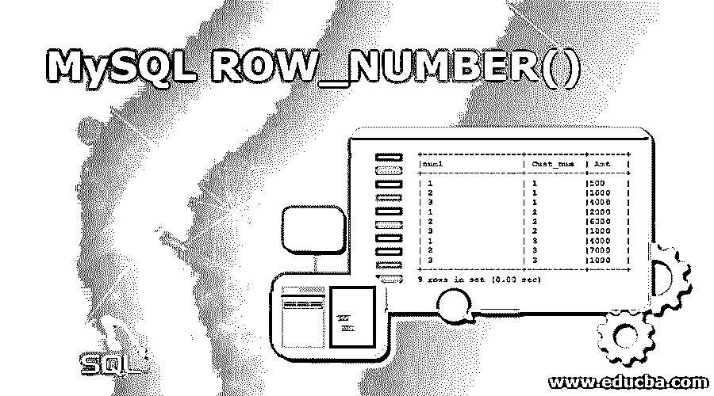
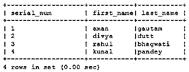
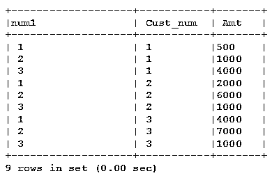

# MySQL ROW_NUMBER()

> 原文：<https://www.educba.com/mysql-row_number/>

## MySQL ROW_NUMBER()函数是什么？

Mysql ROW_NUMBER()函数是一种按顺序或序列返回每行数字的函数，从结果集第一条记录的 1 开始，按升序排列到最后。它为表中的每行或每条记录指定一个数值，从第一行的 1 到第 n 行的 n。

Mysql 版包含了 row_number()特性

<small>Hadoop、数据科学、统计学&其他</small>

幸运的是，MySQL 为我们提供了会话变量，通过这些变量我们可以找到 row_number()函数。

更准确地说，它返回结果集或表的分区中某一行的序列号，从每个分区中第一行的 1 开始，直到第 n 行的 n。

### MySQL ROW_NUMBER()的语法

`row_number()  over (<partition><order by>)`

**1。分区定义**

**语法:**

`partition by <expression1>,<expression2>,….<expression n>`

Partition by 子句用于将行或记录分成更小的数据块。partition 子句后面的表达式是一种可以在 group by 语法中使用的有效条件。根据查询的要求，表达式可以是单个表达式，也可以是由逗号分隔的多个表达式

我们可以用它作为可选语句。如果忽略 row_number()函数查询中的 partition by 子句，那么完整的输出将被视为一个分区。

**2。订单定义**

**语法:**

`order by<expression> [acending|decending],[{,<expression>}..]`

order by 子句主要用于设置行或记录的顺序或次序。

### MySQL ROW_NUMBER()的实现示例

下面是 MySql row_number()的图解。为了便于说明，我们从数据库中提取了产品表:

为每一行数据添加一个行号或序列号，为了估计 row number():函数，我们必须在查询中使用会话变量。

#### 示例#1

解释为每一行添加行号:以下语句从 STUDENT 表返回四个学生，并为每一行添加一个行号，从 1 开始。

**查询:**

`set @row_num=0;
select
(@row_num:=@row_num+1) AS serial_num,
first_name,last_name
from
STUDENT
order by first_name,last_name
limit 4;`

**输出:**

**说明:**

*   首先，定义一个名为@row_num 的变量，并将其初始值设置为 0。@row_num 是一个会话变量，用于将每行的值递增 1。后跟@前缀。
*   然后，使用 select 子句从表 STUDENT 中选择数据，并使用@row_num 和变量 row_num 将每一行的值增加 1。
*   Order by 子句用于按升序(ASC)或降序(DESC)对结果集中的记录进行排序或序列化。默认情况下，它按升序排序。
*   在查询的最后一行，我们使用了 limit 子句约束或限制返回的行数或记录数为 7。

使用会话变量的另一种做法是作为派生表，并将其与主表交叉连接。下面是使用会话变量作为派生表的查询。

#### 实施例 2

**查询:**

`select
(@row_num:=@row_num +1) AS num1,first_name,last_name
from
STUDENT
(select @row_num:=0) AS s
orderby first _name,last_name
limit 4;`

**Note**:  The derived table must have its own alias as in this case is‘s’ for the STUDENT to make the query syntactically correct.**Explanation:**

*   在上面的查询中，首先定义了一个名为@row_num 的变量，并将其初始值设置为 0。@row_num 是一个会话变量，用于将每行的值递增 1。后跟@前缀。
*   我们使用了子查询的概念，它是一个查询中的一个查询。一个 select 子句是外部查询，另一个是用变量 row_num 声明的内部查询，其 initailized 值为 0，外部查询用于增加结果集的行值。
*   然后，使用 select 子句从表 STUDENT 中选择数据，并使用@row_num 和变量 row_num 将每一行的值增加 1。
*   Order by 子句用于按升序(ASC)或降序(DESC)对结果集中的记录进行排序或序列化。默认情况下，它按升序排序。
*   在查询的最后一行，我们使用了 limit 子句约束或限制返回的行数或记录数为 7。

#### 实施例 3

给每组数据指定一个行号，如果我们想给每组数据添加一个行号，为了解释这一点，我们从我的数据库中取出一个银行表。

**查询:**

`select
Cust_num,
Amt
from
Bank
orderby
Cust_num;`

我们希望为每个客户添加一个行号或序列号，并且在更改客户号时，行号也会被重置。

为此，我们必须使用两个会话变量，一个用于行号增量，另一个用于存储旧的客户号，以便与当前的客户号进行比较。

#### 实施例 4

以下查询是向客户组添加行号的示例。

**查询:**

`set @row_num:=0;
select @row_num:=CASE
when @cust_no=Cust_num
then @row_number+1
else 1
end AS num,
@cust_no:=Cust_num cust_num,Amt
from bank
order by Cust_num;`

**输出:**

**说明:**在上面的查询中，我们在查询中使用了 CASE 表达式，变量@row_num 递增，如果客户号保持不变，则重置为 1。上面的查询使用派生表和交叉连接来给出相同的结果。

#### 实施例 5

**查询:**

`select
@row_num:=CASE
When @cust_no=Cust_num
then
@row_num+1
else 1
end AS num1,
@cust_no:=cust_numcust_num,Amt
from
Bank,
(select @cust_no:=0,@row_num:=0) as b
order by Cust_num;`

### 结论

在这篇关于 row_number 函数的文章中，我们学习了如何使用 MySQL row_number()函数为数据结果集中的每一行或每一条记录生成一个序列号。在本文中，我们学习了如何使用 select 语句和 order by 子句以及交叉连接。

### 推荐文章

这是 MySQL ROW_NUMBER()的指南。这里我们讨论 MySQL ROW_NUMBER()函数的介绍以及实际例子和不同的子查询表达式。您也可以浏览我们推荐的文章，了解更多信息——

1.  [MySQL 操作符介绍](https://www.educba.com/mysql-operators/)
2.  [前 23 个 MySQL 字符串函数](https://www.educba.com/mysql-string-functions/)
3.  [MySQL 与 SQLite | 14 大对比](https://www.educba.com/mysql-vs-sqlite/)
4.  [MySQL 时间戳指南](https://www.educba.com/mysql-timestamp/)

