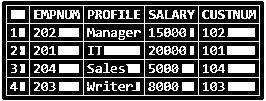

# MySQL IN 运算符

> 原文：<https://www.educba.com/mysql-in-operator/>

## MySQL 在运营商中的介绍

*   MySQL IN 运算符，用于通过检查文字值集中的值或子查询提供的值是否匹配来检索结果集。
*   基本上，该运算符有助于确定特定值(如果在使用 WHERE 子句的子查询结果中可用的话)。
*   如果某个特定值出现在为匹配条件表达式而提供的值列表中，它将从表中获取一组列。
*   因此，与其他 MySQL 操作符一样，MySQL IN 操作符允许比较子查询语句返回的一组列值中的匹配值。
*   如果我们想从数据库表中获得结果行，其中一个特定的值应该出现在通过条件查询得到的值列表中，那么我们使用 MySQL IN 操作符。
*   我们从 MySQL 中使用 WHERE 关键字给定的列的特定值中提取在 in 运算符函数的值列表中具有匹配值的行。

**语法:**

我们用下面的 SQL 语法语句来说明在 MySQL 中 IN 操作符的工作和查询:

<small>Hadoop、数据科学、统计学&其他</small>

`SELECT * FROM TableName WHERE (ColumnA) IN (SELECT query statement);`

运筹学

`SELECT ColumnA, ColumnB,.., FROM TableName WHERE (ColumnA or any expressional condition) IN (‘ValueA’, ‘ValueB’,…..);`

**简要解释上述语法:**

*   我们需要提供任何列值作为 ColumnA，或者在 WHERE 子句的查询中使用任何带有 IN 运算符的表达式。
*   在 In 操作符列表中，我们需要用逗号(，)来区分这些值。
*   我们可以使用 MySQL 中的 SELECT 子句和 in 关键字提供任何子查询语句，以过滤其他表中的值，并运行该语句从表中获得所需的结果行集。
*   如果列值或子查询表达式结果值与值列表中的任何值匹配，则 IN 运算符的结果将为 1。如果不匹配，则 IN 运算符的结果将为 0。

### MySQL 中的 IN 运算符是如何工作的？

按照上面的语法，MySQL IN 运算符在参数中为我们提供了一个相等的值。要使用 IN 关键字，它必须与 WHERE 子句结合在一起。发生这种情况时，执行的查询只影响其值与 in 关键字中的可用值列表相匹配的记录。MySQL 中的 IN 关键字有助于最小化 OR 子句的使用。

假设我们在列表中有所有的常量值，那么在 MySQL 中执行以下操作步骤:

*   首先，它检查值是否与列 a 的数据类型相同。此外，还会对表达式或子查询结果进行评估。
*   接下来，这些值按适当的顺序排序。
*   然后，基于二分搜索法算法搜索该值，这使得使用带有常数值列表的 IN 操作符的 SQL 语句查询可以非常快速地执行。
*   否则，根据 MySQL 中的规则，可以进行类型转换来处理查询。

### 在 MySQL 中实现运算符的示例

现在让我们使用一些例子来讨论 IN 操作符，并学习为它编写 SQL 查询的代码。

#### 示例# 1–在内，不在和或中

我们使用名为“客户”和“雇员”的表。下面是在 Customers 表中使用 IN 运算符的 SQL 语句。

**客户表:**

**员工表:**

`SELECT * FROM Customers WHERE City IN (‘Delhi’, ‘Mumbai’);`

上面带有 in 运算符的查询将从表中获取所有记录，该表中的客户来自 IN 关键字中提供的城市:德里和孟买。

**输出:**

如果我们在上面的查询中使用 OR 运算符，结果将与上面的相同:

`SELECT * FROM Customers WHERE City = ‘Delhi’ OR City = ‘Mumbai’;`

**输出:**

但是如果我们在列表中有多个值，那么我们需要用 OR 操作符来分隔每个值，语句将会非常长。因此，为了避免这种问题，并使 SQL 语法更加正确和可读，在 MySQL 中引入了 IN 操作符。因此，IN 关键字有助于通过用逗号分隔列出值来缩短语句。

相反，如果我们想要得到与列表中的值不匹配的结果集，那么我们在 MySQL 中使用以下带有 NOT IN 运算符的查询:

**查询:**

`SELECT * FROM Customers WHERE City NOT IN (‘Delhi’, ‘Mumbai’);`

**输出:**

从上面的结果可以看出，NOT IN 操作符从表中提取的客户行不属于或不与列表中提供的城市相关:德里和孟买。

#### 示例 2–使用子查询

通常，IN 运算符用于内部查询或子查询。之所以这样做，是因为我们可以使用子查询从一个或多个表中获取值列表，并将它们作为输入提供给 IN 运算符，以匹配外部查询中的值，并从 SQL 语句中生成结果，而不是使用 IN 关键字传递文字值列表。

在下面的查询中，我们使用了两个表 Customers (CustNum，Name，City，Phone)和 Employees (EmpNum，Profile，CustNum，Salary)来过滤 MySQL 中两个表的结果集:

**查询:**

`SELECT CustNum,Name, City FROM Customers WHERE CustNum IN (SELECT CustNum FROM Employees where EmpNum > 202 ) ORDER BY CustNum;`

**输出:**

这里，IN 运算符使用子查询提供了来自客户的结果行，其中 Employees 子查询的输出是 CustNum 列的值，该列包含薪金高于 5000 的雇员。

### 结论

*   请记住，根据上面的 in 运算符语法，如果表中不存在 ColumnA 值，或者子查询表达式提供 NULL 值，或者如果列表中的任何值都为 NULL，则条件不会给出值的适当可比性，因此 IN 运算符的结果将为 NULL。
*   如果我们想得到一个值与值列表中的值不匹配的结果，那么我们可以使用 NOT in 运算符来代替 IN。
*   因此，除了 WHERE 子句，我们还可以在 MySQL 的其他 SQL 查询或语句(如 UPDATE 和 DELETE)中使用 IN 运算符。

### 推荐文章

这是一个 MySQL 的操作指南。这里我们讨论 MySQL IN 运算符的介绍和实际例子以及不同的子查询表达式。您也可以浏览我们推荐的文章，了解更多信息——

1.  [MySQL 操作符介绍](https://www.educba.com/mysql-operators/)
2.  [前 23 个 MySQL 字符串函数](https://www.educba.com/mysql-string-functions/)
3.  [MySQL 与 SQLite | 14 大对比](https://www.educba.com/mysql-vs-sqlite/)
4.  MySQL 时间戳|如何工作？
5.  [MySQL 中 IF 语句指南](https://www.educba.com/if-statement-in-mysql/)

