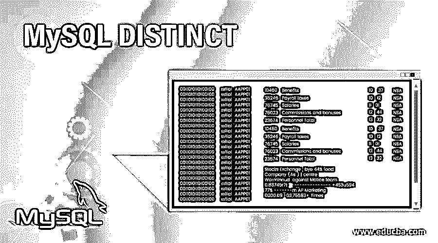
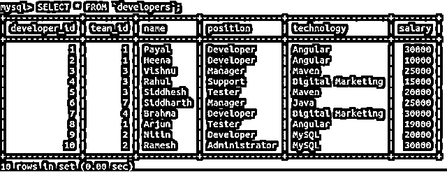
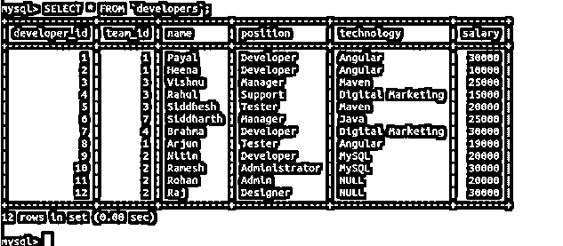
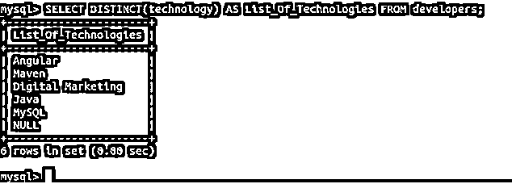
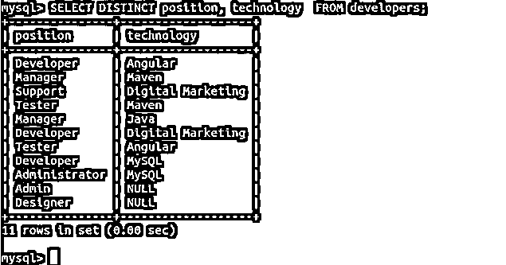
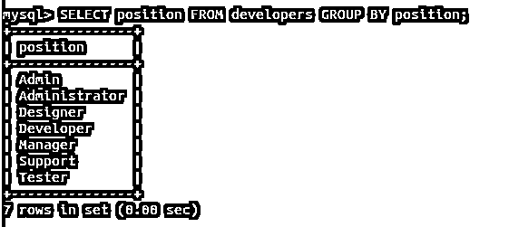
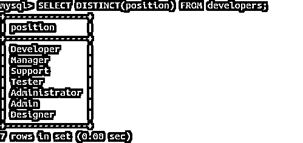

# MySQL 独特

> 原文：<https://www.educba.com/mysql-distinct/>

## MySQL DISTINCT 简介

我们在 MySQL 数据库中使用的大多数表都包含列，除了主键列中有重复的值条目。例如，多个开发人员记录条目在技术列中可以具有相同的值，因为它们可能适用于相同的技术。比如有的开发者可能用 angular，有的可能用 java，有的用 react js 等等。要获得开发人员使用的技术列表，我们必须从开发人员的表中检索技术列的不同值的唯一性。为此，我们可以使用 distinct 关键字。在 MySQL 中，distinct 关键字或子句帮助我们检索表中列的唯一值或不同值。

在本文中，我们将了解 distinct 关键字的用法、语法、包含空值的示例、聚合函数、包含 distinct 函数的多个列，以及 distinct 和 group by 子句之间的相似之处。

<small>Hadoop、数据科学、统计学&其他</small>

**语法:**

`SELECT DISTINCT
list_of_columns
FROM
name_of_table;`

**其中，**

list_of_columns 是要对其应用不同功能的列或单个列的名称列表，name_of_table 是包含要检索的指定列和记录的表名。

### 实现 MySQL DISTINCT 的示例

让我们考虑一个例子，创建一个表名开发者使用下面的 Create query

**代码:**

`CREATE TABLE `developers` (
`developer_id` int(11) NOT NULL,
`team_id` int(11) NOT NULL,
`name` varchar(100) DEFAULT NULL,
`position` varchar(100) DEFAULT NULL,
`technology` varchar(100) DEFAULT NULL,
`salary` int(11) DEFAULT NULL,
PRIMARY KEY (`developer_id`,`team_id`)
) ENGINE=InnoDB DEFAULT CHARSET=latin1`

让我们使用 insert 语句在 developers 表中插入一些记录

**代码:**

`INSERT INTO `developers` (`developer_id`, `team_id`, `name`, `position`, `technology`, `salary`) VALUES('1','1','Payal','Developer','Angular','30000');
INSERT INTO `developers` (`developer_id`, `team_id`, `name`, `position`, `technology`, `salary`) VALUES('2','1','Heena','Developer','Angular','10000');
INSERT INTO `developers` (`developer_id`, `team_id`, `name`, `position`, `technology`, `salary`) VALUES('3','3','Vishnu','Manager','Maven','25000');
INSERT INTO `developers` (`developer_id`, `team_id`, `name`, `position`, `technology`, `salary`) VALUES('4','3','Rahul','Support','Digital Marketing','15000');
INSERT INTO `developers` (`developer_id`, `team_id`, `name`, `position`, `technology`, `salary`) VALUES('5','3','Siddhesh','Tester','Maven','20000');
INSERT INTO `developers` (`developer_id`, `team_id`, `name`, `position`, `technology`, `salary`) VALUES('6','7','Siddharth','Manager','Java','25000');
INSERT INTO `developers` (`developer_id`, `team_id`, `name`, `position`, `technology`, `salary`) VALUES('7','4','Brahma','Developer','Digital Marketing','30000');
INSERT INTO `developers` (`developer_id`, `team_id`, `name`, `position`, `technology`, `salary`) VALUES('8','1','Arjun','Tester','Angular','19000');
INSERT INTO `developers` (`developer_id`, `team_id`, `name`, `position`, `technology`, `salary`) VALUES('9','2','Nitin','Developer','MySQL','20000');
INSERT INTO `developers` (`developer_id`, `team_id`, `name`, `position`, `technology`, `salary`) VALUES('10','2','Ramesh','Administrator','MySQL','30000');`

我们使用相同的插入格式在我的表中插入了多个值。现在，在使用下面的 SELECT 查询检索了 developers 表的记录之后

**代码:**

`SELECT * FROM `developers`;`

**输出**:

现在，让我们使用 technology 列上的 distinct 子句检索开发人员表中使用的所有技术的列表。对此的查询语句如下所示

**代码:**

`SELECT DISTINCT(technology) AS List_Of_Technologies FROM developers;`

**输出:**

正如我们所看到的，技术值的所有重复值都被跳过，只有不同的值被添加到结果集中。

### 具有空值的 DISTINCT 子句

DISTINCT 子句不会忽略表中的空值。如果应用 distinct 子句的列在多个记录中包含 NULL 值，则检索所有 NULL 值，并在 DISTINCT 结果集中用一个 NULL 值表示。让我们用 NULL 技术在开发人员的表中插入两条记录，并查看查询中 DISTINCT 子句的结果。

**代码:**

`INSERT INTO `developers` (`developer_id`, `team_id`, `name`, `position`, `technology`, `salary`) VALUES('11','2','Rohan','Admin',NULL,'20000');
INSERT INTO `developers` (`developer_id`, `team_id`, `name`, `position`, `technology`, `salary`) VALUES('12','2','Raj','Designer',NULL,'30000');`

**输出**:

让我们使用选择查询来检索结果

`SELECT * FROM `developers`;`

**输出**:

现在让我们检查不同查询的输出——

**代码:**

`SELECT DISTINCT(technology) AS List_Of_Technologies FROM developers;`

**输出:**

### 多列上的 DISTINCT 子句

我们可以在一列或多列上使用 DISTINCT 子句。当在一列上定义时，它检索该列的唯一值。但是，当 DISTINCT 子句在多个列上定义时，列值的组合被认为是唯一的。让我们借助一个例子来阐明我们的概念。

让我们对位置和技术列应用 DISTINCT 子句。请注意，在这里位置和技术一起应该有独特的价值。我们可以从 developers 表记录中观察到，有两个名为 Payal 和 Heena 的记录具有相同的技术和职位，即 angular 和 developer。因此，这两列应该只在以下查询的结果集中的一条记录中进行检索。而所有其他记录代表不同的技术、位置组合。

**代码:**

`SELECT DISTINCT position, technology FROM developers;`

**输出:**

该表包含 11 条记录，而该表包含 12 条记录，因为名为 Heena 和 Payal 的两条记录具有相同的组合技术和位置值。

### 使用简单的 GROUP BY 子句检索不同的结果

DISTINCT 是 GROUP BY 子句的一种特殊情况。当 group by 子句用于单个列并检索应用了 GROUP BY 子句的列时，它将检索所有不同的值。现在，让我们根据 position 列对 developers 表进行分组，这将给出所有已分配职位的列表。为此，我们必须在选择查询中以如下方式使用 GROUP BY 语句

**代码:**

`SELECT position FROM developers GROUP BY position;`

**输出**:

这给出了开发者表格中所有不同位置的列表。让我们通过将我们的结果与以下查询的不同查询结果集的输出进行比较来交叉检查我们的结果

**代码:**

`SELECT DISTINCT(position) FROM developers`

**输出:**

### 结论

DISTINCT 子句用于检索表中包含重复值的列的不同值的唯一性。该子句可用于单列或多列。当与多列一起使用时，所有这些列的组合值被认为是唯一的。DISTINCT 子句也考虑空值。DISTINCT 子句是 GROUP BY 子句的一个特例，其中搜索条件与检索到的列相同。

### 推荐文章

这是 MySQL DISTINCT 的指南。在这里，我们讨论 MySQL DISTINCT 的介绍，它如何与查询示例一起工作。您也可以浏览我们的其他相关文章，了解更多信息——

1.  [MySQL 子查询](https://www.educba.com/mysql-subquery/)
2.  [MYSQL 管理工具](https://www.educba.com/mysql-admin-tool/)
3.  [MYSQL 管理](https://www.educba.com/mysql-administration/)
4.  MySQL 中的 IF 语句

