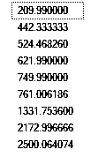
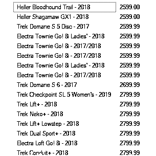
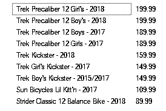
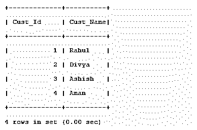
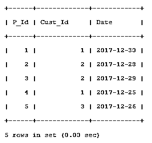
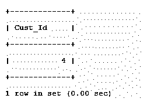

# MySQL 全部

> 原文：<https://www.educba.com/mysql-all/>

## MySQL 简介

MySQL 查询中的所有操作符都用于提取 select 语句的所有元组或记录。ALL 关键字还用于将一个值与子查询的另一组输出中的每一个数据进行比较。

*   当且仅当完整的子查询满足条件时，ALL 运算符输出 true。ALL 运算符以比较运算符开头，如果子查询的所有值都满足条件，它将输出 true。
*   ALL 总是与 MySQL 的 select，where，having 子句结合使用。
*   ALL 用于选择选择查询的所有记录或行。它比较列表或查询结果中每个值的值。例如，ALL 表示大于每个值、大于最大值、小于每个值或等于所有值。假设 ALL >(1，2，3)表示大于 3，ALL < (1，2，3)表示小于 1。

**语法:**

<small>Hadoop、数据科学、统计学&其他</small>

`Select [col_name1,col_name2….col_name n | exp1] from table_name
where exp2 comparison operator ALL(subquery);`

### MySQL 所有参数

以下是 MySQL ALL 的参数及其描述:

| **参数** | **描述** |
| **列名 1** | 表中列的名称。 |
| **Exp1** | 表达式可以是任何算术运算以及由常量、变量、标量函数或列名组成的比较值。 |
| **表名** | 表的名称。 |
| **Exp2** | 比较标量表达式，例如针对所有运算符的子查询中的每个值的列。此外，表达式必须为子查询的所有值返回布尔值 True。 |
| **比较 _ 运算符** | 将表达式与给定的子查询进行比较。以下是可以与 ALL 运算符(=，<>，！=，>，> =， |

#### 所有运算符的语法

`select All column_name1, column_name2 from table name where condition`

下面是带有 having 或 where 子句的所有运算符的语法:

`select column_name1,column_name2 from table_name comparison operator ALL(select column_name from table_name where condition);
expression comparison operator ALL (subquery);`

在哪里，

*   表达式是任何有效的表达式。
*   comparison _ operator 是任何比较运算符，如等于(=)、不等于(<>)、大于(>)、大于或等于(> =)、小于(
*   ()中的子查询是一个 select 语句，它输出单个列的结果。

如果所有对(表达式，c)的计算结果都为 true，则 ALL 运算符输出布尔值 true，其中 c 是单列输出中的值。

如果任何一对(表达式，c)返回 false，那么 ALL 操作符将返回 false。

为了解释 MySQL 查询中所有操作符的概念，我们将使用数据库中一个名为 product 的表。

Note: Not IN can also be written as <> ALL. Below is the syntax of not in operator in MySQL.**Example:**

`select column1 from table1 where column1<> ALL(select column1 from table2);`

上面的例子也可以写成:

`select column1 from table1 where column1 NOT IN (select column1 from table2);`

如果满足以下两个条件，我们可以在 MySQL 的表中使用 ALL 和 NOT 运算符。它们是:

*   MySQL 查询的子查询语句中的表必须包含一个且只能包含一个列或属性。
*   子查询表达式永远不会依赖于列或属性的表达式。

这也可以写成:

`Select column1 from table1 where column1 <> ALL (Table table2);`

`Select column1 from table1 where column1 <> (Table table2);`

### 实现 MySQL ALL 的示例

下面的查询将输出每个品牌产品的平均价格列表

#### 示例#1

**查询:**

`select avg(price) avg_price from product group by id order by avg_price;`

**输出:**

下面是输出控制台中上述查询的输出:

**表达式>全部(子查询)**

如果上述表达式大于子查询返回的最大值，则该表达式返回布尔值 true。

#### 实施例 2

**查询:**

`select p_name,price from product where price> ALL(select avg(price) avg_price from product group by id) order by price;`

**输出:**

输出价格高于所有品牌产品平均价格的产品。

**标量 _ 表达式<全部(子查询)**

如果上述表达式小于子查询返回的最小值，则该表达式返回 TRUE。

以下示例查找标价低于按品牌列出的平均价格列表中最低价格的产品:

#### 实施例 3

**查询:**

`select p_name,price from product where price< ALL(select avg(price) avg_price from product group by id) order by price;`

**输出:**

以上输出价格低于所有品牌产品平均价格的产品。

同样，我们可以将所有运算符与许多其他比较运算符一起使用，如等于(=)、大于或等于(> =)、小于或等于(< =)和不等于(！idspnonenote)。=).

#### 实施例 4

接下来，我们带表客户讲解所有操作。

**查询:**

`select * from customer;`

**输出:**

**查询:**

`select * from tickets;`

**输出:**

**查询:**

`select Cust_Id from customer where Cust_Id <> ALL (select Cust_Id from tickets);`

**输出:**

### 结论

在本教程中，我们学习了如何使用 MySQL ALL 运算符和三个比较运算符，如大于、等于或小于。所有的案例都以一种更简单的方式进行了描述，这样读者在读完这篇文章后就可以对这个主题有一个完整的理解。所有的例子都已经用 MySQL query 解释过了，并附上了输出的截图。我们可以用所有其他比较运算符，如<=,> =，或<>等，进一步扩展我们对所有运算符的理解。

### 推荐文章

这是一个 MySQL 的所有指南。这里我们讨论 MySQL ALL 的介绍和实际例子以及不同的子查询表达式。您也可以浏览我们推荐的文章，了解更多信息——

1.  [MySQL 操作符介绍](https://www.educba.com/mysql-operators/)
2.  [前 23 个 MySQL 字符串函数](https://www.educba.com/mysql-string-functions/)
3.  [MySQL 与 SQLite | 14 大对比](https://www.educba.com/mysql-vs-sqlite/)
4.  [MySQL 时间戳指南](https://www.educba.com/mysql-timestamp/)

