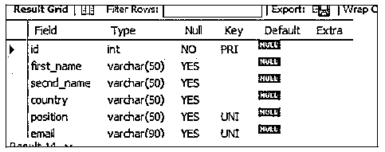

# MySQL 唯一索引

> 原文：<https://www.educba.com/mysql-unique-index/>

## MySQL 唯一索引简介

MySQL 中使用唯一索引约束来维护数据库中值的唯一性。MySQL 有“主键”约束来定义表中的唯一列。但是它只能为每个表定义一列。因此，当预计多个列在整个数据中具有不同的值时，将使用唯一索引。此外，默认情况下，Primary key 约束包含“NOT NULL”条件，而 UNIQUE 索引也可以包含 NULL 值。唯一索引不仅仅是一种有助于维护数据完整性和安全性的特殊索引，它还可以提高数据检索性能。

**语法:**

<small>Hadoop、数据科学、统计学&其他</small>

唯一索引是由“CREATE UNIQUE INDEX()”语句定义的。因此，该语句将创建一个在()中作为唯一列提到的列，不允许其中有重复项。

语法如下所示:

`CREATE UNIQUE INDEX index_name
ON table_name (index_column1, index_column2….);`

以上是明确定义唯一索引。但是我们可以在创建表本身时将列定义为唯一的索引。

`CREATE TABLE table_name(
column1 data_type,
….
UNIQUEINDEX (index_column1, index_column2 ….)
);`

### 唯一索引在 MySQL 中是如何工作的？

因此，让我们创建一个既有主键又有唯一索引的表。让我们考虑一个存储雇员详细信息的表，表名为 EMP_DETAILS。该表将雇员 id、名字、姓氏、国家、职位和电子邮件 id 作为列名。我们将保留“id”作为主键，并将位置和电子邮件定义为唯一索引。

**代码:**

`CREATE TABLE EMP_DETAILS (
id int,
first_name varchar(50),
secnd_name varchar(50),
country varchar(50),
position varchar(50),
email varchar(90),
PRIMARY KEY (id),
UNIQUE INDEX ind (position, email));`

**输出:**

该表将 id 作为主键，因此默认情况下它不为 NULL。position 和 email 列被标记为 UNIQUE，但是由于这两个列在查询中都没有被定义为 NOT NULL，所以它们可以包含 NULL 值，但是不能重复。

#### 示例#1

我们将向该表中插入值，并检查唯一列是否接受重复值。

**代码:**

`INSERT INTO EMP_DETAILS VALUES ('1','Alex','Potter','Belgium','Manager','alex.potter123@gmail.com');`

**输出:**

因此，我们在表 EMP_DETAILS 的一行中插入了值。在前面的查询中，我们将字段 position 和 email 定义为唯一索引。因此这些字段不接受重复值。

#### 实施例 2

让我们尝试将相同的值插入该表的第二行。

**代码:**

`INSERT INTO EMP_DETAILS VALUES ('2','Alex','Potter','Belgium','Manager','alex.potter123@gmail.com');`

**输出:**

我们得到以下错误消息作为结果:

定义的第一个唯一索引是字段位置。这就是显示关于字段位置的错误消息的原因。

#### 实施例 3

让我们看看电子邮件字段。

**代码:**

`INSERT INTO EMP_DETAILS VALUES ('2','Alex','Potter','Belgium','Accountant','alex.potter123@gmail.com');`

**输出:**

我们得到以下错误消息作为结果:

当创建唯一约束时，在后端会自动定义唯一索引。

如果定义的唯一索引在以后某个时间点看起来没有必要，也可以删除它。

#### 实施例 4

这里让我们考虑添加或删除唯一索引的另一个表。

**代码:**

`CREATE TABLE student_details (
id int,
first_name varchar(50),
secnd_name varchar(50),
class varchar(50),
subject1 varchar(50),
email varchar(90));`

**输出:**

所以我们刚刚创建了一个名为 student_details *的表。*我们尚未定义任何主键或唯一索引。

#### 实施例 5

下面让我们定义表的唯一索引如下。

**代码:**

`CREATE UNIQUE INDEX ind ON student_details(id, email);`

**输出:**

所以我们创建了唯一的索引:

#### 实施例 6

这里我们来看看表 student_details 中的索引。

**代码:**

`SHOW INDEX FROM student_details;`

**输出:**

#### 实施例 7

这里，让我们使用 DROPINDEX 命令删除上一个查询添加的惟一索引。

**代码:**

`ALTER TABLE student_details DROP INDEX ind;`

**输出:**

#### 实施例 8

现在，让我们尝试检索表 student_details 中的索引。

**代码:**

`SHOW INDEX FROM student_details;`

**输出:**

因此，插入到表 student_details 中的 unique_indexes 现在被删除，这反过来确认了所有列都将接受任意数量的重复值。因此，我们已经详细检查了如何创建或定义惟一索引，如何向索引中插入值，以及如何从表中删除惟一索引。

### 结论

这里我们看到了唯一索引。在 MySQL 中，惟一索引用于一次定义多个不重复的列。虽然 PRIMARY KEY 约束也可以确保列中的值不重复，但是每个表只能定义一个主键。因此，对于需要区分多个列的情况，使用唯一索引。

### 推荐文章

这是一个 MySQL 的唯一索引指南。这里我们讨论 MySQL 唯一索引的介绍，以及唯一索引如何与查询示例一起工作。您也可以看看以下文章，了解更多信息–

1.  [MySQL 中的条件](https://www.educba.com/condition-in-mysql/)
2.  [MySQL 中的通配符](https://www.educba.com/wildcards-in-mysql/)
3.  [MySQL 中的唯一键](https://www.educba.com/unique-key-in-mysql/)
4.  [MySQL 触发器](https://www.educba.com/mysql-trigger/)

