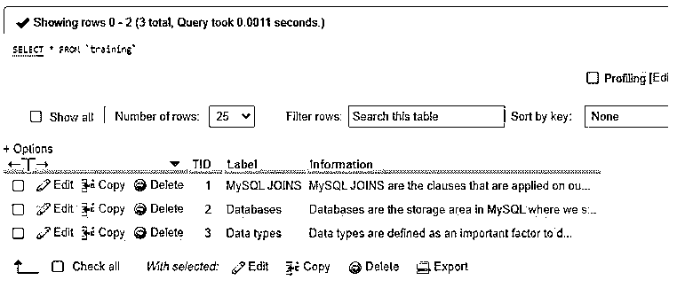

# MySQL 聚集索引

> 原文：<https://www.educba.com/mysql-clustered-index/>

## MySQL 聚集索引简介

通常，MySQL 中的索引是一种独特的数据结构，实现它是为了快速查找具有特定表列值的表行。基本上，索引是一种 B 树结构，用于存储键值，以便在 MySQL 数据库中更快地查找。另一方面，MySQL 聚集索引被解释为管理表行物理排序的索引。实际上，聚簇索引被解释为 MySQL 中 InnoDB 表中管理的索引。如果我们已经创建了聚集索引，那么所有的表行将根据创建聚集索引时实现的键列进行存储。这是因为表行是按聚集索引有组织的顺序存储的，其中每个不同的表只有一个聚集索引。

**语法:**

<small>Hadoop、数据科学、统计学&其他</small>

在创建聚集索引时，我们有下面的基本语法结构，但是您应该首先注意，在我们将一个列定义为聚集索引之前，请确保我们已经删除了前一个列。这意味着当一个列被定义为主键时，将使该列成为该表的聚集索引，因此，要使任何其他表列成为聚集索引，最初我们需要删除前面的列，如下所示:

`//Dropping index
DROP INDEX TableName.IndexName
//Creating Clustered Index
CREATE Clustered Index IndexName_TableName_ColumnName
ON TableName(ColumnName ASC)`

### 聚簇索引在 MySQL 中是如何工作的？

*   每个数据库 InnoDb 表都需要一个聚集索引，基本上它代表支持插入、更新、选择和删除等数据处理的主键。因此，每当用户在数据库中为 InnoDBtable 声明一个主键时，MySQL 就会将该主键作为 MySQL 聚集索引。
*   假设，在表不包含特定表的任何主键的情况下，MySQL 将检查定义所有键列的初始唯一索引，指定 NOT NULL 属性，并将该唯一索引应用为 MySQL 聚集索引。
*   此外，如果 InnoDB 表不包含主键或任何唯一键索引，那么 MySQL 将在内部生成一个隐藏的聚集索引，作为包含行 ID 值的伪列上的 GEN _ CLUST _ INDEX。因此，我们可以说每个数据库 InnoDB 表总是只包含一个聚集索引。
*   现在，除聚集索引之外的所有剩余索引都被定义为二级索引或非聚集索引。二级索引中 InnoDB 表中的每条记录都由非聚集索引中的列和行的主键列组成。因此，MySQL 将在聚簇索引中使用这个主键值进行行查找。
*   因此，有一个短的主键是很重要的，否则当 MySQL 实现二级索引时，它将占用更多的空间。通常在 MySQL 中，为主键列定义一个具有自动递增整数属性的表列。
*   聚集索引表有助于同时存储索引和数据，它基于按一个方向排序的键值。MySQL 聚集索引可以使用一个或多个列在数据库表中创建索引。

**好处:**

*   使用 MySQL 聚集索引，缓存命中率最大化，页面传输最小化。
*   MySQL 聚集索引是具有最小、最大以及计数查询的组或范围的最终选择。
*   在范围的开始，它实现了一个定位机制来寻找一个索引条目。
*   此外，聚集索引支持碎片和其他操作。

**缺点:**

*   它包括几个以非连续方向出现的插入记录。
*   它创建各种恒定的页面分离，如索引页或数据页。
*   更新表记录经常需要很长时间。
*   它需要对查询语句做额外的工作，比如更新、插入和删除。

### MySQL 聚集索引示例

以下是 MySQL 聚集索引的示例:

假设我们正在使用 CREATE 命令创建一个名为 Training 的表，如下所示:

**代码:**

`CREATE TABLE Training(TID INT PRIMARY KEY AUTO_INCREMENT, Label VARCHAR(255), Information TEXT) ENGINE = INNODB;`

在这里，您可以看到，在提到具有相关属性的列和数据类型之后，我们还添加了引擎，即 InnoDB，以确保除了 MyISAM 等其他引擎之外，表是在 InnoDB 的 MySQL 中创建的。

同样，我们使用下面的查询在上面创建的表 Training 中添加了标签和信息列的全文索引:

**代码:**

`CREATE FULLTEXT INDEX Information ON Training(Infromation);
CREATE FULLTEXT INDEX Label ON Training(Label);`

现在，让我们通过以下查询将一些样本记录数据插入到表 Training 中:

**代码:**

`INSERT INTO Training (TID,Label, Information) VALUES(‘1’,’MySQL JOINS’,‘MySQL JOINS are the clauses that are applied on our database tables to combine two or more tables to provide the result set.’);`

让我们显示桌子训练的内容和结构如下:

**代码:**

`SELECT * FROM Training;`

**输出:**

让我们再次查看在该表上创建的索引，该表为 InnoDB 表培训创建了一个聚集索引，如下所示:

它显示了在 InnoDB 表中，主键列索引本身表示 MySQL 聚集索引，用于以排序的方式存储带有相关键值的表数据。

我们甚至可以创建这样的表来拥有一个聚集索引，其中我们在 InnoDB 表中定义了两个整数列作为主键:

**代码:**

`CREATE TABLE Students( Stud_Id INT NOT NULL AUTO_INCREMENT, User_Id INT NOT NULL,
PRIMARY KEY (User_Id, Stud_ID) //clustered index ) ENGINE = InnoDB ;`

**输出:**

### 结论

MySQL 聚簇索引根据键值定义了数据库中每个表数据的方向，键值可以以一种独特的方式进行物理存储。如果在关系数据库表列中存在唯一键或主键，那么 MySQL 将允许在这个确定的列的基础上创建一个聚集索引，命名为 Primary。它有助于表中的键查找、索引扫描和其他与索引相关的数据操作。

### 推荐文章

这是一个 MySQL 聚集索引的指南。这里我们讨论一下引言，聚簇索引在 MySQL 中是如何工作的？和示例。您也可以看看以下文章，了解更多信息–

1.  [MySQL DDL](https://www.educba.com/mysql-ddl/)
2.  [MySQL 展示](https://www.educba.com/mysql-show/)
3.  [MySQL Binlog](https://www.educba.com/mysql-binlog/)
4.  [MySQL DISTINCT](https://www.educba.com/mysql-distinct/)

