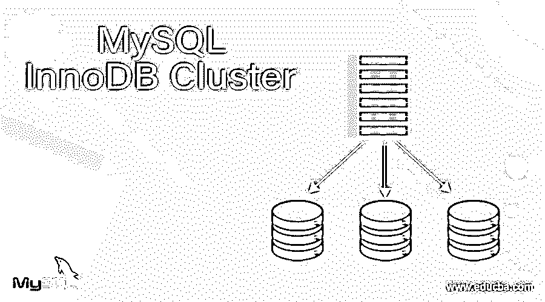

# MySQL InnoDB 集群

> 原文：<https://www.educba.com/mysql-innodb-cluster/>

## MySQL InnoDB 集群的定义

MySQL InnoDB Cluster 可以说是 MySQL 提供的一个非常棒的可用性解决方案，它只包含一个和多个主功能以及故障转移识别。在这里，通过实现由 MySQL Shell 组成的 AdminAPI，可以轻松地组织和管理一组至少三个 MySQL 服务器实例，以实现 InnoDB 集群的目的。MySQL InnoDB 集群包括以下三个模块:

*   **MySQL 组复制**——数据库服务器的集合，互相复制，具有容错能力。
*   **MySQL 路由器**——查询路由器到活力数据库节点。
*   **MySQL Shell**——作为客户端、助手和配置工具。

**语法:**

<small>Hadoop、数据科学、统计学&其他</small>

MySQL InnoDB 集群是使用 MySQL Shell 中包含的 AdminAPI 执行的，通过将至少三个 MySQL 服务器实例分组来提供高可用性解决方案。MySQL 服务器的每个实例都执行 MySQL 组复制。

MySQL Shell 中的 AdminAPI 是使用全局变量 dba 及其相关方法来访问的。dba 变量的这个过程允许用户配置、部署和管理 InnoDB 集群。这里，假设我们将使用 dba.createCluster()方法来创建 InnoDB 集群。

请注意，MySQL Shell 允许使用套接字连接来连接到服务器。而 AdminAPI 需要到服务器实例的 TCP 连接。因此，在使用 AdminAPI 时，我们不应该使用套接字连接。您可以使用命令 dba.help()方法获取 AdminAPI 的联机帮助。

对于特定方法的在线支持，我们需要应用格式 object.help('methodname ')，如下图所示:

`dba.help(‘getClsuter’)  // Fetches a cluster from metadata store`

**语法:**

`<Dba>.getCluster([name])`

在哪里

Name 定义参数，以表示要恢复的集群的名称。

如果名称不详细，它将返回默认的集群。

但是，如果指定了名称，但是没有找到具有定义名称的集群，那么就会产生一个错误。

### InnoDB Cluster 在 MySQL 中是如何工作的？

MySQL 是一个对象关系和开源类型的数据库管理系统，具有可伸缩性和可扩展性等更多特性。它还通过多个数据中心维护数据复制。

MySQL 5.7 版本支持 MySQL InnoDB 集群，这是一个 Oracle 高访问性解决方案，可以安装在 MySQL 上，以保持多主功能和自发故障转移。该解决方案包括三个组成部分:

#### 1.组复制

它定义了一组数据库服务器，其中 MySQL 数据库通过多个节点进行复制，包括容错特性。假设 MySQL 数据库中的数据发生了任何变化，那么它会定期复制到服务器的辅助节点。MySQL 中的组复制概念与 AlwaysOn 可用性组的概念相同。

#### 2.MySQL 路由器

每当发生故障转移时，这有助于使客户端应用程序知道集群拓扑和主实例。MySQL 路由器通过路由将数据请求重定向到可访问的 MySQL 服务器实例来管理这类功能。它作为一个代理来实现隐藏多个 MySQL 数据库服务器。此概念与 Windows Server 故障转移群集的虚拟网络名称概念相同。

#### 3.MySQL 外壳

这是一种用于配置以实现连接、部署以及管理 MySQL InnoDB 集群的工具。MySQL Shell 包含一个 Admin API，它有一个 dba 全局变量，用于部署和完成 InnoDB 集群。

### 特征

让我们讨论一下借助此解决方案提供的其他一些功能，如下所示:

#### 1.不同的主模式或多个主模式

这意味着群集既可以只使用一个写入器和多个读取器进行控制(这也是默认设置，建议使用一个),也可以使用多个写入器进行控制，这样整个节点都可以允许写入事务。由于冲突的稳固性，后者是以性能损失为代价提供的。

#### 2.自发故障识别

这里，内部组件能够检测到故障节点，这可能是崩溃或任何网络问题，并且还同意从集群中机械地消除它。假设如果一个成员没有连接到集群，并且也变得不可访问，那么它将不会接收事务。这确保了集群数据不会受到这种情况的阻碍。

#### 3.容错

它定义了集群为维护失败成员而实施的策略。因为它也基于由其他两个成员保持的多数，其中一个集群需要三个成员来支持一个节点。如果有更多的节点，那么群集支持的故障节点也会更多。在集群中，成员或节点的极限数量目前被限制为 7，其中大部分由四个或更多的活动节点存储。我们可以说，一个七个节点的集群最多可以支持和维护三个故障节点。

### 例子

让我们来看看如何使用 MySQL InnoDB Cluster 并管理共享管理任务，解释如下:

#### 1.从 MySQL InnoDB 集群中消除实例

如果您想随时从集群中删除实例，您可以这样做。这可以使用 cluster . remove instance(instance)的方法来执行，编写如下:

`Cluster.removeInstance(‘root@localhost:3360’)`

此方法操作确保特定实例从联机的整个集群成员的元数据以及实例本身中消除。如果被消除的实例需要应用任何事务，AdminAPI 将等待几秒钟，这是 MySQL Shell 使用 dba.gtidWaitTimeout 选项配置的，该选项的默认值是 60 秒。

#### 2.运行 InnoDB 集群

如果用户想要运行群集，您需要使用 cluster.dissolve()命令连接到读写实例，例如仅一个主群集中的主实例。这将删除整个元数据以及与群集链接的配置，并限制实例上的组复制。而实例之间复制的任何数据都不会被分离。

您将无法撤消这个分解或运行 InnoDB 集群的过程，但是可以使用以下命令再次创建它:

`dba.createCluster().`

cluster.dissolve()方法将只配置在线或可访问的服务器实例

#### 3.改变集群的拓扑

默认情况下，InnoDB 集群以单一主模式执行。这里，集群只包含一个主服务器，它执行读和写(R/W)查询，集群中的其余实例只执行读(R/O)查询。为此，作战命令是:

`cluster.switchToSinglePrimaryMode({instance}).`

但是，当集群被配置为以多主模式运行时，集群中的所有实例都被定义为主实例，它们在主实例中接受读和写(R/W)查询。为此，我们将使用以下命令:

`cluster.switchToMultiPrimaryMode().`

### 结论

由于 MySQL Innodb 被认为是负责数据库管理系统 MySQL 和 MariaDB 的存储引擎，因此 MySQL InnoDB Cluster 已被引入 MySQL，成为一种高可用性解决方案，可轻松配置和管理一组至少三个 MySQL 服务器实例，作为 Innodb 集群工作。但是 InnoDB 集群并不为 MySQL NDB 集群提供支持或维护，因为该 NDB 集群由 NDB 存储引擎以及许多未配备 MySQL server 的 NDB 集群专用的代码程序管理。

### 推荐文章

这是一个 MySQL InnoDB 集群的指南。这里我们讨论 InnoDB cluster 的定义、特性以及如何在 MySQL？并分别举例说明。您也可以看看以下文章，了解更多信息–

1.  [MySQL sort_buffer_size](https://www.educba.com/mysql-sort_buffer_size/)
2.  [MySQL NOW](https://www.educba.com/mysql-now/)
3.  [MySQL Hour()](https://www.educba.com/mysql-hour/)
4.  [MySQL 获取](https://www.educba.com/mysql-fetch/)

