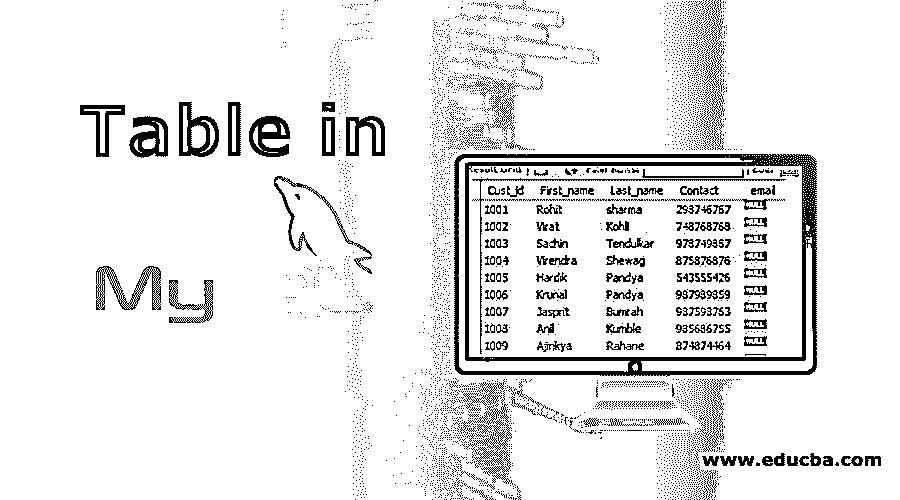
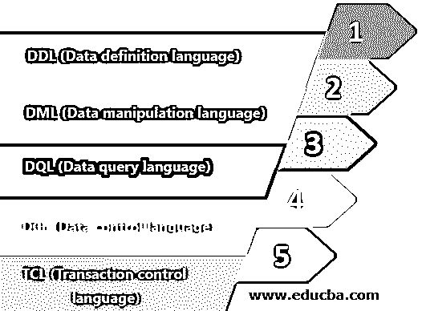
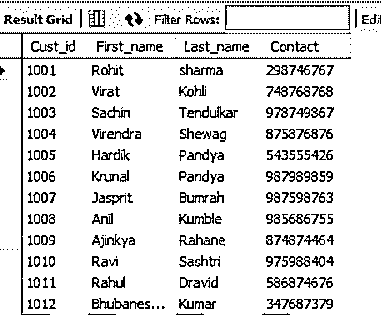
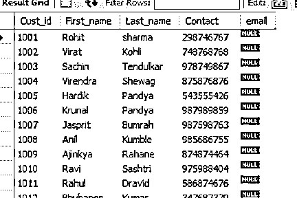
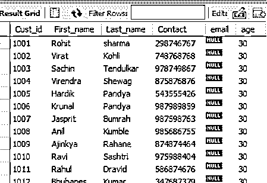
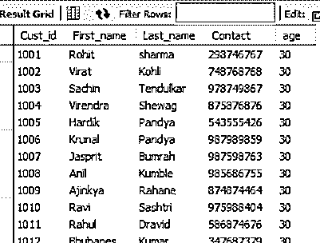
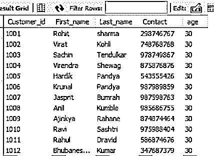
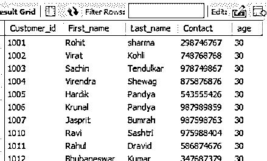

# MySQL 表

> 原文：<https://www.educba.com/table-in-mysql/>

## MySQL 中的表简介

表格是在数据库中保存记录的结构化格式，因为它易于访问，并且可以通过绘制多个表格之间的关系来维护。在 MySQL 的表中有两种表，叫做父表和子表。每个表中必须有一个主键，它是每个记录的唯一标识。在子表中，主键是父表中的一个属性，也可以称为外键，因为这个键在两个表之间建立了关系。如果两个表之间存在一个公共字段，我们可以使用多种类型的连接命令来连接这两个表，比如 inner join、outer join、left & right join。该表可以包含多种数据类型，如 INT()、SMALLINT()、BIGINT()、CHAR()、VARCHAR()、DATE()、TIME()、TIMESTAMP()、BOOLEAN()等。除此之外，我们还可以在表中执行许多操作，如连接、子查询等。

### 如何在 MySQL 中创建表格？

SQL 语言有很多种。

<small>Hadoop、数据科学、统计学&其他</small>

这分为以下几类:

*   数据定义语言
*   数据操作语言
*   DQL(数据查询语言)
*   数据控制语言
*   事务控制语言

创建表、修改和删除表属于 DDL。

| **命令** | **描述** | **样本查询** |
| **创建** | 它用来创建一个表或数据库。 | 创建员工表； |
| **改变** | 用于修改或更改表中的值。 | ALTER TABLE table_name

添加列 col _ name

 |
| **重命名** | 重命名表或数据库名称。 | ALTER TABLE table_name将列 col_name 重命名为 new _ col _ name |
| **下降** | 这将删除表的记录以及表的结构。这无法回滚/撤消。 | 如果 table_name 存在，则删除表； |
| **截断** | 这只会清空记录，为将来的记录留下结构。 | 截断表雇员； |

让我们创建一个客户表。

**代码:**

`CREATE TABLE (IF NOT EXIST) ‘tablename’
‘Fieldname’ datatype (optional parameter)
PRIMARY KEY (‘Fieldname’)
;
OR
CREATE TABLE (IF NOT EXIST) ‘Tablename’
‘Fieldname’ datatype PRIMARY KEY
;`

*   “创建表”负责在数据库中创建新表。
*   “如果不存在”并不是强制性的给予。它主要检查我们想要赋予新表的名称是否已经存在于数据库中。
*   “数据类型”指的是我们想要分配属性的数据类型。例如:数字、字符串、日期等。
*   在末尾或行中，我们还可以导出约束，如主键、唯一键、非空等。

**最佳实践:**

*   我们应该使用大写的 SQL 关键字，如选择，删除，删除等。
*   我们应该总是以分号结束 SQL 查询。
*   我们应该始终避免表名或字段名之间的空格。相反，我们应该使用下划线，如 student_table、customer_order 等。

让我们在数据库中创建下面的“客户”表:

| **客户标识** | **名字** | **姓氏** | **联系人** |
| **第 1009 章** | 阿金克亚 | 拉哈内 | Eight billion seven hundred and forty-six million eight hundred and seventy-four thousand four hundred and sixty-four |
| **第 1005 章** | 哈弟 | Pandya | Five billion four hundred and thirty-five million five hundred and fifty-five thousand four hundred and twenty-six |
| **第 1007 章** | Jasprit | 邦拉 | Nine billion eight hundred and seventy-five million nine hundred and eighty-six thousand seven hundred and sixty-three |
| **第 1002 章** | 维拉特 | 柯利 | Seven billion four hundred and eighty-seven million six hundred and eighty-seven thousand six hundred and forty-eight |
| **第 1010 章** | 拉维河 | Sashtri | Nine billion seven hundred and fifty-nine million eight hundred and seventy-eight thousand four hundred and four |
| **第 1006 章** | Krunal | Pandya | Nine billion eight hundred and seventy-four million nine hundred and eighty-nine thousand eight hundred and fifty-nine |
| **第 1012 章** | 布巴内斯瓦尔 | 库马尔 | Three billion five hundred and forty-seven million six hundred and eighty-seven thousand three hundred and seventy-nine |
| **第 1004 章** | 维伦德拉 | Shewag | Eight billion seven hundred and sixty-five million eight hundred and seventy-six thousand eight hundred and seventy-six |
| **第 1003 章** | 萨钦 | 滕杜尔卡尔 | Nine billion eight hundred and seventy-eight million seven hundred and forty-nine thousand eight hundred and sixty-seven |
| **第 1008 章** | 木蓝属植物 | 昆布尔 | Nine billion eight hundred and fifty-six million eight hundred and seventy-six thousand seven hundred and fifty-five |
| **第 1001 章** | rohit！rohit | 夏尔马 | Two billion nine hundred and eighty-six million seven hundred and forty-six thousand seven hundred and sixty-seven |
| **第 1011 章** | 拉胡尔 | 大卫 | Five billion eight hundred and seventy-six million eight hundred and seventy-four thousand six hundred and seventy-six |

**步骤 1:** 创建包含这些字段的表格。

**代码:**

`CREATE TABLE customer (
Cust_id INT(10),
First_name VARCHAR(20) not null,
Last_name VARCHAR(20) not null,
Contact INT(10),
PRIMARY KEY (Cust_id)
);`

**第二步:**插入所有记录。

**代码:**

`INSERT INTO customer
VALUES
(1009, ‘Ajinkya’,’Rahane’, 8746874464),
(1005, ‘Hardik’, ‘Pandya’, 5435555426),
(1007, ‘Jasprit’, ‘Bumrah’, 9875986763),
(1002, ‘Virat’, ‘Kohli’, 7487687648),
(1010, ‘Ravi’, ‘Sashtri’, 9759878404),
(1006, ‘Krunal’, ‘Pandya’, 9874989859),
(1012, ‘Bhubaneswar’, ‘Kumar’, 3547687379),
(1004, ‘Virendra’, ‘Shewag’, 8765876876),
(1003, ‘Sachin’, ‘Tendulkar’, 9878749867),
(1008, ‘Anil’, ‘Kumble’, 9856876755),
(1001, ‘Rohit’, ‘Sharma’, 2986746767),
(1011, ‘Rahul’, ‘Dravid’, 5876874676);`

**输出:**

### 如何在 MySQL 中修改表？

Alter 主要用于在表中进行操作，比如添加新列、更改现有列的名称、删除现有列、重命名表名以及添加约束。

#### 示例#1

添加新列。

**代码:**

`ALTER TABLE customer
ADD COLUMN email VARCHAR(50);`

**输出:**

#### 实施例 2

**代码:**

`ALTER TABLE customer
ADD COLUMN age INT(5)
DEFAULT 30;`

**输出:**

#### 实施例 3

**代码:**

`ALTER TABLE customer
DROP COLUMN email ;`

**输出:**

#### 实施例 4

**代码:**

`ALTER TABLE customer
RENAME COLUMN Cust_id TO Customer_id;`

**输出:**

### 如何在 MySQL 中删除一个表？

删除目的有三种命令，如删除、截断和删除。

DROP table 删除整个记录以及表的结构/索引。

**语法:**

`DROP TABLE Table_name;`

TRUNCATE table 只删除表中的记录，保留结构以备将来使用。

**语法:**

`TRUNCATE TABLE Table_name;`

DELETE 与 WHERE 子句一起使用，从表中删除记录。

**语法:**

`DELETE FROM customer
WHERE first_name LIKE ‘A%’;`

**输出:**

(它删除了名字以“A”开头的所有记录)

### 结论

SQL 中的这些表有利于以结构化的形式保存数据，这样我们就可以使用这些记录，并且可以轻松地执行许多操作。每一行都可以用一个唯一的字段来标识，以便更好地访问特定的记录。在使用这些表的数据库中，我们可以通过创建一些外键来与不同的表/数据建立许多关系。这有助于我们轻松、安全、快速地存储大量数据。

### 推荐文章

这是一个 MySQL 中的表的指南。这里我们分别讨论如何在 MySQL 中创建表，如何修改表，以及如何删除表。您也可以浏览我们推荐的其他文章，了解更多信息——

1.  [SQL 中的 Distinct 关键字](https://www.educba.com/distinct-keyword-in-sql/)
2.  [SQL 服务器约束](https://www.educba.com/sql-server-constraints/)
3.  [在 MySQL 中选择](https://www.educba.com/select-in-mysql/)
4.  [MySQL 聚合函数](https://www.educba.com/mysql-aggregate-function/)

