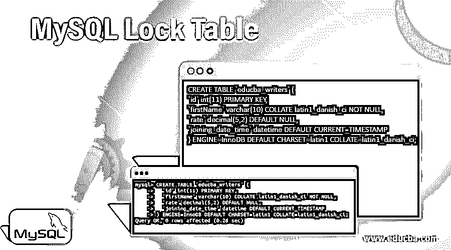
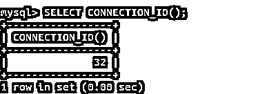

# MySQL 锁表

> 原文：<https://www.educba.com/mysql-lock-table/>

## MySQL 锁表介绍

在 MySQL 中，我们可以根据需要在其中存储多个表和记录。多个不同的用户可以同时访问和操作这些数据库内容。当多个用户访问相同的数据和记录时，您必须确保他们每个人都应该接收到正确和适当的相同信息。根据操作请求的到达，在正确的时间适当地执行插入、更新和删除操作，以保持数据库内容的一致性和正确性。

简而言之，我们必须确保读写操作得到适当的管理，以避免数据库中的任何不一致。MySQL 提供了为读写操作锁定表的功能。在本文中，我们将学习读锁、写锁的工作原理及其语法，并使用一个示例实现概念和功能。

<small>Hadoop、数据科学、统计学&其他</small>

### 锁定表格

当多个客户端会话试图在同一时间点使用同一个表时，可以将锁视为针对 MySQL 中的每个表维护的标志，以管理对数据库的访问。MySQL 为每个客户端会话提供了获取该表的工具，方法是锁定该表，以防止其他客户端会话使用该表，直到该特定会话完成其使用该表的任务。

客户机会话只能为自己获取或释放表上的锁。任何其他客户端会话都不能为其他会话获取或释放表上的锁。

#### 锁定表的语法

当我们想要在单个表上应用锁时，我们可以使用下面的语法

**语法#1**

`LOCK TABLE name_of_table [READ | WRITE];`

在上面的语法中，name_of_table 是您希望锁定的表的名称，此外，您还需要指定锁的类型，以确定是对该表进行读操作还是写操作。

如果您想要获取多个表上的锁，那么您可以使用下面的 LOCK TABLES 语句语法，其中您需要以逗号分隔的方式指定表的名称以及您想要在每个表上获取的锁的类型

**语法#2**

`LOCK TABLES name_of_table1 [READ | WRITE],
name_of_table2 [READ | WRITE],
name_of_table3 [READ | WRITE],
... ;`

#### 解锁表的语法

解锁通过会话获取的表的语法:

如果您已经锁定了一个特定的表来对其执行某些操作，那么您需要释放该锁以允许其他表访问该表。要解锁锁，您可以使用以下语法

**语法#3**

`UNLOCK TABLES;`

### 实现 MySQL 锁表的例子

现在让我们来讨论可以获得的两种类型的锁及其工作情况。

#### 1.读取锁定

多个客户端会话可以同时获取表上的读锁。即使没有获得该表上的锁的会话也可以读取该表的内容，而不必获得该表上的锁。当特定会话获得读锁时，只能对该表执行读操作，而不能通过对该表执行任何写操作来操作该表的内容。

此外，如果任何其他客户端会话想要将数据写入该表，那么它们的操作将被置于等待状态，并且只能在该表上的读锁被释放时执行。在会话终止时，无论终止是正常的还是异常的，在所有读和写类型的表上获得的所有锁都被释放。

让我们使用以下查询语句创建一个名为 educba_writers 的表

**代码:**

`CREATE TABLE `educba_writers` (
`id` int(11) PRIMARY KEY,
`firstName` varchar(10) COLLATE latin1_danish_ci NOT NULL,
`rate` decimal(5,2) DEFAULT NULL,
`joining_date_time` datetime DEFAULT CURRENT_TIMESTAMP
) ENGINE=InnoDB DEFAULT CHARSET=latin1 COLLATE=latin1_danish_ci;`

**输出:**

让我们在其中插入一些记录

**代码:**

`INSERT INTO `educba_writers` (`id`, `firstName`, `rate`, `joining_date_time`) VALUES
(1, 'Payal', '750.00', '2020-05-28 16:02:34'),
(2, 'Vyankatesh', '700.00', '2020-05-29 16:13:19'),
(3, 'Omprakash', '600.00', '2020-05-28 20:32:50'),
(4, 'Parineeta', '980.00', '2020-05-28 13:35:11');`

**输出:**

在我们获取 educba_writers 表上的读锁之前，如果我们想知道当前数据库会话的连接 id，那么我们可以使用下面的语句

**代码:**

`SELECT CONNECTION_ID();`

**输出:**

现在，我们将使用下面的语句来获取 educba_writers 表的锁

**代码:**

`LOCK TABLE educba_writers READ;`

**输出:**

现在，如果我们试图使用当前会话或任何其他会话在 educba_writers 表上执行插入、更新或删除操作，则会引发错误。考虑执行以下语句–

**代码:**

`INSERT INTO `educba_writers` (`id`, `firstName`, `rate`, `joining_date_time`) VALUES
(5, 'Pihu', '750.00', '2020-05-28 16:02:34');`

**输出:**

如果您试图从另一个会话中触发相同的查询，它将进入等待状态，如下所示

您可以通过查看如下过程列表来确认这一点

**代码:**

`SHOW PROCESSLIST;`

**输出:**

#### 2.写锁定

当某个会话获得写锁时，只有该会话可以对该表执行读写操作，直到锁被释放。当该表被写锁定时，其他会话无法读取或写入该表。让我们写锁定 educba_writers 表–

**代码:**

`LOCK TABLE educba_writers WRITE;`

**输出:**

让我们执行插入操作并检查结果

**代码:**

`INSERT INTO `educba_writers` (`id`, `firstName`, `rate`, `joining_date_time`) VALUES
(6, 'Priya', '650.00', '2020-05-29 16:02:34');`

**输出:**

从其他会话插入或操作将导致等待，直到锁被释放。

**代码:**

`INSERT INTO `educba_writers` (`id`, `firstName`, `rate`, `joining_date_time`) VALUES (7, 'Priyanka', '650.00', '2020-05-29 16:02:34');`

**输出:**

#### 3.解锁表格

让我们使用下面的语句解锁这些表

**代码:**

`UNLOCK TABLES;`

**输出:**

您可以观察到，一旦当前会话中的表上的锁被释放，我们在另一个会话中触发的插入查询将被执行

**输出:**

### 结论

我们可以获得 MySQL 表上的读锁，也称为共享锁，它可以防止任何会话获得表上的写锁。我们可以使用写锁，也称为排他锁，因为除了当前会话，没有其他会话可以对表执行读写操作。

### 推荐文章

这是一个 MySQL 锁表的指南。这里我们讨论一个 MySQL 锁表的介绍，语法，它是如何工作的，并给出了相应的例子。您也可以浏览我们的其他相关文章，了解更多信息——

1.  [MySQL 索引](https://www.educba.com/mysql-index/)
2.  [MySQL 数据库修复](https://www.educba.com/mysql-database-repair/)
3.  MySQL 中的 IF 语句
4.  [MySQL INSTR()](https://www.educba.com/mysql-instr/)

