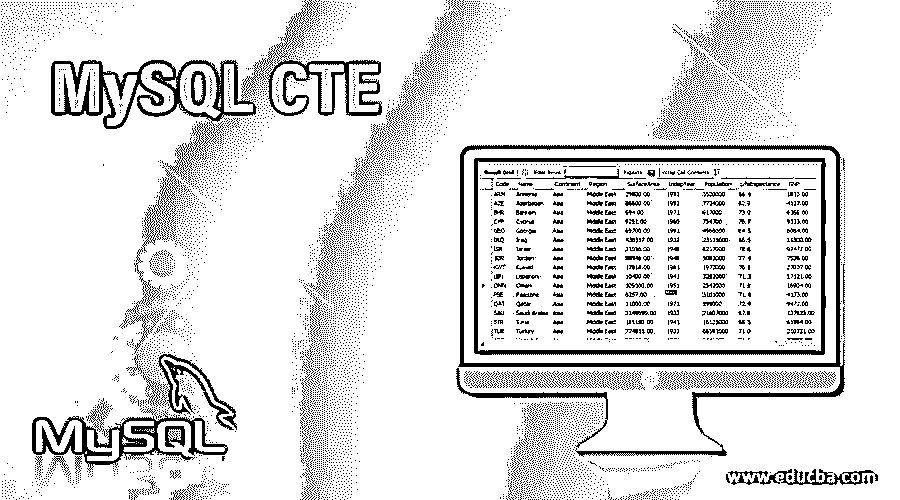
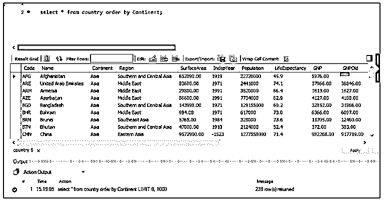
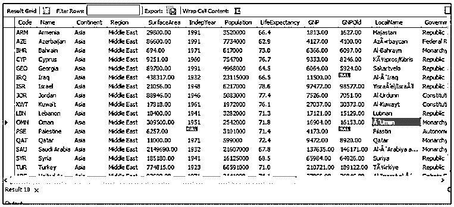
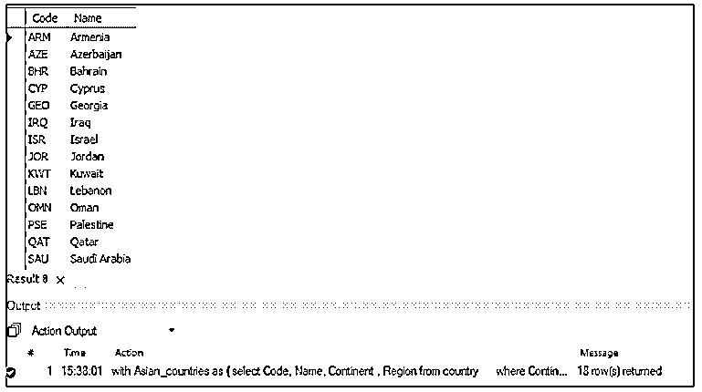
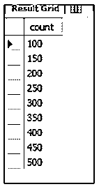

# MySQL CTE

> 原文：<https://www.educba.com/mysql-cte/>

## MySQL CTE 的定义

CTE 代表常见的餐桌用语。在 MySQL 中，它是一个临时的结果集，在一个 SQL 语句中有一个范围。CTE 可以在该语句中的任何地方被多次引用。通常，“WITH”子句用于定义 CTE。公用表表达式不作为单独的语句存在，而是始终与紧随 CTE 之后的 SELECT、INSERT、UPDATE 或 DELETE 语句一起使用。CTE 在功能和范围上类似于 SQL 中的派生表。

### MySQL CTE 的语法

如上所述，在 SELECT、INSERT UPDATE 或 DELETE 语句中使用了一个公共表表达式。定义 CTE 的简单语法是:

<small>Hadoop、数据科学、统计学&其他</small>

`withcte_name (column_names) as (
query )`

这里 cte_name 是公共表表达式的名称。cte_name 后面是要选择的列。此外，选择列的条件在大括号中定义。所以，现在我们将试着把它放到我们的表中，并进一步讨论常见表表达式的细节。

我们将考虑样本数据库中的国家表。我们在这张表中列出了 239 个国家。下面给出的截图是表格的一部分。让我们试着用 CTE 从这个大表中编写一个查询，以便于访问定义的临时数据集。

`select * from country order by Continent;`

### CTE 如何在 MySQL 中工作？

让我们首先看一个简单的选择查询，其中定义了 CTE。我们的场景是从亚洲大陆中识别属于中东地区的国家。所以，我们必须考虑两个条件，首先是洲=“亚洲”，然后是地区=“中东”。对于这个场景，查询如下所示

**查询:**

`WITH Asian_countries as (
SELECT *
FROM country
WHERE Continent = 'Asia' )
SELECT *
FROM Asian_countries
WHERE Region = 'Middle East'
ORDER by Name;`

查询的第一部分定义了 CTE。这个查询的 CTE 名称是 Asian_countries，它保存来自原始表 COUNTRY 的国家列表，条件是 Continent ='Asia '。在查询的第二部分，我们将选取 CTE 亚洲国家中区域为“中东”的国家的详细信息。

**输出:**

现在，假设我们有从同一个示例中选择特定列的场景。在上面的查询中，我们选择了表中的所有列。

**查询:**

`WITH Asian_countries as (
SELECT Code, Name, Continent , Region
FROM country
WHERE Continent = 'Asia' )
SELECT Code, Name
FROM Asian_countries
WHERE Region = 'Middle East'
ORDER by Name;`

这里的 CTE 是亚洲国家。因此，临时表或公共表表达式应该包含来自条件为 Continent = 'Asia '的表 COUNTRY 的数据。因此，表 country 中以亚洲为洲的国家的详细信息，如国家代码、国家名称、地区和洲，将存储在公共表表达式 Asian_countries 中。

查询的第二部分说，从这个 CTE 中，将提取 Region =“Middle East”的那些国家的 country_code 和 country_name，按 country _ name 的升序排列并显示。预期的输出将是一个以代码和名称为列的列表，按照亚洲大陆和中东地区名称的字母顺序排列。

**输出:**

在某些情况下，WITH 子句的使用受到限制。以下是一些场景:

*   子句用在 SELECT、UPDATE 和 DELETE 语句的开头。

`WITH … SELECT …
WITH … UPDATE …
WITH … DELETE …`

*   在包含 SELECT 语句的语句中，位于 SELECT 语句之前。

`INSERT … WITH … SELECT …
REPLACE … WITH … SELECT …
CREATE TABLE …WITH … SELECT …`

*   WITH 语句不能在同一级别多次使用。相反，使用单个 WITH 子句，并添加多个 CTE，用逗号分隔。

**不正确用法:**

`WITH cte_name1 as (….), WITH cte_name2 as (….) SELECT ….`

**正确用法:**

`WITH cte_name1 as (….), cte_name2 as (….) SELECT …`

请注意，同一个 CTE 可以在另一个 CTE 中引用，也可以单独引用。当 CTE 引用自己时，它就变成了递归 CTE。让我们用下面的例子来理解一个简单的递归 CTE:

**查询:**

`WITH RECURSIVE trial (count) AS
(
SELECT 100
UNION ALL
SELECT count + 50 FROM trial WHERE count < 500
)
SELECT * FROM trial;`

此查询中的 CTE 名称是“试用”。我们在 CTE 子查询中有如下三个部分。

*   **SELECT … :** 该部分初始化第一行，是查询的非递归部分。
*   **UNION ALL:** 这部分将子查询的非递归部分和递归部分分开。它可以是 UNION ALL 或 UNION DISTINCT。
*   **SELECT …:** 这部分显示进一步的行，是子查询的递归部分。该示例具有这样的部分-从试验中选择计数+ 50，其中计数< 500-其中值‘计数’将被更新值 50，直到它达到值 500。

让我们看看这个查询的输出。

**输出:**

我们可以看到输出中有一列“count ”,值从 100 到 500，每一列更新 50。我们需要记住，子查询的递归和非递归部分对于所有列都必须具有相同的列宽，因为输出列宽取决于子查询的非递归部分。递归 cte 主要用于初始化斐波那契数列，搜索或遍历任何数据。

### 结论

MySQL 中添加了通用表表达式(cte ),以降低 SQL 查询的复杂性。它生成一个临时的结果集，可以在同一个 SQL 查询中访问该结果集，作为引用或被执行。为了定义 CTE，主要使用 WITH 子句，并且可以在同一个 WITH 子句中定义多个 CTE。

### 推荐文章

这是一个 MySQL CTE 的指南。这里我们也讨论一下 mysql cte 的定义和语法？以及 cte 如何在 mysql 中工作？.您也可以看看以下文章，了解更多信息–

1.  [MySQL 中的运算符](https://www.educba.com/mysql-in-operator/)
2.  [MySQL 中的唯一键](https://www.educba.com/unique-key-in-mysql/)
3.  [MySQL 子查询](https://www.educba.com/mysql-subquery/)
4.  [MySQL 约束](https://www.educba.com/mysql-constraints/)

