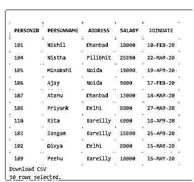
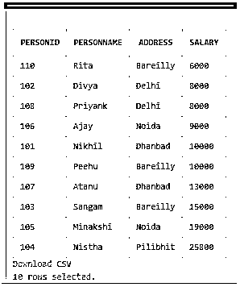
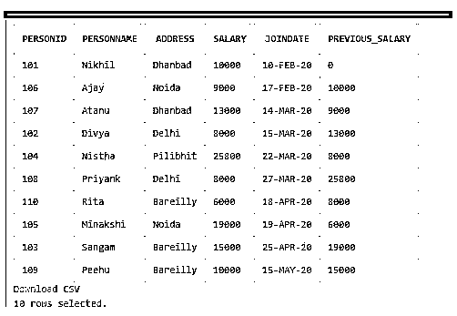
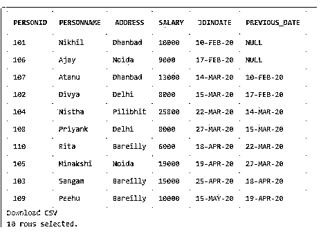
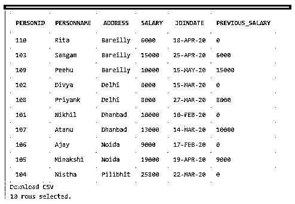

# MySQL LAG()

> 原文：<https://www.educba.com/mysql-lag/>

## mysql lag_)函数介绍

MySQL LAG()函数负责从一个表中获取结果记录，该表包含从同一输出中的当前行访问的前一行的数据信息。MySQL LAG()函数可以定义为一种 Windows 函数，它可以帮助查看大量记录，并从现有记录中访问该行的数据值。这里，一个 Windows 函数是 MySQL query，它有助于以更简单、更新颖的方式解决任何查询问题，并且性能更好。因此，LAG()函数允许从当前行之前的表行中检索数据值。它的函数与 MySQL LEAD()函数不同，MySQL LEAD()函数的计算是从现有行的后续行提供数据。

### 句法

MySQL LAG()函数具有以下语法结构，说明了该 MySQL 函数在服务器上的工作方式:

<small>Hadoop、数据科学、统计学&其他</small>

`LAG(Expr, OffsetValue, DefaultValue) OVER (PARTITION BY expression,…..
ORDER BY Expr [DESC/ASC],….);`

以下是 MySQL 中 LAG()函数的上述语法中使用的术语的描述:

*   **Expr:** 这表示 LAG()函数从上一行返回的值，借助结果或分区集中的许多行，可以通过当前行访问该值。
*   **OffsetValue:** 它将值定义为零或任何精确的正整数，即当前行之后的行数，我们将从该行接收值。如果偏移值设置为零，那么 LAG()函数将为当前行执行“expr”的值，否则，如果没有指定，那么 LAG()函数默认取值 1。
*   **DefaultValue:** 如果函数参数中不存在前面的行，LAG()函数将使用该默认值作为结果显示。假设如果偏移量设置为 2，那么返回值将是第一行的默认值。但是，如果不提供默认值，LAG()函数会将 NULL 作为默认结果。
*   **OVER:** 这个 MySQL 函数与 LAG()函数一起使用，在执行查询时将行分成组。但是，如果 LAG()遗漏了()或者它为空，那么 LAG()使用所有表行计算出的结果。
*   **PARTITION BY:** 这个 MySQL 子句对 LAG()函数很有帮助，因为 PARTITION BY 用于将输出集中的表行划分为分区，以便允许 LAG 函数正常工作。如果 PARTITION BY 没有应用于 LAG()函数，那么该函数将假设整个输出集为一个分区。
*   **ORDER BY:** 在 LAG()函数起作用之前，这个 ORDER BY 子句定义了每个分区中表行的顺序。我们还可以添加 MySQL 中用于排序的排序术语，然后我们可以使用 ASC 和 DESC。

### MySQL LAG()函数是如何工作的？

MySQL LAG()函数是一个非聚合的 MySQL 窗口函数，用于生成其分区内任何表行的前一个值。window 函数可以说是一个 MySQL 函数，它实现了对分区的每条记录的操作，或者称为 window。因此，查询时会为每一行生成这个结果，这不太可能是 MySQL 中的聚合函数，因为这个函数对行进行分组，结果显示在一个记录行中。当前行是操作或查询将要发生的行。窗口被称为表中的一组行，其与当前行相关联或者允许函数对当前表行进行操作。这里，LAG()语法中的‘expr’可以是任何列，也可以是 MySQL 中的内置函数。

### 在 MySQL 中实现 LAG()函数的例子

让我们考虑以下在 MySQL 中实现 LAG()函数的例子:

假设我们创建了一个 Persons 表，其中包含 PersonID、PersonName、Address、Salary、JoinDate 等字段，并在示例表中插入了一些数据值。该表的输出如下所示:

`select * from Persons;`

#### 示例#1

现在，首先，让我们查询以下语句，首先从按 Salary 列值排序的表中获取数据:

**代码:**

`SELECT PersonID, Personname, Address, Salary FROM Persons ORDER BY Salary;`

**输出:**

#### 实施例 2

对于 LAG()函数，让我们编写查询来产生结果，其中没有提到分区，偏移值设置为 1，默认值设置为 0。查询如下，其中 LAG()函数应用于“Persons”表单的“Salary”列:

**代码:**

`SELECT PersonID, Personname, Address, Salary, JoinDate, LAG(Salary, 1, 0) OVER( ORDER BY JoinDate ASC) AS Previous_Salary FROM Persons;`

**输出:**

**解释:**正如您所看到的，LAG()函数 new column 的第一行保存了该行的前一个值，由于我们放置了 offset，它为 salary 列提供了行内的前一个值。

#### 实施例 3

同样，让我们考虑另一个查询，其中我们添加了 JoinDate 列，LAG()函数将在该列上操作，Offset 值为 2，没有提供默认值。该查询如下所示:

**代码:**

`SELECT PersonID, Personname, Address, Salary, JoinDate, LAG(JoinDate, 2) OVER(ORDER BY JoinDate ASC) AS Previous_Date FROM Persons;`

**输出:**

**解释:**我们可以注意到，第一个&秒将 NULL 作为结果集中 Previous_Date 列的默认值，因为没有以前的行可用。偏移值设置为 2，因此 Lag 函数使用结果集中的前 2 行。但是在 3 rd 行中，它从 JoinDate 列中的第一行接收值。

#### 实施例 4

现在，在 LAG()和 OVER()中使用 PARTITION BY，对地址列进行分组，然后相应地实现 LAG()函数，得到如下集合:

**代码:**

`SELECT PersonID, Personname, Address, Salary, JoinDate, LAG(Salary,1, 0) OVER( PARTITION BY Address ORDER BY JoinDate ASC) AS Previous_Salary FROM Persons;`

**输出:**

**解释:**每个地址列的第一行被设置为默认值 0，并采用偏移量 1 来显示 person 表中 Previous_Salary 列中的前一个值。

### 结论

需要注意的是，我们需要使用一个带有 OVER()函数、PARTITION BY 等的 LAG 函数。在 MySQL 中运行 LAG()，否则，可能会在服务器上产生错误。此外，查看函数语法代码中是否缺少任何其他参数。因此，MySQL LAG()函数对于计算当前表行和前一个表行之间的差异以产生期望的结果非常重要。

### 推荐文章

这是 MySQL LAG()的指南。这里我们讨论 MySQL LAG()的介绍，语法，它是如何工作的，以及代码和输出的例子。您也可以浏览我们的其他相关文章，了解更多信息——

1.  [MySQL 中的运算符](https://www.educba.com/mysql-in-operator/)
2.  [MySQL 子查询](https://www.educba.com/mysql-subquery/)
3.  [MySQL 约束](https://www.educba.com/mysql-constraints/)
4.  [MySQL 中的任何一个](https://www.educba.com/any-in-mysql/)

